# SEOJEV — Search Intelligence & Technical SEO Platform

> A production-grade, multi-tenant search intelligence platform and 6-pass crawling engine built for automated technical SEO discovery, systemic root-cause analysis, local machine learning calibration, and multi-cloud ticket generation.

---

## 1. What the System Does

### The Problem
Traditional SEO auditing tools produce thousands of fragmented, repetitive alerts (e.g., 5,000 separate "missing meta description" or "broken link" issues) with zero awareness of page template architecture, no numeric evidence provenance, and no automated translation into engineering work orders. Auditing large, dynamic sites (10,000+ pages) often leads to memory bloat, uncalibrated priority scores, and manual spreadsheet wrangling.

### The Purpose
**SEOJEV** transforms raw web crawling into an actionable search operating system. It moves beyond superficial checklist scans by:
1. **Clustering pages into structural templates** using 64-bit SimHash algorithms.
2. **Suppressing issue explosion** by pinpointing systemic root causes at the template and component level.
3. **Calculating deterministic numeric provenance** across internal link graphs, Core Web Vitals, and search signals.
4. **Calibrating confidence and impact** using local Apple Silicon MLX inference (`laya-mlx`) with zero external API dependencies.
5. **Generating ready-to-dispatch engineering and content work orders** with automated ticket exports for GitHub Issues, Jira, and Linear.

### Main Capabilities
* **Asynchronous Deep Crawling**: Bounded memory footprint, robots.txt compliance, recursive XML sitemap processing, crawl trap quarantining, and selective Playwright browser rendering for JavaScript-heavy single-page apps.
* **Internal Link Graph Intelligence**: NetworkX-powered graph analysis computing PageRank, CheiRank, Hubs/Authorities, crawl depth distribution, and cut-vertex orphan page risks.
* **11 Root-Cause Detectors**: Comprehensive detection covering canonicals, hreflang, indexability funnels, pagination loops, soft 404s, mobile parity, redirect chains, structured data schema validation, and rendering diffs.
* **Vertical Provenance Analysis**: Industry-specific entity graph extraction and schema auditing for Automotive, E-commerce, SaaS, Real Estate, and Healthcare.
* **Multi-Tenant REST Platform**: FastAPI service with JWT and API-key authentication, strict organization row-level isolation, and asynchronous Redis task queuing.
* **Real-Time Telemetry & Cancellation**: Server-Sent Events (SSE) streaming live pass progress with cooperative cancellation that leaves zero corrupted or half-written database records.
* **Object Storage & Signed Downloads**: Direct S3/MinIO artifact archiving for Word audit reports, CSV suites, offline HTML explorers, and single-archive `export.zip` bundles with signed, expiring download URLs.

---

## 2. Architecture & Technologies

SEOJEV is structured across decoupled architectural layers that bridge high-throughput crawling, analytical graph intelligence, local on-device machine learning, and a multi-tenant cloud backend:

```mermaid
flowchart TD
    subgraph Clients["Clients & Interfaces"]
        CLI["CLI Tool (main.py)"]
        NextJS["Next.js 14 Dashboard\n(Overview, Opps, Templates, Blueprints, GSC, Downloads, Diff, Work Orders)"]
    end

    subgraph API["FastAPI Platform Service"]
        FastAPIApp["FastAPI REST Endpoints"]
        AuthModule["JWT & API Key Auth"]
        SitesRouter["Sites Router (/sites)"]
        RunsRouter["Runs Router (/runs)"]
        ArtifactsRouter["Artifacts Router (/artifacts)"]
        OppsRouter["Opportunities Router (/runs/{id}/opportunities)"]
        TplsRouter["Templates Router (/runs/{id}/templates)"]
        BpsRouter["Blueprints Router (/runs/{id}/blueprints)"]
        GscRouter["Search Console Router (/runs/{id}/gsc)"]
        WorkOrdersRouter["Work Orders Router (/work-orders)"]
        DiffRouter["Snapshot Diff Router (/runs/{id}/diff)"]
    end

    subgraph Messaging["Redis Queue & Pub/Sub"]
        Queue["Run Queue (seojev:queue:runs)"]
        PubSub["Pub/Sub Telemetry (run:id:progress)"]
        CancelFlag["Cancellation Flag (run:id:cancel)"]
    end

    subgraph WorkerLayer["Asynchronous Worker"]
        Worker["Background Task Worker (jobs/worker.py)"]
    end

    subgraph CoreEngine["SEOJEV 6-Pass Pipeline Engine"]
        P1["Pass 1: Async Crawler & SnapshotRecorder"]
        P2["Pass 2: NetworkX Link Graph & SimHash Templates"]
        P3["Pass 3: OpportunityEngine V3 (11 Detectors)"]
        P4["Pass 4: Laya MLX Calibration (Apple Silicon)"]
        P5["Pass 5: Work Orders & Ticket Exporters"]
        P6["Pass 6: Word, CSV & HTML Deliverables"]
        
        P1 --> P2 --> P3 --> P4 --> P5 --> P6
    end

    subgraph Storage["Persistence & Object Storage"]
        Postgres[("PostgreSQL Multi-Tenant Database")]
        SQLite[("Per-Run SQLite Store data/{id}.db")]
        MinIO[("MinIO / AWS S3 Object Storage")]
    end

    CLI --> CoreEngine
    NextJS -->|HTTP / SSE| FastAPIApp
    FastAPIApp --> AuthModule
    FastAPIApp --> SitesRouter
    FastAPIApp --> RunsRouter
    FastAPIApp --> ArtifactsRouter
    FastAPIApp --> OppsRouter
    FastAPIApp --> TplsRouter
    FastAPIApp --> BpsRouter
    FastAPIApp --> GscRouter
    FastAPIApp --> WorkOrdersRouter
    FastAPIApp --> DiffRouter

    RunsRouter -->|Enqueue Run| Queue
    RunsRouter -->|Set Cancel Flag| CancelFlag
    RunsRouter -->|Stream SSE Progress| PubSub

    Worker -->|Dequeue Job| Queue
    Worker -->|Check Cancel Flag| CancelFlag
    Worker -->|Publish Progress| PubSub
    Worker -->|Execute Pipeline| CoreEngine

    CoreEngine -->|Post-Run ETL| Postgres
    CoreEngine -->|Run-level State| SQLite
    Worker -->|Upload Artifacts| MinIO
    Worker -->|Record Metadata| Postgres
    ArtifactsRouter -->|Query Metadata| Postgres
    ArtifactsRouter -->|Generate Presigned URL| MinIO
    NextJS -.->|Direct Download via Signed URL| MinIO
    OppsRouter -->|Read Opps & Save Feedback| Postgres
    TplsRouter -->|Read Clusters & Findings| Postgres
    BpsRouter -->|20-Dimension Generator| SQLite
    GscRouter -->|Striking Distance & Cannibalization| SQLite
```



```
┌────────────────────────────────────────────────────────────────────────┐
│                          Clients & Interfaces                          │
│         CLI (`main.py`)    │    Web Frontend / API Clients             │
└──────────────────┬─────────────────────────────┬───────────────────────┘
                   │                             │ HTTP / SSE / REST
                   ▼                             ▼
┌────────────────────────────────────────────────────────────────────────┐
│                        FastAPI Platform Service                        │
│   • Auth (JWT / API Key)        • Sites CRUD (Org Scoped)              │
│   • Runs Enqueueing             • SSE Telemetry Stream                 │
│   • Artifacts & Direct Signed URLs (`/artifacts/{id}/download`)        │
└─────────────────────────────────┬──────────────────────────────────────┘
                                  │ Enqueue Job
                                  ▼
┌────────────────────────────────────────────────────────────────────────┐
│                       Redis Task Queue & Pub/Sub                       │
│   • List Queue: `seojev:queue:runs`    • Pub/Sub: `run:{id}:progress`  │
│   • Cancellation Flag: `run:{id}:cancel` • Retry / Backoff State       │
└─────────────────────────────────┬──────────────────────────────────────┘
                                  │ Dequeue (`blpop`)
                                  ▼
┌────────────────────────────────────────────────────────────────────────┐
│                       Background Asynchronous Worker                   │
│   • Cooperative Cancel Checks   • 1-Retry Backoff Policy               │
│   • Terminal Status Dispatch    • Automatic ETL & S3 Sync Trigger      │
└─────────────────────────────────┬──────────────────────────────────────┘
                                  │ Invokes
                                  ▼
┌────────────────────────────────────────────────────────────────────────┐
│                SEOJEV 6-Pass Search Intelligence Engine                 │
│                                                                        │
│   [Pass 1: P1_CRAWL]                                                   │
│   Async HTTP, Robots, Sitemaps, Traps, Soft-404, Playwright Render     │
│   → Scratchpad Storage: SQLite WAL (`data/{run_id}.db`)                │
│   → Content Store: Content-Addressed Compressed Cache (`store/`)       │
│                                                                        │
│   [Pass 2: P2_SIGNALS]                                                 │
│   NetworkX Link Graph, SimHash Template Clustering, Near-Duplicates,  │
│   Core Web Vitals Sample (TTFB, FCP, LCP, CLS), Schema & Verticals     │
│                                                                        │
│   [Pass 3: P3_SEARCH_OPPORTUNITIES]                                    │
│   OpportunityEngine V3: 11 Detectors, Root-Cause Suppression,          │
│   SHA-256 Fingerprints, Stable Display IDs (`OPP-...`), ICE Scoring   │
│                                                                        │
│   [Pass 4: P4_CALIBRATION]                                             │
│   Laya MLX Local Inference (4-bit Apple Silicon) / Deterministic       │
│   Fallback Classifier, Calibrated Confidence, Sensitivity Matrix       │
│                                                                        │
│   [Pass 5: P5_WORK_ORDERS]                                             │
│   WorkOrderManager (`WO-ENG-...`, `WO-CNT-...`), ClaimsLinter Gate,    │
│   Ticket Generation (GitHub Issues JSON, Jira CSV/JSON, Linear JSON)   │
│                                                                        │
│   [Pass 6: P6_DELIVERABLES]                                            │
│   28-Section Master Word Report, Executive Word Report, 25+ CSVs,      │
│   Standalone Interactive HTML Explorer (`explorer.html`)               │
└──────────────────┬─────────────────────────────┬───────────────────────┘
                   │                             │
                   ▼ (Post-Run ETL)              ▼ (Artifact Upload)
┌──────────────────────────────────┐ ┌──────────────────────────────────┐
│        PostgreSQL Database       │ │       S3 / MinIO Storage         │
│   • `orgs`, `users`, `api_keys`  │ │   Bucket: `seojev-artifacts`     │
│   • `sites`, `runs`, `artifacts` │ │   Path: `{org}/{site}/{run}/...` │
│   • `templates`, `findings`      │ │   • Word Reports (.docx)         │
│   • `opportunities` (with ICE)   │ │   • All CSV Inventories (.csv)   │
│   • `work_orders`, `snapshots`   │ │   • Single-File HTML Explorer    │
│   • Multi-Tenant Isolation       │ │   • Pre-bundled `export.zip`     │
└──────────────────────────────────┘ └──────────────────────────────────┘
```

---

## 3. Technology Purpose & Rationale

| Technology / Component | Purpose in SEOJEV | Why It Exists in the Stack |
| :--- | :--- | :--- |
| **Python 3.12 + `asyncio`** | Core engine & crawler runtime | Non-blocking concurrent HTTP crawling (10–50 requests/sec) with controlled concurrency semaphores. |
| **Playwright** | Headless Chromium browser rendering | Selectively executed only when initial HTML payloads are thin or indicate client-side hydration (`<div id="root"></div>`, `<div id="__next"></div>`). |
| **SQLite (WAL Mode)** | Local run scratchpad & frontier storage | High-speed local disk persistence for crawled URLs, headers, and intermediate signals without network roundtrips. |
| **NetworkX** | Internal link graph modeling | Computes PageRank, CheiRank, In-link counts, Hub/Authority ratios, and cut-vertices to find isolated page clusters and orphans. |
| **SimHash (64-bit)** | Structural template clustering | Clusters thousands of dynamic URLs into cohesive layout templates based on DOM token frequencies and structural fingerprints. |
| **Laya MLX (`aac6fef/laya-mlx`)** | On-device ML calibration | 4-bit Apple Silicon MLX inference calibrating issue severity, confidence probabilities, and ICE scores without leaking data to third-party LLM APIs. |
| **FastAPI** | REST API platform service | High-performance asynchronous API layer with auto-generated OpenAPI documentation, Pydantic validation, and dependency injection. |
| **PostgreSQL 14+ + `psycopg 3`** | Multi-tenant persistent data warehouse | Normalized relational persistence with mandatory `org_id` foreign keys on every table, indexed JSONB configs, and row-level isolation. |
| **Redis** | Background job queue & pub/sub | FIFO run task scheduling (`seojev:queue:runs`), pub/sub pass telemetry (`run:{id}:progress`), and cooperative cancellation flags. |
| **MinIO / AWS S3 + `boto3`** | Cloud object storage & direct delivery | Direct binary artifact hosting. Clients receive signed, expiring URLs (`/artifacts/{id}/download`); the API process never buffers or proxies large files. |
| **`python-docx`** | Automated document generation | Compiles polished 28-section executive and technical Word audit reports with styled tables, callouts, and formatted action plans. |

---

## 4. Component Relationships & Architecture Table

| Component | Upstream Dependency | Downstream Dependent | Primary Responsibility |
| :--- | :--- | :--- | :--- |
| **`api/routers/runs.py`** | Client Requests, JWT Auth | `jobs/queue.py`, PostgreSQL | Accepts run requests, enqueues background jobs, exposes SSE progress and cancellation. |
| **`jobs/worker.py`** | `jobs/queue.py`, Redis | `engine/pipeline.py`, ETL, S3 | Background loop pulling jobs, executing the 6 passes, catching cancellations, and triggering ETL. |
| **`engine/pipeline.py`** | `jobs/worker.py` or CLI | Crawler, Analyzers, Reporters | Orchestrates Passes 1 through 6, emitting granular progress callbacks and enforcing cooperative cancel checks. |
| **`crawler/crawler.py`** | `engine/pipeline.py` | `crawler/storage.py`, Network | Manages seed discovery, sitemaps, robots.txt, politeness delays, and frontier resume. |
| **`engine/opportunity_engine_v3.py`** | Page & Link Signals | `engine/work_orders.py`, SQLite | Groups issues into systemic opportunities with SHA-256 fingerprints and numeric provenance. |
| **`engine/laya_adapter.py`** | Opportunity Records | Work Orders & Reports | Evaluates ML confidence scores on Apple Silicon hardware, falling back to deterministic heuristics. |
| **`database/etl.py`** | SQLite Run DB (`data/{id}.db`) | PostgreSQL Tables | Idempotently copies completed run data into Postgres using deterministic primary keys. |
| **`services/object_store.py`** | Reports on Disk | S3 / MinIO, Postgres | Uploads deliverables under `{org}/{site}/{run}/...` and signs time-limited direct download URLs. |

---

## 5. Major Use Cases & Step-by-Step Workflows

### Use Case 1: Automated Enterprise Site Audit
1. **Trigger**: An engineering or SEO lead issues a request via `POST /runs` specifying `site_id`, `max_pages=5000`, and `concurrency=10`.
2. **Immediate Acknowledgment**: The API returns HTTP 201 with `status: "queued"` within 20 milliseconds.
3. **Queue & Crawl**: The background worker picks up the job. The crawler inspects `robots.txt`, processes sitemap index hierarchies, identifies trap URLs, and crawls pages asynchronously into a local SQLite database.
4. **Analysis & Synthesis**: Structural templates are clustered via SimHash; the link graph is analyzed via NetworkX; 11 detectors synthesize root-cause opportunities with ICE scores.
5. **ETL & Object Storage**: The run data is ingested into multi-tenant PostgreSQL tables, and all deliverables (Word reports, CSV inventories, HTML explorer, ticket JSONs) are uploaded to S3/MinIO.
6. **Delivery**: The client downloads the reports or single-archive `export.zip` via secure presigned URLs.

### Use Case 2: Live Progress Telemetry via Server-Sent Events (SSE)
1. **Subscribe**: Frontend client connects to `GET /runs/{run_id}/progress` with a Bearer token.
2. **Channel Subscription**: FastAPI opens a Redis pub/sub subscription to `run:{run_id}:progress`.
3. **Stream Events**: As the worker executes each pass (`P1_CRAWL` → `P2_SIGNALS` → `P3_SEARCH_OPPORTUNITIES` → `P4_CALIBRATION` → `P5_WORK_ORDERS` → `P6_DELIVERABLES`), it emits monotonic progress percentages, pass identifiers, and counter metadata.
4. **Terminal State**: Upon receiving `"status": "completed"` (or `"cancelled"` / `"failed"`), the SSE connection closes cleanly.

### Use Case 3: Cooperative Mid-Crawl Cancellation & Clean Resumption
1. **Cancellation Request**: A client calls `POST /runs/{run_id}/cancel`.
2. **Flagging**: The API sets Redis key `run:{run_id}:cancel = "1"`.
3. **Clean Halt**: Between URL fetches, the crawler checks `cancel_check()`, terminates the crawl loop, and raises `PipelineCancelledException`.
4. **Zero Partial Corruption**: The worker records `runs.status = 'cancelled'`. **ETL is skipped entirely**, ensuring zero partial or corrupt rows are written to PostgreSQL.
5. **Resumption**: The client calls `POST /runs/{run_id}/resume`. The worker initializes the crawler with `resume=True`, queries `storage.get_queued_urls(...)`, hydrates the scheduler with unvisited URLs, and finishes the crawl from where it stopped.

### Use Case 4: Engineering & Content Work Order Generation
1. **Linting**: The claims linter checks detected opportunities against systemic rules (e.g. verifying that canonical updates target existing, indexable 200 OK pages).
2. **Work Order Partitioning**: `WorkOrderManager` generates discrete engineering (`WO-ENG-...`) and content (`WO-CNT-...`) work orders.
3. **Ticket Export**: Outputs formatted task payloads for:
   - `github_issues.json`: Ready for GitHub CLI (`gh issue create`).
   - `jira_import.json` & `jira_issues.csv`: Configured with Jira standard issue fields.
   - `linear_import.json`: Formatted for Linear batch import.

### Use Case 5: Deep Diagnostic Exploration & Human Feedback Loop (Stage 7)
1. **Root-Cause Diagnostic Exploration**: Analysts navigate to `/runs/[id]/opportunities` to view sortable, filterable opportunities. Expanding any card reveals the strict 6-phase reasoning chain (`Observation -> Evidence -> Diagnosis -> Hypothesis -> Action -> Verification`) alongside 7 numeric ICE factors (Visibility, Gap, Page Importance, Template Scope, Tech Severity, CTR Headroom, Link Gap).
2. **Human-in-the-Loop Feedback**: Users submit feedback verdicts (`Fixed`, `False Positive`, `Accepted`, `Won't Fix`) directly from the UI, persisting into PostgreSQL `feedback` with tenant isolation and surviving browser reloads.
3. **SimHash Template Architecture**: Users inspect clustered structural templates at `/runs/[id]/templates`, drilling into template detail views showing real affected member URLs and associated systemic findings.
4. **20-Dimension Blueprint Inspector**: Users drill down into crawled URLs at `/runs/[id]/blueprints` and `/runs/[id]/blueprints/detail`, inspecting the engine's 20 diagnostic dimensions (Query Fit, Entity Coverage, Structured Data Schema, Internal Links, AEO/GEO readiness) or viewing rendered raw Markdown.
5. **Search Performance & GSC Intelligence**: Users analyze striking-distance opportunities (positions 11–20), multi-page cannibalization risks, query topic clusters, and position bracket trend distributions at `/runs/[id]/gsc`, with explicit empty states when Search Console data is unconnected.

### Use Case 6: Artifact Downloads, Snapshot Diff & Work Order Verification (Stage 8)
1. **Downloads Center**: Users visit `/runs/[id]/downloads` to view the comprehensive deliverables inventory fetched via `GET /runs/{id}/artifacts`. Every artifact (DOCX, CSV, HTML, JSON) displays filename, icon/type, formatted file size, and an individual download action.
2. **Direct Presigned S3 Downloads**: Individual downloads retrieve signed object-storage URLs via `GET /artifacts/{id}/download`. Files are streamed directly from S3/MinIO without proxying large payloads through the API or frontend, guaranteeing byte-for-byte SHA-256 integrity.
3. **One-Click Bundle ZIP**: Users click "Download all (.zip)" which calls `GET /runs/{id}/export.zip` to retrieve a signed URL for the complete run deliverables archive.
4. **Snapshot Diff Comparison**: Users navigate to `/runs/[id]/diff` to compare the current run against any prior baseline run for the same site (`GET /runs/{id}/diff?compare_run_id=...`). The real engine (`SnapshotDiffer`) classifies every evaluated URL into:
   - **Fixed**: Defect resolved (e.g. HTTP status 500/404 restored to 200, title tag restored, or inadvertent noindex removed).
   - **Regressed**: Regression introduced (e.g. healthy 200 page degraded to 4xx/5xx or set to noindex).
   - **New**: Newly crawled page detected with technical errors (`NEW_ISSUE`).
   - **Improved**: Title tag enhanced, schema added, or content hash updated favorably.
   - **Still Failing**: Ongoing technical issues that persist across both snapshots.
   - **Unchanged**: URL identical across both snapshots.
5. **Template-Based Diff Grouping**: Differences are clustered and displayed under their respective structural templates (e.g. `tpl_brand_bikes_2seg`), allowing engineering teams to see systemic fixes across an entire layout component.
6. **Engineering vs Content Work Orders**: Users access `/runs/[id]/work-orders` with dedicated segmentation for Engineering tickets (structural templates, server status, metadata tags) versus Content tickets (missing sections, Q&A blocks, keyword gaps).
7. **Multi-Platform Ticket Exports**: Users export any work order via `POST /work-orders/{id}/export?platform=...` to generate real downloadable JSON payloads for **GitHub Issues**, **Jira Tasks**, **Linear Issues**, or formatted **Markdown**, complete with a copy-to-clipboard modal.
8. **Automated Spec Verification**: Users click "Run verification now" or invoke `POST /work-orders/{id}/verify`. `VerificationRunner` performs live HTTP fetching and sandboxed DOM evaluation of the ticket's verification spec (e.g. `status_code == 200`, `canonical_matches_url == True`, `has_selector(...)`), distinguishing **PASS**, **FAIL**, and **ERROR** / inconclusive outcomes while persisting an immutable audit record to PostgreSQL `verifications`.

---

## 6. End-to-End Request Lifecycle & Data Flow

Here is the exact data path for crawl audits, artifact downloads, diff comparisons, and work order operations:

```
[Client / UI]
      │
      │ 1. POST /runs { site_id, max_pages: 50, concurrency: 2 }
      ▼
[FastAPI: api/routers/runs.py]
      │ 2. ScopedQuery: Validate site ownership for user's org_id
      │ 3. INSERT INTO runs (status='queued')
      │ 4. RunQueue.enqueue_run()
      ▼
[Redis: seojev:queue:runs]
      │
      │ 5. blpop (Async Worker Dequeue)
      ▼
[Worker: jobs/worker.py]
      │ 6. UPDATE runs (status='running', current_pass='P1_CRAWL')
      │ 7. Execute SEOJEVPipeline
      ▼
[Engine Pipeline: engine/pipeline.py]
      ├── Pass 1: Async Crawler → Writes Pages to SQLite WAL (`data/{id}.db`)
      │           └── SnapshotRecorder → Captures URL state snapshots (title, canonical, status, schema)
      ├── Pass 2: Link Graph & SimHash → Analyzes NetworkX graph & templates
      ├── Pass 3: OpportunityEngine V3 → Groups 11 detector findings into opportunities
      ├── Pass 4: Laya Adapter → Computes calibrated confidence via local MLX
      ├── Pass 5: WorkOrderManager → Emits tickets (GitHub, Jira, Linear)
      └── Pass 6: Deliverables → Compiles Word reports, CSVs, and explorer.html
      │
      │ 8. run_etl()
      ▼
[PostgreSQL: database/etl.py]
      │ 9. Upsert runs, sites, templates, findings, opportunities, work_orders, snapshots
      ▼
[Object Storage: services/object_store.py]
      │ 10. Upload reports, CSVs, HTML explorer, and export.zip to S3 / MinIO
      │ 11. INSERT INTO artifacts (id, s3_key, checksum_sha256, size_bytes)
      ▼
[Stage 8 Operations]
      ├── Downloads Center:
      │   ├── GET /runs/{id}/artifacts → Lists artifacts inventory
      │   ├── GET /artifacts/{id}/download → Signed direct S3 URL (SHA-256 verified)
      │   └── GET /runs/{id}/export.zip → Signed bundle ZIP archive download
      ├── Snapshot Diff Viewer:
      │   └── GET /runs/{id}/diff?compare_run_id={base_id} → Runs SnapshotDiffer, returns
      │       Fixed/Regressed/New/Improved grouped by structural template
      └── Work Orders & Tickets:
          ├── GET /runs/{id}/work-orders?order_type=engineering|content → Scoped ticket list
          ├── POST /work-orders/{id}/export?platform=github|jira|linear → Generates downloadable export payload
          └── POST /work-orders/{id}/verify → VerificationRunner live fetch & spec eval (PASS/FAIL/ERROR)
```

---

## 7. Repository Structure

```
seojev/
├── analysis/               # Technical signal extractors & analyzers
│   ├── duplicate_detector.py # Near-duplicate content detection
│   ├── extractors.py       # Metadata, headings, OpenGraph, schemas extractors
│   ├── link_graph.py       # NetworkX link graph, PageRank, orphan page analysis
│   ├── performance.py      # Core Web Vitals (TTFB, FCP, LCP, CLS, INP)
│   ├── template_analyzer.py# SimHash 64-bit structural template clustering
│   └── verticals.py        # Vertical entity extraction (Auto, Ecom, SaaS, etc.)
├── api/                    # FastAPI REST API platform service
│   ├── routers/            # Scoped route handlers
│   │   ├── auth.py         # /auth/register, /auth/login, /auth/api-keys
│   │   ├── sites.py        # /sites CRUD (multi-tenant org-scoped)
│   │   ├── runs.py         # /runs trigger, status, SSE progress, cancel, resume
│   │   ├── artifacts.py    # /artifacts/{id}/download (direct presigned URLs)
│   │   ├── opportunities.py# /runs/{id}/opportunities & /opportunities/{id}/feedback
│   │   ├── templates.py    # /runs/{id}/templates clustered templates & details
│   │   ├── blueprints.py   # /runs/{id}/blueprints & 20-dimension blueprint generator
│   │   ├── gsc.py          # /runs/{id}/gsc query intelligence, striking distance, cannibalization
│   │   ├── work_orders.py  # /runs/{id}/work-orders, /work-orders/{id}/export, /work-orders/{id}/verify
│   │   └── diff.py         # /runs/{id}/diff snapshot comparisons & /runs/{id}/compare-targets
│   ├── auth.py             # JWT bearer & API-key authentication dependencies
│   ├── config.py           # Platform settings (PostgreSQL, Redis, S3/MinIO, JWT)
│   ├── main.py             # FastAPI entrypoint with lifespan background worker
│   └── schemas.py          # Pydantic request & response models
├── crawler/                # Asynchronous crawling engine
│   ├── content_store.py    # Content-addressed compressed HTML storage
│   ├── crawler.py          # Main async crawler engine with frontier management
│   ├── fetcher.py          # HTTP client connection pooling & retry handling
│   ├── render.py           # Playwright headless browser selective rendering
│   ├── robots.py           # Robots.txt parser and rule matcher
│   ├── scheduler.py        # Priority heap scheduler with politeness rate-limiting
│   ├── sitemap.py          # Recursive XML sitemap index parser
│   ├── soft404.py          # Site fingerprinting soft-404 detector
│   ├── storage.py          # Local SQLite WAL scratchpad storage
│   └── traps.py            # Calendar & repeating directory crawl trap quarantine
├── database/               # PostgreSQL persistence & ETL layer
│   ├── connection.py       # psycopg 3 connection factory
│   ├── etl.py              # Idempotent SQLite → PostgreSQL ETL loader
│   ├── migrations/         # Versioned SQL migration scripts
│   │   ├── 001_phase2_postgres.sql # Base schema (orgs, sites, runs, opps, etc.)
│   │   ├── 002_artifacts.sql       # Artifacts ledger and S3 key indexing
│   │   └── 003_stage8_work_orders.sql # Work orders acceptance criteria & verifications table
│   ├── migrator.py         # Automated database migration runner
│   └── scoped_query.py     # Tenant-isolation query wrapper (`WHERE org_id = ...`)
├── docs/                   # Platform documentation & baseline records
│   ├── PHASE2_BASELINE.md  # Golden baseline metrics (48 findings, 6 templates)
│   └── PHASE2_ASSUMPTIONS.md # Comprehensive architectural decisions log
├── engine/                 # V3 Operating System orchestration
│   ├── claims_linter.py    # Quality gate validation for recommendations
│   ├── laya_adapter.py     # Apple Silicon MLX inference & fallback classifier
│   ├── opportunity_engine_v3.py # Opportunity synthesis, ICE scoring, provenance
│   ├── pipeline.py         # Unified 6-Pass pipeline callable as library or CLI
│   └── work_orders.py      # Engineering and content work order generator
├── intelligence/           # Search and AEO evaluators
│   ├── aeo_evaluator.py    # Answer Engine Optimization (Perplexity/ChatGPT) scoring
│   ├── geo_evaluator.py    # Generative Engine Optimization audit
│   ├── gsc.py              # Google Search Console query performance integrator
│   └── serp.py             # Search engine results page competitor intelligence
├── jobs/                   # Background job queue & worker processes
│   ├── queue.py            # Redis FIFO queue, cancellation, and pub/sub client
│   └── worker.py           # Background worker executing pipeline tasks and ETL
├── lab/                    # Synthetic defect lab for detector benchmarking
│   ├── server.py           # Multi-threaded synthetic HTTP test site server
│   └── site_generator.py   # Synthetic site generator with 16 planted defect classes
├── reports/                # Report generation engines
│   ├── csv_generator.py    # 26+ CSV audit inventory compiler
│   ├── docx_generator.py   # 28-section Master Word audit report compiler
│   └── html_explorer.py    # Single-file offline interactive HTML audit explorer
├── verification/           # Real snapshot diff & automated verification engine
│   ├── snapshot.py         # SnapshotRecorder taking full URL state snapshots
│   ├── differ.py           # SnapshotDiffer comparing runs and classifying changes
│   └── runner.py           # VerificationRunner executing live specs (PASS/FAIL/ERROR)
├── frontend/               # Next.js 14 App Router Web Client (TypeScript + Tailwind)
│   ├── src/app/            # App Router pages & navigation
│   │   ├── login/          # /login authenticated sign-in
│   │   ├── register/       # /register agency & user account registration
│   │   ├── sites/          # /sites multi-tenant target site directory & modal
│   │   ├── runs/           # /runs history & /runs/new audit run configuration
│   │   └── runs/[id]/      # /runs/[id] run detail & real-data exploration suite
│   │       ├── opportunities/ # Root-cause diagnostic chain & ICE factors
│   │       ├── templates/     # Clustered templates & affected member URLs
│   │       ├── blueprints/    # 20-dimension blueprint inspector & raw markdown
│   │       ├── gsc/           # Striking distance, cannibalization, & search trends
│   │       ├── downloads/     # Downloads Center with signed individual URLs & export.zip
│   │       ├── diff/          # Snapshot Diff Viewer with Fixed/Regressed/New/Improved by template
│   │       └── work-orders/   # Engineering & Content work orders, verifications, & exports
│   ├── src/components/     # UI components (RunNavTabs, ProtectedRoute, etc.)
│   ├── src/context/        # AuthContext session management
│   └── src/lib/api.ts      # Authenticated API client & SSE subscriber
├── services/               # Platform services
│   └── object_store.py     # S3 / MinIO client, presigned URLs, zip bundler
├── tests/                  # Automated test suites
│   ├── test_pipeline.py    # Stage 1: Pipeline library mode, progress, cancellation
│   ├── test_postgres_etl.py# Stage 2: PostgreSQL schema, ETL, idempotency, isolation
│   ├── test_api_stage3.py  # Stage 3: FastAPI auth, sites CRUD, synchronous runs
│   ├── test_stage4_queue.py# Stage 4: Redis queue, SSE stream, cancel, resume, retry
│   ├── test_stage5_artifacts.py # Stage 5: S3 upload, presigned URLs, expiry, zip bundle
│   ├── test_stage6_frontend.py  # Stage 6: Next.js Frontend E2E Playwright tests
│   ├── test_stage7_exploration.py # Stage 7: Real-data exploration Playwright tests
│   └── test_stage8_downloads_diff_workorders.py # Stage 8: Downloads, snapshot diff, work order verifications & exports
├── main.py                 # CLI entrypoint supporting all audit & analysis flags
└── requirements.txt        # Python package dependencies
```

---

## 8. Implementation Status

| Capability / Feature | Status | Details |
| :--- | :---: | :--- |
| **6-Pass Core Engine** | **Implemented** | All 6 passes callable as library or CLI with progress callbacks and cancellation checks. |
| **11 Root-Cause Detectors** | **Implemented** | Canonical, hreflang, link graph, soft 404, CWV, duplicate, schema, index funnel, mobile, traps. |
| **Template Clustering** | **Implemented** | 64-bit SimHash DOM token clustering grouping URLs into structural templates. |
| **Numeric Evidence Provenance** | **Implemented** | Every opportunity links directly to page/node metrics, link graph PageRank, and test evidence. |
| **Laya MLX Calibration** | **Implemented** | On-device 4-bit inference via `laya-mlx` on Apple Silicon with deterministic fallback classifier. |
| **Work Orders & Ticket Exporters**| **Implemented** | Formatted JSON/CSV ticket exports for GitHub Issues, Jira, and Linear. |
| **Deliverables Suite** | **Implemented** | 28-section Master Word report, Executive Word report, 26 CSVs, standalone HTML explorer. |
| **PostgreSQL Multi-Tenant Schema**| **Implemented** | 17 normalized tables with mandatory `org_id` keys, migrations runner, and ScopedQuery helper. |
| **Idempotent ETL Pipeline** | **Implemented** | Normalizes SQLite runs into Postgres with deterministic primary keys and zero row duplication. |
| **FastAPI REST API** | **Implemented** | JWT auth, API key hashing, org-scoped Sites and Runs CRUD (returns 404 on cross-org reads). |
| **Redis Asynchronous Job Queue** | **Implemented** | FIFO run queue, cooperative cancellation flags, retry-once with backoff, needs_attention status. |
| **Server-Sent Events (SSE)** | **Implemented** | Real-time progress broadcasting via Redis pub/sub channel `run:{id}:progress`. |
| **Frontier Resumption** | **Implemented** | Clean resumption of cancelled crawls from SQLite queued URLs without recrawling or data loss. |
| **Object Storage (S3 / MinIO)** | **Implemented** | Deliverables uploaded to `{org}/{site}/{run}/...`, direct presigned download URLs, `export.zip`. |
| **Web Frontend (Next.js)** | **Implemented** | Next.js 14 App Router (TypeScript + Tailwind), JWT session auth, Sites CRUD, New Run Wizard, Live SSE telemetry, direct artifact downloads. |
| **Real-Data Exploration Suite** | **Implemented** | Stage 7 exploration screens: Opportunities with 6-stage diagnostic chains & ICE factors, Human-in-the-loop verdict persistence, SimHash Templates explorer with member URLs & findings, 20-Dimension Page Optimization Blueprint inspector, and Search Console intelligence with striking-distance targets, cannibalization detection, query clusters, and trend charts. |
| **Downloads Center & Signed S3 URLs** | **Implemented** | Stage 8 real deliverables inventory (`GET /runs/{id}/artifacts`), individual downloads using direct signed S3/MinIO URLs (SHA-256 byte integrity verified), and one-click bundle ZIP (`GET /runs/{id}/export.zip`). Never proxies large files through the API. |
| **Snapshot Diff Viewer** | **Implemented** | Stage 8 real engine comparison (`SnapshotDiffer`) classifying before/after changes into Fixed, Regressed, New (`NEW_ISSUE`), Improved, Still Failing, and Unchanged. Grouped by structural template with status code, title, and robots changes. |
| **Engineering & Content Work Orders** | **Implemented** | Stage 8 separate segmented views for Engineering vs Content work orders with real problem statements, required changes, acceptance criteria, verify specs, and evidence refs. |
| **Multi-Platform Ticket Exports** | **Implemented** | Stage 8 real downloadable JSON export payloads (`POST /work-orders/{id}/export`) for GitHub Issues, Jira Tasks, Linear Issues, and Markdown with modal copy-to-clipboard. |
| **Work-Order Automated Verification** | **Implemented** | Stage 8 live HTTP/DOM evaluation (`POST /work-orders/{id}/verify`) using `VerificationRunner`, distinguishing PASS, FAIL, and ERROR/inconclusive with audit records logged to PostgreSQL `verifications`. |
| **GSC / Live SERP Live Fetching** | *Partial* | Ingests real GSC CSV performance data, calculates striking distance/cannibalization/clusters/trends, generates synthetic datasets; live Google OAuth token sync planned. |

---

## 9. Setup & Development Guide

### Prerequisites
* **Python 3.12+**
* **Node.js 18+ & npm** (for Next.js frontend)
* **PostgreSQL 14+** running locally or in Docker
* **Redis 6+** running locally (`brew services start redis` or Docker)
* **MinIO / AWS S3** running locally (`brew services start minio` or Docker)
* **Playwright Browsers** (for client-side JavaScript rendering & browser tests)

### Environment Variables
Configure `.env` or export in your shell:

```bash
# Database
DATABASE_URL=postgresql:///seojev_test

# Redis Queue
REDIS_URL=redis://localhost:6379/0

# Object Storage (MinIO local defaults)
S3_ENDPOINT_URL=http://127.0.0.1:9000
S3_ACCESS_KEY=minioadmin
S3_SECRET_KEY=minioadmin
S3_BUCKET=seojev-artifacts
S3_REGION=us-east-1

# Security
JWT_SECRET=your_super_secret_jwt_key_here
JWT_EXPIRE_MINUTES=1440
```

### Installation

```bash
# 1. Clone the repository
git clone git@github.com:07anishu12/SEO-Agent-using-LAYA.git
cd seojev

# 2. Set up virtual environment
python3 -m venv .venv
source .venv/bin/activate

# 3. Install Python dependencies
pip install -r requirements.txt
pip install boto3 moto
playwright install chromium

# 4. Install Frontend dependencies & build
cd frontend
npm install
npm run build
cd ..

# 5. Initialize PostgreSQL database and apply migrations
createdb seojev_test
python -c "from database.migrator import PostgresMigrator; PostgresMigrator().run_migrations()"

# 6. Start supporting services (macOS / Homebrew example)
brew services start redis
brew services start minio
```

---

## 10. Running the System

### 1. One-Line Start (Full Local Stack)

Start the entire SEOJEV platform — Docker infra, FastAPI backend, Celery worker, Celery beat scheduler, and Next.js frontend — with a single command:

```bash
make dev
# or directly:
./scripts/dev.sh
```

This single command will:
1. Load environment variables from `.env` (automatically copying `.env.example` if `.env` does not exist).
2. Spin up Postgres, Redis, and MinIO in Docker via `docker compose -f docker-compose.dev.yml up -d postgres redis minio`.
3. Poll each service until healthy via real TCP/HTTP readiness checks.
4. Run pending database migrations automatically (`database.migrator`).
5. Launch the FastAPI backend (with `--reload`), Celery worker, Celery beat scheduler, and Next.js frontend in parallel with color-coded log prefixing (`[backend]`, `[worker]`, `[beat]`, `[frontend]`).
6. Cleanly trap `Ctrl+C` to terminate all native background processes without leaving orphaned processes behind.

To stop the Docker infra containers when finished:
```bash
make down
# or: ./scripts/dev.sh --full-down
```

> [!CAUTION]
> **CRITICAL ARCHITECTURAL CONSTRAINT — APPLE SILICON MLX & DOCKER**:
> Laya's on-device MLX inference (`aac6fef/laya-mlx`) requires direct native access to Apple Silicon GPU hardware. Docker Desktop on macOS runs containers inside a Linux virtual machine, so if the FastAPI backend or Celery worker are containerized, Apple Silicon MLX silently fails and cannot access the host GPU.
>
> **Design Pattern**:
> - **PostgreSQL, Redis, and MinIO** run in Docker (they do not require MLX).
> - **FastAPI backend, Celery worker (`jobs.worker`), Celery beat scheduler (`jobs.scheduler`), and Next.js frontend** run **NATIVELY on the host**, keeping Laya MLX operational.
> - **DO NOT move the backend or worker into Docker containers.**

---

### 2. CLI Audit (Standalone Engine)
Run a direct crawl and generate reports locally without the API:

```bash
# Basic run against any website
python main.py https://example.com/ --max-pages 100 --concurrency 5 --output reports/run_01/

# Full run with Playwright rendering and performance sample
python main.py https://example.com/ \
    --max-pages 500 \
    --concurrency 10 \
    --render \
    --performance-sample 50 \
    --output reports/full_audit/
```

### 3. Alternative: Starting Services Manually (Multi-Terminal)

```bash
# Option A: In-process worker (development)
ENABLE_WORKER=true uvicorn api.main:app --host 127.0.0.1 --port 8000 --reload

# Option B: Dedicated standalone worker (production)
# Terminal 1: API Server
uvicorn api.main:app --host 0.0.0.0 --port 8000

# Terminal 2: Background Task Worker
python -m jobs.worker
```

### 4. Alternative: Starting Frontend Manually

```bash
cd frontend

# Development server
npm run dev

# Production build and server
npm run build
npm start
```
Visit `http://localhost:3000` to access the interactive dashboard.

### 5. Running the Comprehensive Test Suite

The repository features comprehensive automated test suites covering all architectural layers:

```bash
# Increase file descriptor limit for concurrent crawler/browser tests on macOS
ulimit -n 4096

# Run all platform and browser tests (Stages 1 through 10)
PYTHONPATH=. pytest tests/test_pipeline.py tests/test_postgres_etl.py tests/test_api_stage3.py tests/test_stage4_queue.py tests/test_stage5_artifacts.py tests/test_stage6_frontend.py tests/test_stage7_exploration.py tests/test_stage8_downloads_diff_workorders.py tests/test_stage9_watch_alerts.py tests/test_stage10a_trends.py tests/test_stage10b_laya_backends.py tests/test_stage10c_recurring_audits.py tests/test_stage10d_gsc_anomaly.py tests/test_stage10e_cicd_webhook.py tests/test_stage10f_ticket_sync.py tests/test_stage10g_fts.py tests/test_stage10h_rbac.py tests/test_stage10i_portfolio.py -v

# Run individual stage test suites
PYTHONPATH=. pytest tests/test_pipeline.py -v         # Stage 1: Pipeline & cancellation
PYTHONPATH=. pytest tests/test_postgres_etl.py -v     # Stage 2: Postgres ETL & isolation
PYTHONPATH=. pytest tests/test_api_stage3.py -v       # Stage 3: Auth & Sites API
PYTHONPATH=. pytest tests/test_stage4_queue.py -v     # Stage 4: Redis Queue & SSE
PYTHONPATH=. pytest tests/test_stage5_artifacts.py -v # Stage 5: Object Storage & Presigned URLs
PYTHONPATH=. pytest tests/test_stage6_frontend.py -v  # Stage 6: Next.js Frontend E2E Playwright tests
PYTHONPATH=. pytest tests/test_stage7_exploration.py -v # Stage 7: Real-data Exploration Playwright tests
PYTHONPATH=. pytest tests/test_stage8_downloads_diff_workorders.py -v # Stage 8: Downloads, snapshot diff, work order verifications & exports
PYTHONPATH=. pytest tests/test_stage9_watch_alerts.py -v # Stage 9: Watches, Alerts, and Dispatcher
PYTHONPATH=. pytest tests/test_stage10a_trends.py -v   # Stage 10a: Historical Trends
PYTHONPATH=. pytest tests/test_stage10b_laya_backends.py -v # Stage 10b: Cloud-Portable Laya
PYTHONPATH=. pytest tests/test_stage10c_recurring_audits.py -v # Stage 10c: Scheduled Recurring Audits
PYTHONPATH=. pytest tests/test_stage10d_gsc_anomaly.py -v # Stage 10d: GSC Anomaly Detection
PYTHONPATH=. pytest tests/test_stage10e_cicd_webhook.py -v # Stage 10e: CI/CD Webhook
PYTHONPATH=. pytest tests/test_stage10f_ticket_sync.py -v # Stage 10f: Bi-directional Ticket Sync
PYTHONPATH=. pytest tests/test_stage10g_fts.py -v     # Stage 10g: Full-Text Search
PYTHONPATH=. pytest tests/test_stage10h_rbac.py -v    # Stage 10h: Role-Based Permissions
PYTHONPATH=. pytest tests/test_stage10i_portfolio.py -v # Stage 10i: Multi-Site Portfolio
```

---

## 5. Stage 9 & Stage 10 Power Features

### Stage 9: Watches, Regression Alerts & Notification Dispatcher
- **Autonomous Watch Scheduler (`jobs/scheduler.py`)**: Periodically checks active site schedules, scans robots.txt, sitemaps, top pages, and template drift without human intervention.
- **Alert Persistence (`alerts` table)**: Structured alert records with severity (`info`, `warning`, `critical`), alert types (`NOINDEX_LEAK`, `CANONICAL_CHANGE`, `SITEMAP_DROP`, `5XX_SPIKE`), and affected URL payloads.
- **Multi-Channel Notification Dispatcher (`services/notifications.py`)**: Event fan-out delivery across Slack webhooks, Email (SMTP/dummy sink), and generic HTTP webhooks.
- **UI Center (`/sites/[id]/watch`)**: Schedule configuration, real-time alert ledger, and interactive resolution controls.

### Stage 10: Power Features Specification

#### 10a: Historical Trend Engine
- **Table**: `site_trends` (`site_id`, `org_id`, `run_id`, `metric`, `date`, `value`, `metadata_json`).
- **Engine**: Triggered asynchronously on `run.completed` to record `issue_count` and `opportunity_count` time-series data. Fully idempotent with duplicate run suppression.
- **API**: `GET /sites/{id}/trends?metric=issue_count&start_date=...&end_date=...`
- **Frontend**: Interactive SVG historical trend chart with date-axis, empty states, and dynamic toggle metrics.

#### 10b: Cloud-Portable Laya Backends
- **Abstraction**: `LayaClassifierBackend` contract under `laya/backends/`.
- **Implementations**:
  - `mlx.py`: Apple Silicon native acceleration using `laya-mlx`.
  - `llama_cpp.py`: Cross-platform local GGUF CPU/GPU inference for non-Apple environments.
  - `api.py`: Remote hosted inference via OpenAI-compatible endpoints with configurable timeouts.
- **Configuration**: `LAYA_BACKEND=mlx|llama_cpp|api` switches backends seamlessly without altering core engine code.

#### 10c: Scheduled Recurring Audits
- **Architecture**: Extends the Stage 9 Celery/Redis scheduler to execute full 6-pass SEO audits.
- **Automation**: Enqueues real runs, generates snapshots, computes diffs against previous snapshots, classifies regressions (`noindex`, `canonical_change`, `sitemap_drop`, `5xx_spike`), and dispatches alerts.
- **Table**: `sites` augmented with `recurring_cron`, `timezone`, `last_run_at`, and `next_run_at`.

#### 10d: GSC Anomaly Detection
- **Statistical Detector**: Runs automated daily decay detection over impressions and clicks at both page and template levels.
- **Algorithm**: Standardized z-score decay calculation with variance guards; explicitly handles short-history/insufficient-data scenarios to prevent false alarms.
- **Output**: Persists alerts to `alerts` table and emits notifications via the unified Stage 9 dispatcher.

#### 10e: CI/CD Deployment Webhook
- **Endpoint**: `POST /sites/{site_id}/deploy-webhook`
- **Workflow**: Accepts authenticated deployment events with commit SHA and deploy reference, triggers scoped re-crawls, performs snapshot diffing, and delivers regression outcomes directly to Slack and PR comments.
- **Security**: Strict organization scoping and Bearer token / API-key verification.

#### 10f: Bi-Directional Ticket Sync
- **Webhook Integration**: `POST /work-orders/webhook/{platform}` (GitHub, Jira, Linear).
- **Execution**: When an external issue is closed, loads the linked work order's `verify_spec`, executes automated verification against real HTTP/HTML targets, and updates status strictly to `Verified` (PASS) or `Verification failed` (FAIL). Idempotent event processing prevents redundant re-verifications.

#### 10g: PostgreSQL Full-Text Search
- **Database**: Generated `tsvector` columns with GIN indexes across findings, blueprints, and GSC queries (`009_stage10g_search.sql`).
- **API**: `GET /search?q=...&category=...&site_id=...` returning categorized results with ranking (`ts_rank_cd`) and dynamic highlighting (`ts_headline`).
- **Frontend**: Global search modal in navigation bar and dedicated `/search` page.

#### 10h: Role-Based Access Control (RBAC)
- **Roles**:
  - `viewer`: Read-only access to sites, runs, search, artifacts, and trends; denied all mutations (403 Forbidden).
  - `editor`: Operational capabilities (create runs, configure watches, export/verify tickets); denied administrative user/org management (403 Forbidden).
  - `admin`: Full administrative control including user provisioning, role promotion, site deletion, and org settings.
- **Enforcement**: Server-side dependencies (`require_admin`, `require_editor_or_admin`) with cryptographic JWT signature verification.
- **Frontend**: Dynamic UI action suppression (hides "New Run", renders role badges and "Viewer (Read-Only)" indicator).

#### 10i: Portfolio View & Lower-Priority Feature Status
- **10i.1 Multi-Site Portfolio View (Completed)**:
  - `GET /sites/portfolio`: Aggregates total sites, healthy sites, total issues, opportunities, and open alerts across all sites for a tenant.
  - Per-site health calculation (`healthy`, `warning`, `critical`).
  - Frontend summary cards and site cards with real status badges and counters.
- **10i.2 Grounded Content-Draft Assist (Deferred)**:
  - *Status*: DEFERRED.
  - *Reason*: Requires full semantic evidence retrieval across blueprints and GSC queries, strict claim-evidence verification, anti-hallucination guardrails, and custom LLM drafting UI. Deferred to maintain system stability and prevent unverified scaffolding.
  - *What remains*: Prompt grounding pipeline, evidence-to-claim validators, and content draft editor.
- **10i.3 Competitor Benchmarking (Deferred)**:
  - *Status*: DEFERRED.
  - *Reason*: Requires multi-domain external crawl infrastructure, SERP competitive rank tracker integrations, and careful separation of observed crawler facts from derived competitor metrics. Deferred to prevent crawler queue contention and IP blocking.
  - *What remains*: Cross-domain competitive crawler scheduler, SERP connector, and comparative benchmarking UI.

---

## License

Proprietary — Built by the SEOJEV Engineering Team.

