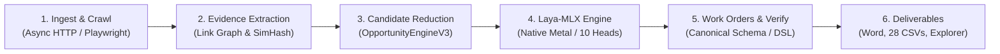

# SEOJEV

A production-hardened, deterministic technical SEO intelligence and automated work-order generation platform powered by local Apple Silicon machine learning inference (`laya-mlx`).

[-black.svg)](docs/ARCHITECTURE.md)
[](docs/LAYA_CONFIDENCE.md)
[](docs/PROJECT_REPORT.md)
[](docs/PROJECT_REPORT.md)

---

## What It Does

Traditional SEO crawlers inundate engineering teams with thousands of unranked, repetitive per-page warnings (e.g., "5,000 pages missing meta description"). **SEOJEV** eliminates this alert fatigue by acting as an end-to-end search intelligence operating system:

1. **Groups pages into structural template families** using 64-bit SimHash DOM token frequencies and route patterns.
2. **Clusters deterministic crawl signals** into upstream root-cause blockers (e.g., a routing 404 suppressing downstream checks) using directed internal link graphs (PageRank/CheiRank) and 11 rule suites.
3. **Executes calibrated machine learning decisions** on an on-device Apple Silicon 4-bit transformer (`laya-mlx`) across 10 multi-task SEO heads.
4. **Emits deduplicated, verifiable work orders** (`WO-ENG-...`, `WO-CNT-...`) with executable acceptance criteria and ticket exports for Jira, Linear, and GitHub Issues.

---

## Architecture



---

## Key Capabilities

- **Deterministic Root-Cause Clustering:** Upstream server errors and global directives suppress repetitive downstream symptoms.
- **Graph-Theoretic Analysis:** NetworkX directed multigraph computing PageRank, CheiRank, click depth, and orphan page isolation.
- **Template Family Miner:** Clusters URLs by structural layout signatures rather than surface-level query strings.
- **Cryptographic Fingerprinting:** Every opportunity receives a permanent SHA-256 fingerprint: $\text{hash}(\text{rule\_id} + \text{scope} + \text{subject})$.
- **Baseline Acceptance DSL:** Sandboxed verification evaluates test specifications against stored crawl HTML before developers write code.
- **Claims Linter:** Deterministic AST/regex quality gate rejecting unsubstantiated ranking or traffic promises.

---

## Laya-MLX Local Inference

**Laya-MLX is the exclusive decision maker in SEOJEV.**
- **Checkpoint:** Pinned HuggingFace checkpoint [`aac6fef/laya-mlx`](https://huggingface.co/aac6fef/laya-mlx) (`@20aed815fc6acde75733882e7ec0e3f28aeb9717`).
- **10 Multi-Task Heads:** Evaluates `verdict`, `category`, `severity`, `action`, `scope`, `root_cause`, `canonical_indexability`, `content_assessment`, `cannibalization`, and `internal_linking` in a single forward pass.
- **Fail-Closed AI Safety:** If Apple Silicon Metal hardware or the pinned checkpoint is missing, the system terminates immediately. **No fallback LLMs, mock models, or heuristic substitutes exist.**
- **Calibrated Gating Policy:** Evaluates selected option probabilities ($\min(P_{\text{verdict}}, P_{\text{action}})$) to route candidates to `AUTO_ACCEPT`, `HUMAN_REVIEW`, or `SUPPRESS`.
- **Exact Prompt Caching:** Re-evaluating identical template prompts yields 0 ms GPU latency via `SQLiteStageStore`.

---

## Production Engineering

- **MemoryGuard & Zero Swap Growth:** Actively monitors process RSS and active swap delta ($\Delta \text{Swap} \le 64\text{ MB}$), pausing runs cleanly for resumable restart on memory pressure.
- **Multi-Tenant Isolation:** Full `organization_id` row-level scoping across all database tables with 20 passing negative authorization tests.
- **SSRF Defense:** Blocks crawling requests to private IP ranges (`10.0.0.0/8`, `172.16.0.0/12`, `192.168.0.0/16`), loopback (`127.0.0.1`), and cloud metadata (`169.254.169.254`).
- **Bounded Redis Queues:** Enforces `max_queue_size` backpressure rejection (`QueueFullError`) and automatic stale job recovery.
- **Standardized Health Probes:** `/health/liveness` for process health; `/health/ready` deep-inspecting PostgreSQL, Redis, MinIO, and Apple Silicon MLX compatibility.

---

## Validation & Empirical Results

All metrics represent measured data from experimental validation runs (documented in `docs/acceptance/`):

- **1,000 Real URLs Validated (Drivio.in):** 266 template families, 2,529 candidates, 1,079 work orders, 0 failed schemas.
- **Zero Swap Growth:** 1,014.48 MiB peak RSS, 0.00 MiB swap delta across all 5 execution passes.
- **Decision Equivalence:** 100.0% choice and gate match (1,207/1,207 candidates) between streaming reducers and baseline worker pools.
- **Safe Submission Batch:** Autotuned safe batch sizes up to **64** candidates with zero swap growth.
- **Idempotency Replay:** 100.0% cache hit rate (50/50 candidates) on restart without GPU execution.
- **Synthetic Defect Benchmark:** 100.0% clean page suppression (184/184 TN, 0 FP); 0.0% recall under frozen production thresholds (documented baseline).

---

## Limitations

- **Apple Silicon Hardware Dependency:** Local inference requires macOS Darwin `arm64` hardware with Metal support (cannot run MLX inside standard Linux Docker on macOS).
- **Scalar Inference Rate:** Inference operates sequentially at ~1.42–1.74 decisions per second (~85–104 decisions/minute).
- **In-Process Evidence Boundary:** Deterministic evidence operates in-process via SQLite/NetworkX (multi-node crawls require future distributed SQL reducers).
- **Synthetic Benchmark Recall:** Generic whole-page synthetic assessment prompts result in 0.0% recall under frozen production thresholds due to conservative suppression.

---

## Documentation

- [**Technical & Research Project Report**](docs/PROJECT_REPORT.md): Comprehensive 26-section paper covering motivation, architecture, ML inference, memory safety, problems encountered, and lessons learned.
- [**System Architecture Specification**](docs/ARCHITECTURE.md): Concise architectural specifications, data flows, storage topology, and failure matrices.
- [**Production Deployment Guide**](docs/PRODUCTION.md): Deployment topologies, `launchd` supervision, environment configurations, and operational runbooks.
- [**Production Readiness Matrix**](docs/PRODUCTION_READINESS.md): Audit matrix and test evidence across all 25 operational dimensions.
- [**Laya Confidence Specification**](docs/LAYA_CONFIDENCE.md): Probability calculations, temperature calibrations, and threshold specifications.

---

## Quick Start

### 1. Prerequisites
- macOS 14+ on Apple Silicon (`arm64`) with 16 GB+ unified memory
- Python 3.11 or 3.12
- PostgreSQL 15+ and Redis 7+

### 2. Setup
```bash
git clone https://github.com/07anishu12/SEO-Agent-using-LAYA.git
cd SEO-Agent-using-LAYA
git checkout fix/laya-pipeline

python3 -m venv .venv
source .venv/bin/activate
pip install -r requirements.txt
playwright install chromium
```

### 3. Run Verification Tests
```bash
# Run Production Hardening test suite (10 tests)
PYTHONPATH=. .venv/bin/pytest tests/test_production_hardening.py -v

# Run Stage 11 Security & Multi-Tenancy suite (20 tests)
PYTHONPATH=. .venv/bin/pytest tests/test_stage11_security.py -v

# Execute End-to-End Production Smoke Test (real MLX inference & work orders)
.venv/bin/python scripts/smoke_test.py
```

### 4. Run CLI Audit
```bash
# Analyze existing crawl data in dev profile (<=500 URLs)
.venv/bin/python main.py https://www.drivio.in/ --crawl-id crawl_20260928_152046 --analyze-only --profile dev
```

---

## Project Status

**SEOJEV v1.0 — FEATURE DEVELOPMENT FROZEN.**  
The repository is complete, production-hardened, and packaged as an authoritative open-source technical and research artifact.
