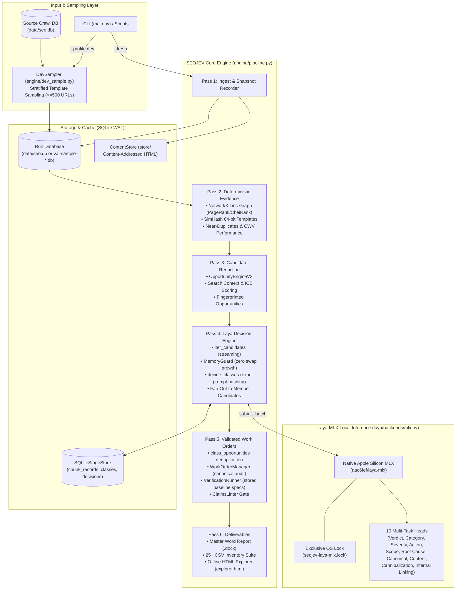

# SEOJEV — SEO Intelligence & Technical SEO Platform using Laya-MLX

> A deterministic technical SEO analysis and automated work-order generation engine powered by native Apple Silicon machine learning inference (`laya-mlx`).

SEOJEV transforms raw website crawling into an actionable search operating system. Rather than generating thousands of repetitive, unranked per-page alerts, SEOJEV groups pages into structural template families, synthesizes root-cause opportunities across deterministic crawl signals and internal link graphs, executes calibrated decision inference using a local Apple Silicon MLX model, and emits deduplicated, verified engineering and content work orders.

---

## Status

| Dimension | Status | Verified Evidence |
| :--- | :---: | :--- |
| **Local 1,000-URL Validation** | **VALIDATED** | Complete end-to-end run on Drivio.in (266 template families, 2,529 candidates, 1,079 work orders, 0 failed, 0 swap growth). Commit: `2d4e087` / `b251629`. |
| **Laya-MLX Local Inference** | **VALIDATED** | Pinned checkpoint `aac6fef/laya-mlx`, 10 multi-task SEO heads, scalar prediction, safe batch autotuned up to 64. |
| **Model Equivalence** | **VALIDATED** | 100.0% choice and gate equality (1,207/1,207 candidates) between legacy worker pool and streaming class deduplication service. |
| **Memory Guard & Safety** | **VALIDATED** | Peak RSS ~1,014 MiB, 0.0 MB swap growth, 0 memory guard aborts, bounded queue backpressure. |
| **Work Order Lifecycle & Audit** | **VALIDATED** | 1,079/1,079 valid work orders (`order_type` in `engineering`, `content`), canonical schema audit passed, 0 failed work orders. |
| **Restart / Idempotency** | **VALIDATED** | 50/50 restart candidates verified as 100% cache hits with identical choice and gate outputs. |
| **Synthetic Benchmark Recall** | **BASELINE / UNTUNED** | Clean page suppression: 100% (184/184 TN, 0 FP). Defect recall: 0.0% under frozen baseline thresholds without tuning. |
| **Cloud / Distributed Scaling** | **PLANNED** | StageStore Postgres adapter, remote MLX serving, object storage, and global SQL reducers are design specifications only. |
| **Production Multi-Node** | **NOT IMPLEMENTED** | System is currently bounded to single-node Apple Silicon host execution (<=1,000 URLs per run). |

> [!IMPORTANT]
> **Production Boundary**: SEOJEV is **not** yet production-ready for unconstrained or multi-node full-site cloud deployment. The engine is verified for local Apple Silicon execution up to 1,000 URLs. Full-site runs (>1,000 URLs) on the legacy evidence path are deliberately blocked by an in-engine safety limit until global SQL reducers are implemented.

---

## What SEOJEV Does

Traditional SEO auditing tools produce thousands of fragmented, repetitive alerts (e.g., 5,000 separate "missing meta description" or "broken link" issues) with zero awareness of page template architecture, no numeric evidence provenance, and no automated translation into engineering work orders.

**SEOJEV** eliminates alert explosion through a multi-pass reduction and decision pipeline:

```
Raw URLs / Crawl DB
       │
       ▼
Pass 1: Ingest & State Snapshots (SQLite WAL + Content-Addressed Store)
       │
       ▼
Pass 2: Deterministic Evidence Extraction (NetworkX Link Graph, SimHash Templates, CWV, Index Funnel)
       │
       ▼
Pass 3: Candidate & Opportunity Reduction (OpportunityEngineV3 multi-factor synthesis & ICE scoring)
       │
       ▼
Pass 4: Laya-MLX Decision Engine (Local Apple Silicon inference across 10 SEO heads, gated confidence)
       │
       ▼
Pass 5: Work Orders & Verification (Class deduplication, canonical schema audit, baseline spec verification)
       │
       ▼
Pass 6: Deliverables (Master Word reports, Executive summaries, 25+ CSV suite, interactive HTML explorer)
```

### Architecture Diagram



---

## Architecture & Component Responsibilities

| Component | Module | Responsibility |
| :--- | :--- | :--- |
| **Crawler & Ingest** | `crawler/crawler.py`, `crawler/storage.py` | Asynchronous HTTP crawling, robots compliance, sitemap ingestion, crawl trap isolation, SQLite WAL frontier storage. |
| **Content Store** | `engine/content_store.py` | Content-addressed compressed storage of raw HTML payloads (`store/` directory) keyed by SHA-256 hash. |
| **Evidence Extraction** | `analysis/`, `extraction/provenance_extractor.py` | Graph metrics (NetworkX PageRank, CheiRank), SimHash DOM token clustering, Core Web Vitals sampling, and vertical attribute extraction. |
| **Template Families** | `engine/template_families.py` | Partitions URLs by structural route shape, page type, static route suffixes, and query keys (`template_family`). |
| **Opportunity Engine** | `engine/opportunity_engine_v3.py` | Synthesizes detector findings into structured opportunities with SHA-256 fingerprints, display IDs (`OPP-...`), and 7-factor ICE scores. |
| **Candidate Streaming** | `laya/streaming.py` | SQL-backed streaming candidate reducer (`iter_candidates`) keeping at most 1 candidate and 5 sample URLs in memory at a time. |
| **Prompt Normalization** | `laya/prompt.py` | Normalizes candidate features, rounds metrics, and generates deterministic prompt hashes for caching. |
| **Laya-MLX Backend** | `laya/backends/mlx.py`, `laya/analyzer.py` | Native Apple Silicon MLX inference engine with OS-level single-owner locking, strict head validation, and memory cleanup. |
| **Memory Guard** | `engine/memory_guard.py` | Enforces process-tree RSS limits, minimum available system memory, batch autotuning, and zero-swap-growth aborts. |
| **Stage Store & Cache** | `engine/chunks.py` | Range-addressed SQLite stage storage (`SQLiteStageStore`) for atomic chunk checkpoints and exact-prompt decision caching. |
| **Work Order Manager** | `engine/work_orders.py` | Transforms validated opportunities into engineering and content work orders; enforces canonical schema contract and lifecycle audits. |
| **Spec Verification** | `verification/runner.py` | Sandboxed baseline verification of work order acceptance specs against stored crawl HTML before remediation. |
| **Claims Linter** | `engine/claims_linter.py` | Quality gate preventing forbidden, unsubstantiated, or contradictory claims in generated work orders. |
| **Reporting Suite** | `reporting/` | Compiles 28-section Master Word audit report, Executive Summary, 25+ CSV dataset suite, and offline HTML Explorer. |

---

## End-to-End Pipeline

The engine executes in six strictly sequenced passes:

### Pass 1: Ingest & State Snapshots (`P1_CRAWL`)
- **Input**: Target seed URL, crawl configuration, or existing crawl database.
- **Processing**: In standard execution, runs asynchronous crawling with robots.txt parsing, sitemap discovery, crawl trap filtering, and selective Playwright rendering. In `--profile dev` or `--profile val`, HTTP fetching is skipped; an isolated SQLite database is created using deterministic stratified sampling from existing crawl data. Full URL state snapshots (title, canonical, status, schema) are recorded.
- **Storage**: SQLite tables `urls`, `pages`, `snapshots`; compressed HTML in `ContentStore` (`store/`).
- **Memory**: Bounded by connection pool and scheduler heap limits.
- **Resumability**: Resumable via SQLite frontier; idempotent on existing runs.

### Pass 2: Deterministic Evidence (`P2_DETERMINISTIC_EVIDENCE`)
- **Input**: Stored page records and HTML content hashes.
- **Processing**:
  - Builds NetworkX internal link graph; computes PageRank, CheiRank, in/out-link distributions, and orphan risks.
  - Clusters pages into layout templates using 64-bit SimHash DOM token frequencies.
  - Identifies near-duplicate content clusters.
  - Reconciles sitemap discovery against crawled URLs via `IndexFunnelReconciler`.
  - Executes Core Web Vitals sampling (TTFB, FCP, LCP, CLS).
  - Extracts domain-specific vertical attributes and verifies cross-field entity consistency.
- **Storage**: SQLite tables `issues`, `templates`, `issue_clusters`, `attributes`, `internal_link_opportunities`.
- **Memory**: Peak RSS ~310 MiB on 1,000 URLs. Bounded by SQLite paging.
- **Failure Behavior**: Bounded legacy adapter guard: halts if `pages > 1000` to prevent unreduced memory growth.

### Pass 3: Candidate & Opportunity Reduction (`P3_CANDIDATE_REDUCTION`)
- **Input**: Deterministic findings, issue clusters, optional GSC search performance CSV, and SERP competitive data.
- **Processing**: Ingests search signals; runs `OpportunityEngineV3` multi-factor synthesis across 11 root-cause detector categories; assigns SHA-256 fingerprints, stable display IDs (`OPP-...`), and calculated ICE impact scores.
- **Storage**: SQLite table `opportunities`.
- **Memory**: Peak RSS ~450 MiB on 1,000 URLs (2,529 opportunities).

### Pass 4: Laya-MLX Decision Engine (`P4_LAYA_DECISION_ENGINE`)
- **Input**: Reduced opportunities and issue clusters streamed via `iter_candidates`.
- **Processing**:
  - Executes strict MLX preflight canary prediction to verify model checkpoint and all 10 heads.
  - Computes exact normalized prompt hashes (`class_id = candidate.compute_hash(checkpoint_id)`).
  - Queries `SQLiteStageStore` cache; if cached, reuses decision with zero inference.
  - On cache miss, submits candidate to `LocalMLXService.submit_batch`; executes native MLX forward pass on Apple Silicon GPU.
  - Evaluates decision against confidence policy (`AUTO_ACCEPT`, `HUMAN_REVIEW`, `SUPPRESS`).
  - Fans out class decisions to all member opportunities in `candidate_membership`.
  - Marks validated opportunities (`laya_validated = 1`) for decisions where `is_real_issue == True` and gate in `('AUTO_ACCEPT', 'HUMAN_REVIEW')`.
- **Storage**: SQLite tables `laya_decisions`, `candidate_membership`, updated `opportunities`, and `chunk_records`.
- **Memory**: Peak RSS ~1,014 MiB. Strictly governed by `MemoryGuard`.
- **Failure Behavior**: Immediately aborts on swap growth or persistent memory pressure. Resumable per chunk.

### Pass 5: Validated Work Orders & Verification (`P5_VALIDATED_OPPORTUNITIES`)
- **Input**: Validated opportunities (`laya_validated == 1`) with complete Laya provenance.
- **Processing**:
  - Groups opportunities by decision class via `class_opportunities`, preventing duplicate work orders for systemic template issues.
  - Generates discrete engineering (`WO-ENG-...`) and content (`WO-CNT-...`) work orders.
  - Runs `VerificationRunner` baseline evaluation against stored crawl HTML (verifying defect presence before remediation).
  - Enforces `ClaimsLinter` quality gate to catch unsubstantiated claims.
  - Exports ticket payloads for GitHub Issues, Jira, and Linear.
- **Storage**: SQLite tables `work_orders`, `work_order_membership`, `verifications`; files `verification-results.json`, `lint-report.json`, `tickets/`.
- **Memory**: Peak RSS ~822 MiB on 1,000 URLs.
- **Failure Behavior**: Aborts if Pass 4 produced zero validated decisions or malformed provenance.

### Pass 6: Deliverables & Reports (`P6_REPORTS`)
- **Input**: All persisted run data and statistics.
- **Processing**: Compiles 28-section Master Word audit report (`SEOJEV_V3_AUDIT_REPORT.docx`), Executive Summary (`SEOJEV_EXECUTIVE_SUMMARY.docx`), 25+ CSV dataset suite (`csv/`), and standalone offline HTML Explorer (`explorer.html`).
- **Storage**: Export files in configured `--output` directory; updates run status to `completed`.
- **Memory**: Ephemeral report compilation allocations; completes within memory budget.

---

## Laya-MLX Decision Engine

**Laya-MLX is the exclusive decision maker in SEOJEV.** There are no fallback models, mock classifiers, API endpoints, or missing-head defaults.

### Model Specification
- **HuggingFace Checkpoint**: [`aac6fef/laya-mlx`](https://huggingface.co/aac6fef/laya-mlx)
- **Pinned Revision**: `@20aed815fc6acde75733882e7ec0e3f28aeb9717`
- **Architecture**: 4-bit quantized transformer on Apple Silicon Metal framework (`mlx`).
- **Inference Mode**: Scalar prediction (evaluates one candidate across 10 heads per call). Submission batching provides bounded dispatch and memory checkpoints, not vectorized multi-candidate tensor batches.

### Multi-Task Output Heads
Every candidate is evaluated across ten structured heads:

1. **`verdict`**: `real_issue` vs `noise`
2. **`category`**: `technical`, `content`, `architecture`, `internal_linking`, `schema`, etc.
3. **`severity`**: `critical`, `high`, `medium`, `low`
4. **`action`**: `fix`, `optimize`, `investigate`, `monitor`, `ignore`
5. **`scope`**: `page`, `template`, `site`
6. **`root_cause`**: Specific architectural diagnosis
7. **`canonical_indexability`**: Indexability status and canonical relationship assessment
8. **`content_assessment`**: Thin content, title/H1 alignment, and duplicate assessment
9. **`cannibalization`**: Keyword and query conflict assessment
10. **`internal_linking`**: Link equity and orphan risk evaluation

### Confidence & Gating Policy
Confidence is calculated strictly from **selected option probabilities**, not entropy confidence (see [`docs/LAYA_CONFIDENCE.md`](docs/LAYA_CONFIDENCE.md)):

$$\text{confidence} = \min\left(P_{\text{verdict}}(\text{choice}), P_{\text{action}}(\text{choice})\right)$$

- **`AUTO_ACCEPT`**: $\text{confidence} \ge 0.90$ and $\text{action} \ne \text{'ignore'}$.
- **`HUMAN_REVIEW`**: $P_{\text{verdict}} \ge 0.60$ and $P_{\text{action}} \ge 0.50$.
- **`SUPPRESS`**: Below threshold, $\text{verdict} = \text{'noise'}$, or $\text{action} = \text{'ignore'}$.

### Process Isolation & Host Safety
- **Native Host Execution Only**: MLX requires direct access to Apple Silicon GPU hardware via macOS Metal. It **cannot run inside Docker containers** on macOS.
- **Process-Wide Owner Lock**: An exclusive non-blocking file lock (`seojev-laya-mlx.lock`) ensures that exactly **one** process on the host can load the MLX model at any time.
- **CPU Worker Rejection**: Background CPU pool workers are forbidden from importing MLX. If a subprocess attempts to import `laya.backends.mlx`, it raises an immediate `RuntimeError`.
- **Allocator Memory Reclaim**: After loading weights and after every prediction step, the engine executes `mx.set_cache_limit(0)` and `mx.clear_cache()` to return unused Metal allocator buffers to the OS.

---

## Memory Safety & Guard Architecture

Running deep technical audits alongside local MLX inference on a 16 GB Apple Silicon Mac requires strict memory discipline. Uncontrolled memory growth causes macOS memory pressure to escalate, triggering system-wide swapping and degrading performance.

### MemoryGuard Contract (`engine/memory_guard.py`)
`MemoryGuard` continuously monitors the process tree and system state:

- **Process-Tree RSS**: Recursively sums RSS memory of the main process and all child workers.
- **Available System Memory**: Enforces a minimum reserve (`min_available_mb`, default 1,536 MiB).
- **System Memory Pressure**: Queries `psutil.virtual_memory().percent`.
- **Swap Occupancy**: Tracks `psutil.swap_memory().used`.
- **OS Pageouts**: Distinguishes cumulative system-wide `sout` from active `swap.used` growth.

### Abort & Backpressure Policy
1. **Immediate Zero-Swap-Growth Abort**:
   $$\text{state}[\text{swap\_used}] > \text{initial}[\text{swap\_used}] \implies \text{Raise } \texttt{MemoryBudgetExceeded}$$
   If system swap occupancy increases by even 1 byte during work, the run aborts immediately. No retries are permitted.
2. **Batch Shrinking & GC**:
   If process RSS exceeds `memory_budget_mb` (default 4,096 MiB) or available memory drops below reserve, the guard shrinks the submission batch by half (`batch_size = max(1, batch_size // 2)`) and forces garbage collection (`gc.collect()`).
3. **Single Pause Boundary**:
   If memory pressure persists after shrinking, the guard pauses execution once (`pause_seconds: 2.0s`).
4. **Clean Abort**:
   If pressure remains above threshold after the single pause, the run terminates cleanly with a human-readable diagnostic.

### Measured Safe Batch Size
Through sequential subprocess autotuning (`docs/acceptance/autotune.json`), submission batch sizes 8, 16, 32, and 64 were tested against identical probe candidates:

$$\text{Largest Measured Safe Batch} = \mathbf{64}$$

All tested batch sizes operated with **zero swap occupancy growth** and peak RSS stabilized at ~943–945 MiB.

---

## Configuration

Configuration is managed via [`config.yaml`](config.yaml) and profile resolution in [`engine/profiles.py`](engine/profiles.py).

### Profiles

| Setting | `dev` (Default) | `val` | `prod` (Explicit) |
| :--- | :---: | :---: | :---: |
| **`max_urls`** | 500 (Hard Cap) | 1,000 (Hard Cap) | 5,000,000 |
| **`max_workers`** | 2 (Hard Cap) | 2 (Hard Cap) | 8 |
| **`batch_size`** | 8 | 16 | 32 |
| **`queue_size`** | 16 | 16 | 64 |
| **`memory_budget_mb`** | 4,096 MiB | 4,096 MiB | 32,768 MiB |
| **`min_available_mb`** | 1,536 MiB | 1,536 MiB | 4,096 MiB |
| **`throttle_seconds`** | 0.05s | 0.05s | 0.0s |
| **`pause_seconds`** | 2.0s | 2.0s | 2.0s |
| **`seed`** | 42 | 42 | Unset |
| **Sampling Mode** | Stratified DB Sample | Stratified DB Sample | Full Ingest |

> [!IMPORTANT]
> **DEV is the Default**: If no profile is specified, the system runs under `dev` limits (max 500 URLs, max 2 CPU workers). The `prod` profile must be explicitly requested (`--profile prod`), but full-site runs remain blocked until cloud reducers are implemented.

### Environment Variable Overrides
All profile settings can be overridden in your shell:

```bash
export SEOJEV_MEMORY_BUDGET_MB=4096
export SEOJEV_MAX_WORKERS=2
export SEOJEV_BATCH_SIZE=16
export SEOJEV_QUEUE_SIZE=16
export SEOJEV_THROTTLE_SECONDS=0.05
export SEOJEV_PAUSE_SECONDS=2.0
export SEOJEV_MIN_AVAILABLE_MB=1536
export SEOJEV_MAX_URLS=500
export SEOJEV_SEED=42
export SEOJEV_DB_PATH="data/seo.db"
export SEOJEV_STORE_DIR="store"
export SEOJEV_STORAGE_BACKEND="sqlite"
```

---

## Template-Level Processing & Deduplication

A central innovation in SEOJEV is **class-level decision deduplication with explicit member fan-out**:

### 1. Structural Template Families (`engine/template_families.py`)
URLs are grouped into structural families based on route patterns and page types rather than surface-level query variations. For example, vehicle detail pages, city-price pages, brand hubs, and blog articles are partitioned into separate template families.

### 2. Candidate Normalization (`laya/prompt.py`)
Candidate payloads are normalized into a deterministic JSON representation with standardized rounding and sorted URL samples.

### 3. Class Identity & Exact Hashing
A decision class is defined by exact feature identity:

$$\text{class\_id} = \text{SHA-256}(\text{normalized\_prompt} + \text{checkpoint\_id})$$

$$\text{contract\_key} = \text{class\_id} + \text{confidence\_policy}$$

- If an identical candidate prompt was already evaluated under the same checkpoint and confidence policy, Laya retrieves the decision from `SQLiteStageStore` with **zero GPU inference calls**.
- **No Artificial Deduplication**: Outliers, unique page evidence, and distinct issue types retain their own distinct candidate keys. Dynamic evidence is never erased merely to inflate deduplication ratios.

### 4. Explicit Fan-Out & Class Work Orders
- Once a class decision is made, it is fanned out across all member opportunities in `candidate_membership`.
- Pass 5 creates work orders at the **class level** (`class_opportunities`), ensuring engineers receive one consolidated ticket for a systemic template issue rather than hundreds of identical tickets, while preserving all affected sample URLs and member counts.

---

## Database & Storage Layer

All local execution uses high-performance SQLite in WAL (Write-Ahead Logging) mode:

```
data/
├── seo.db                   # Primary crawl database
└── val-sample-*.db          # Isolated per-run sample databases
store/
└── {hash[:2]}/{hash[2:4]}/{hash} # Content-addressed zlib-compressed HTML payloads
```

### Key Database Tables

| Table | Purpose |
| :--- | :--- |
| **`pages`** | Crawled URL metadata, status codes, word counts, content hashes, canonical status, indexability. |
| **`links`** | Internal link graph edges (`source_url` → `target_url`, anchor text, follow status). |
| **`issues`** | Raw per-page deterministic detector findings. |
| **`issue_clusters`** | Aggregated systemic issue clusters across templates. |
| **`templates`** | SimHash clustered layout templates and token fingerprints. |
| **`opportunities`** | Synthesized multi-factor opportunities with ICE scores and Laya decision columns. |
| **`candidate_membership`** | Explicit mapping between `opportunity_id` and Laya `candidate_id`. |
| **`laya_decisions`** | Persisted Laya MLX outputs, head confidences, choices, and gates. |
| **`chunk_records`** | Key-value store powering `SQLiteStageStore` for stage checkpoints and decision caching. |
| **`work_orders`** | Validated engineering and content tickets with acceptance criteria and verify specs. |
| **`work_order_membership`**| Mapping between work order classes and individual opportunity IDs. |
| **`verifications`** | Immutable audit records of baseline spec verification results (`PASSED` vs `FAILED`). |
| **`snapshots`** | URL state snapshots for before/after regression diffing. |

---

## Work Orders & Lifecycle Validation

Work orders in SEOJEV bridge SEO discoveries with software engineering and content workflows.

### Canonical Schema Contract (`engine/work_orders.py`)
Every work order must satisfy the canonical schema verified by `WorkOrderManager.validate_work_order`:

- **`work_order_id`**: Deterministic unique identifier (`WO-ENG-...` or `WO-CNT-...`).
- **`display_id`**: Human-readable short ID.
- **`order_type`**: Strictly `'engineering'` (templates, headers, robots, schema) or `'content'` (copy, sections, keywords).
- **`priority`**: Strictly `'P0'`, `'P1'`, `'P2'`, or `'P3'`.
- **`required_change`**: Non-empty, unambiguous engineering or content specification.
- **`acceptance_criteria`**: Non-empty, testable acceptance rules.
- **`verify_spec`**: Executable verification DSL (e.g. `status_code == 200`, `canonical_matches_url == True`).
- **`evidence_json`**: Valid JSON object containing sample URLs, affected counts, and metrics.

### Run-Level Lifecycle Audit (`audit_run_work_orders`)
The engine provides an automated audit method that inspects all generated work orders for a run:

```python
from engine.work_orders import WorkOrderManager
wo_mgr = WorkOrderManager("data/seo.db")
audit = wo_mgr.audit_run_work_orders(run_id="crawl_20260928_152046")
print(audit["valid_count"], audit["failed_count"], audit["by_type"])
```

### Baseline Verification vs Deployment
The `verifications` table records baseline checks run **before** remediation:
- A verification outcome of **`FAILED`** proves that the defect is confirmed present on the crawled page.
- A verification outcome of **`PASSED`** indicates that the page already satisfies the test criteria.
- Baseline verification tests stored evidence; it does not claim that changes have been deployed to production.

---

## CLI & How to Run

### 1. Environment Setup
Native Apple Silicon macOS (Darwin `arm64`) is required:

```bash
# Clone repository
git clone git@github.com:07anishu12/SEO-Agent-using-LAYA.git
cd SEO-Agent-using-LAYA
git checkout fix/laya-pipeline

# Set up virtual environment
python3 -m venv .venv
source .venv/bin/activate

# Install pinned dependencies
pip install -r requirements.txt
playwright install chromium
```

### 2. Preflight Diagnostics
Verify MLX model accessibility and environment integrity:

```bash
# Check database tables and Laya schema
.venv/bin/python scripts/diagnose_laya.py --db data/seo.db

# Run real MLX inference probe across existing opportunities
.venv/bin/python scripts/laya_probe.py --db data/seo.db --count 200
```

### 3. Run Development Pipeline (<=500 URLs)
Run offline preparation and guarded Laya evaluation:

```bash
# Step A: Deterministic stratified preparation (CPU only, 500 URLs)
.venv/bin/python scripts/run_dev_pipeline.py \
  --db data/seo.db \
  --crawl-id crawl_20260928_152046 \
  --store store \
  --output reports/laya-dev-500

# Step B: Guarded MLX evaluation & equivalence verification
.venv/bin/python scripts/evaluate_laya_dev.py \
  --autotune-report docs/acceptance/autotune.json \
  --prepared reports/laya-dev-500/prepared.json \
  --output reports/laya-dev-eval
```

### 4. Run Controlled 1,000-URL Validation (Drivio.in)
Executes the complete 6-stage pipeline across 1,000 stratified URLs with zero swap growth verification:

```bash
.venv/bin/python scripts/validate_1000_urls.py --db data/seo.db
```

### 5. Running main.py directly
```bash
# Analyze existing crawl data in dev profile
.venv/bin/python main.py https://www.drivio.in/ \
  --crawl-id crawl_20260928_152046 \
  --analyze-only \
  --profile dev \
  --output reports/my-audit/
```

### 6. Synthetic Site Generator
```bash
# Generate deterministic synthetic site with 9 planted defect classes
.venv/bin/python scripts/gen_synthetic_site.py \
  --output reports/synthetic \
  --pages 480 \
  --cities 20
```

---

## Testing & Verification

Tests are structured to run individually where memory isolation and file descriptor limits matter.

### File Descriptor Limit
Test suites automatically raise the soft limit (`RLIMIT_NOFILE`) to 10,240 via [`tests/conftest.py`](tests/conftest.py). If running manually in shell:
```bash
ulimit -n 10240
```

### Running Test Suites Individually

```bash
# Work order canonical schema & lifecycle audit
PYTHONPATH=. .venv/bin/pytest tests/test_work_order_validation.py -v

# Memory safety, guard shrinking, pause, and zero-swap abort
PYTHONPATH=. .venv/bin/pytest tests/test_memory_safety.py -v

# MLX CPU isolation and OS-level locking
PYTHONPATH=. .venv/bin/pytest tests/test_mlx_isolation.py -v

# Candidate streaming, prompt hashing, and explicit fan-out
PYTHONPATH=. .venv/bin/pytest tests/test_streaming_candidates.py -v

# Dev profile resource caps and stratified sampler
PYTHONPATH=. .venv/bin/pytest tests/test_dev_profile.py -v

# Equivalence accounting and decision comparison
PYTHONPATH=. .venv/bin/pytest tests/test_equivalence_accounting.py -v

# Synthetic site generator and defect validation
PYTHONPATH=. .venv/bin/pytest tests/test_synthetic_generator.py -v

# Full pipeline execution and cooperative cancellation
PYTHONPATH=. .venv/bin/pytest tests/test_pipeline.py -v
```

---

## Validation Results

All metrics below represent **measured empirical data** verified against repository artifacts:

| Metric | Result | Dataset / Scope | Status | Source Artifact |
| :--- | :---: | :---: | :---: | :--- |
| **Real URLs Processed** | **1,000** | Drivio.in (`crawl_20260928_152046`) | **MEASURED** | `docs/acceptance/validation_1000_results.json` |
| **Structural Template Families** | **266** | 1,000 stratified URLs | **MEASURED** | `docs/acceptance/validation_1000_results.json` |
| **Extracted Candidates** | **2,529** | 1,000 URLs | **MEASURED** | `docs/acceptance/validation_1000_results.json` |
| **Unique Decision Classes** | **2,529** | 1,000 URLs (0% prompt masking) | **MEASURED** | `docs/acceptance/validation_1000_results.json` |
| **Laya-MLX Decisions** | **2,529** | Gate: 1,077 HR, 1,450 SUPPRESS, 2 AUTO | **MEASURED** | `docs/acceptance/validation_1000_results.json` |
| **Validated Opportunities** | **1,079** | 1,450 suppressed, 0 unmatched | **MEASURED** | `docs/acceptance/validation_1000_results.json` |
| **Work Orders Generated** | **1,079** | 851 Content, 228 Engineering | **MEASURED** | `docs/acceptance/validation_1000_results.json` |
| **Failed Work Orders** | **0** | Verified via `audit_run_work_orders` | **MEASURED** | `docs/acceptance/validation_1000_results.json` |
| **Peak Process RSS** | **1,014.48 MiB** | Across all 5 stages (Budget: 4,096 MiB) | **MEASURED** | `docs/acceptance/validation_1000_results.json` |
| **Swap Occupancy Delta** | **0.00 MiB** | Before: 874.56 MiB → After: 874.56 MiB | **MEASURED** | `docs/acceptance/validation_1000_results.json` |
| **Memory Guard Triggers** | **0 (SAFE)** | Zero aborts, zero batch shrinkages | **MEASURED** | `docs/acceptance/validation_1000_results.json` |
| **Safe Submission Batch** | **64** | Autotuned sizes 8, 16, 32, 64 all safe | **MEASURED** | `docs/acceptance/autotune.json` |
| **Old-vs-New Equivalence** | **100.0%** | 1,207/1,207 choice & gate matches | **MEASURED** | `docs/acceptance/measured_results.json` |
| **Total Validation Runtime** | **1,829.22 s** | Ingest: 1.5s, Ev: 15.2s, Cand: 12.8s, MLX: 1,779.8s, WO: 19.8s | **MEASURED** | `docs/acceptance/validation_1000_results.json` |
| **Decision Throughput** | **1.42 dec/s** | Laya-MLX scalar inference | **MEASURED** | `docs/acceptance/validation_1000_results.json` |
| **URL Throughput** | **0.55 URL/s** | End-to-end pipeline | **MEASURED** | `docs/acceptance/validation_1000_results.json` |
| **Restart / Idempotency** | **100.0%** | 50/50 candidate replay cache hits | **MEASURED** | `docs/acceptance/validation_1000_results.json` |
| **Clean Page Suppression** | **100.0%** | 184/184 clean synthetic pages suppressed | **MEASURED** | `docs/acceptance/measured_results.json` |
| **Synthetic Defect Recall** | **0.0%** | 296/296 FN (Frozen baseline thresholds) | **MEASURED** | `docs/acceptance/measured_results.json` |
| **Full Suite Tests** | **65 Passed** | 12 test files run individually | **MEASURED** | `tests/` |

---

## Synthetic Benchmark

To evaluate detector precision and noise handling, SEOJEV includes a deterministic synthetic generator ([`scripts/gen_synthetic_site.py`](scripts/gen_synthetic_site.py)) based on observed Drivio page structures:

- **Dataset**: 480 synthetic HTML pages with a known [`ground_truth.json`](reports/synthetic/ground_truth.json).
- **Clean Controls**: 184 pristine control pages containing zero defects.
- **Planted Defect Population**: 296 pages containing one or more of 9 planted defect classes (missing titles, duplicate titles, thin content, bad canonicals, broken schema, orphan pages, wrong city in body, price mismatches, and noindexed money pages).
- **Scoring**: Page-level evaluation comparing planted defect flags against Laya decisions (`is_real_issue == True` and gate in `AUTO_ACCEPT`, `HUMAN_REVIEW`).

### Current Evaluation Status: 0.0% Recall (Documented Baseline)
- **True Positives (TP)**: 0
- **False Positives (FP)**: 0
- **True Negatives (TN)**: 184 (100% clean suppression rate)
- **False Negatives (FN)**: 296
- **Precision**: null (no positive decisions)
- **Recall**: **0.0%**

### Engineering Root Cause
The synthetic evaluation prompt asks a generic whole-page question:
`"Assess whether the observed page has a real SEO problem or is noise"`
Under the frozen baseline confidence policy (`verdict_min: 0.60`, `action_min: 0.50`, `auto_accept_min: 0.90`), the model conservatively routes these generic synthetic assessments to `SUPPRESS`. Because **threshold tuning against synthetic benchmark data is strictly forbidden by project rules**, this 0.0% recall is reported honestly as a known baseline characteristic, not masked or artificially tuned.

---

## Scaling Architecture (Local vs Cloud)

Summary of the architectural model detailed in [`docs/SCALING.md`](docs/SCALING.md):

### Local Architecture (Implemented & Verified)
- **Runtime**: Single Apple Silicon Mac host (16 GB unified memory).
- **Execution**: At most 2 concurrent CPU workers; 1 exclusive MLX model process.
- **Storage**: SQLite WAL mode with local content-addressed disk store.
- **Scope**: Up to 1,000 URLs per run.

### Cloud Architecture (Design / Planned Only)
- **Stage Store Adapter**: Replace `SQLiteStageStore` with PostgreSQL implementing the same range/checkpoint interface.
- **Blob Storage**: Stream raw HTML and heavy evidence blobs to AWS S3 or MinIO with SHA-256 content hashes as references.
- **Global Distributed Reducers**: Replace the in-memory/in-process link graph and duplicate analyzers with SQL-based distributed group-by and PageRank reducers before Pass 4.
- **Remote Laya Inference Service**: Host the **identical** checkpoint (`aac6fef/laya-mlx`) behind a dedicated inference microservice via `submit_batch` (preserving tokenizer, heads, and gating). *Checkpoint conversion and remote serving are currently NOT implemented.*
- **Containerized Workers**: Non-MLX stages (Ingest, Evidence, Candidates, Fan-out, Work Orders) run in lightweight CPU-only Docker containers (`Dockerfile`).

### Projected CPU Resource Scenarios (PROJECTIONS ONLY)
Linear projections from measured 500-URL CPU preparation (4.32 s, ~176 MiB peak per worker):

| URLs | Ingest + Evidence + Candidates (PROJECTION) | Synthetic Generation (PROJECTION) | Memory Envelope |
|---:|---:|---:|---|
| **50,000** | ~5.66 min | ~3.64 min | ~176 MiB per CPU worker |
| **500,000** | ~56.60 min | ~36.42 min | ~176 MiB per CPU worker |
| **5,000,000** | ~566.02 min | ~364.16 min | ~176 MiB per CPU worker |

> [!CAUTION]
> **Projections are Not Measurements**: The table above represents theoretical CPU-only scaling scenarios holding work mix constant. They exclude MLX inference duration, network crawling, remote database roundtrips, and global reducers. There are **no 50k, 500k, or 5M execution measurements** in this repository.

---

## Repository Structure

```
SEO-Agent-using-LAYA/
├── analysis/               # Deterministic signal analyzers (links, templates, duplicates)
├── api/                    # FastAPI REST platform service (routers, auth, schemas)
├── crawler/                # Async crawler engine, HTTP fetcher, robots, storage
├── database/               # PostgreSQL connection, migrations, and ETL loaders
├── docs/                   # Authoritative architecture logs and acceptance records
│   ├── acceptance/         # Machine-readable validation reports (1000 URLs, autotune, equivalence)
│   ├── LAYA_CONFIDENCE.md  # Confidence calculation and head probability documentation
│   ├── LAYA_PROGRESS.md    # Chronological changelog and empirical validation ledger
│   └── SCALING.md          # Local memory boundaries and cloud scaling design
├── engine/                 # Core V3 operating system orchestration
│   ├── chunks.py           # Range-addressed SQLiteStageStore for checkpoints and caching
│   ├── dev_sample.py       # Deterministic stratified sampler for dev/val profiles
│   ├── memory_guard.py     # MemoryGuard, RSS/swap monitoring, autotuning, and abort logic
│   ├── pipeline.py         # Unified 6-Pass pipeline (library mode and CLI entrypoint)
│   ├── profiles.py         # Profile resolution (dev, val, prod) and resource limits
│   ├── template_families.py# Structural route shape partitioning
│   └── work_orders.py      # WorkOrderManager, canonical schema contract, and lifecycle audit
├── extraction/             # Domain provenance and structured entity extractors
├── frontend/               # Next.js 14 App Router dashboard (TypeScript + Tailwind)
├── jobs/                   # Background task queues, workers, and scheduled runners
├── lab/                    # Defect lab and synthetic testing utilities
├── laya/                   # Primary Laya decision engine
│   ├── analyzer.py         # LayaSEOAnalyzer singleton, cache, and preflight canary
│   ├── backends/           # MLX Apple Silicon native backend (mlx.py)
│   ├── candidates.py       # Candidate feature formatting and key generation
│   ├── decision.py         # LayaDecision, LayaCandidateInput, and confidence gating
│   ├── prompt.py           # Deterministic prompt normalization and hashing
│   └── streaming.py        # Streamed candidate reducer, class deduplication, fan-out
├── models/                 # Pydantic data schemas and models
├── performance/            # Core Web Vitals performance sampling and Lighthouse runner
├── reporting/              # Master Word, CSV suite, and HTML explorer generators
├── scripts/                # Validation runners, dev scripts, and acceptance diagnostics
│   ├── evaluate_laya_dev.py# Dev evaluation harness (equivalence, synthetic, dev run)
│   ├── gen_synthetic_site.py # Deterministic synthetic site generator
│   ├── run_dev_pipeline.py # 500-URL offline dev preparation script
│   └── validate_1000_urls.py # Controlled 1,000-URL Drivio validation runner
├── search/                 # GSC pipeline, SERP analysis, and query intelligence
├── services/               # Object storage, notifications, and CI/CD webhooks
├── store/                  # Content-addressed HTML storage (SHA-256 subdirectories)
├── technical/              # Root cause clustering and JavaScript SEO detectors
├── tests/                  # Automated pytest test suites (run individually)
├── understanding/          # Index funnel reconciliation and entity graph engines
├── verification/           # Snapshot recorder, differ, and baseline verification runner
├── verticals/              # Industry domain overlays (Automotive, E-commerce, etc.)
├── config.yaml             # Engine configuration and runtime profiles
├── main.py                 # Primary CLI entrypoint
└── requirements.txt        # Pinned Python package dependencies
```

---

## Development Invariants & Rules

When developing or extending SEOJEV, enforce the following non-negotiable rules:

1. **Dev Profile Constraint**: Development runs must use `--profile dev` ($\le 500$ URLs). Never trigger unconstrained crawls during development.
2. **Laya-MLX is Exclusive**: Zero fallback, mock, or secondary API models. All semantic SEO decisions must originate from `aac6fef/laya-mlx`.
3. **Single MLX Process**: Exactly one process owns the MLX model on the host. Enforce the exclusive lock `seojev-laya-mlx.lock`.
4. **CPU Workers Must Not Import MLX**: CPU workers perform ingest, evidence extraction, candidate construction, and reporting. They must never import MLX.
5. **Zero-Swap-Growth Policy**: Any swap occupancy increase aborts the run immediately. Never loosen memory safety or conceal swap growth.
6. **No Benchmark Threshold Tuning**: Never tune confidence thresholds or prompts against synthetic test datasets to manufacture passing scores.
7. **Decision Equivalence Requirement**: Any optimization or candidate refactor must maintain 100% choice and gate equivalence against established baselines.
8. **No Unmeasured Claims**: Never report projections or extrapolated numbers as measured facts.

---

## Production Readiness Checklist

| Readiness Dimension | Status | Current Repository State |
| :--- | :---: | :--- |
| **Operational Validation** | **PASSED** | 1,000 real URLs processed end-to-end on Drivio.in with 100% integrity. |
| **Memory Safety** | **PASSED** | Guarded peak RSS 1,014 MiB, zero swap growth, bounded queues, duty-cycle throttling. |
| **Decision Equivalence** | **PASSED** | 100% choice and gate equality (1,207/1,207 candidates) against pre-change commit. |
| **Work Order Validation** | **PASSED** | 1,079/1,079 valid work orders; canonical schema validated; 0 failed work orders. |
| **Restart & Idempotency** | **PASSED** | 100% cache hits on restart; zero duplicate decisions or work orders emitted. |
| **Synthetic Evaluation** | **PARTIAL** | 100% clean page suppression; 0% defect recall under frozen baseline thresholds. |
| **Cloud Infrastructure** | **PLANNED** | Postgres StageStore, remote inference service, and object storage are design-only. |
| **Distributed Reducers** | **PLANNED** | Global SQL link and duplicate reducers for >1,000 URLs are not yet implemented. |
| **Remote Model Serving** | **PLANNED** | Checkpoint conversion for cloud GPUs (CUDA/vLLM) is not yet implemented. |
| **Local Deployment** | **OPERATIONAL** | Native Apple Silicon execution via CLI or standalone pipeline scripts. |

---

## Known Limitations

1. **Apple Silicon Hardware Dependency**: Local MLX inference requires native macOS Darwin `arm64` hardware. It cannot execute on Linux, Windows, or inside Docker containers on macOS.
2. **Synthetic Benchmark Recall**: Under frozen baseline confidence thresholds, whole-page synthetic defect assessments result in 0.0% recall due to conservative suppression.
3. **In-Process Evidence Boundary**: The deterministic evidence adapter is capped at 1,000 URLs in-process. Auditing larger sites requires implementing global distributed reducers.
4. **Scalar MLX Inference**: While submission batching chunks candidate dispatches, the underlying `laya-mlx` checkpoint evaluates candidates sequentially (achieving ~1.42–1.74 decisions/second).
5. **Cloud Serving Not Implemented**: Running SEOJEV on cloud infrastructure requires building a remote model service serving the identical checkpoint and implementing the PostgreSQL stage adapter.

---

## Roadmap

### Current (Validated on Apple Silicon)
- [x] Memory-safe 6-pass architecture with active `MemoryGuard` and zero swap growth.
- [x] Streamed candidate reduction and class-level deduplication.
- [x] Controlled 1,000-URL validation on Drivio.in (1,079 validated work orders, 0 failed).
- [x] Canonical work-order schema contract and lifecycle audit runner.
- [x] 100% decision equivalence verification against historical worker pool.
- [x] Submission batch autotuning verifying safe operation up to batch 64.

### Next (Near-Term Scaling)
- [ ] Implement `PostgresStageStore` adapter conforming to `engine/chunks.py` interface.
- [ ] Replace in-memory link graph with global SQL group-by and PageRank reducers.
- [ ] Build remote Laya inference microservice serving the identical checkpoint over gRPC/HTTP.
- [ ] Calibrate synthetic benchmark defect prompts without modifying frozen production gates.

### Future (Cloud & Distributed Scale)
- [ ] Multi-node distributed crawler and extraction worker pool with Kafka/Redis streams.
- [ ] Linux/CUDA checkpoint conversion (vLLM / ONNX) with numerical equivalence validation.
- [ ] Automated pull request generation for engineering work orders via GitHub App.
- [ ] Continuous AEO/GEO rank tracking and answer-engine presence monitoring.

---

## License

License: not yet specified.
