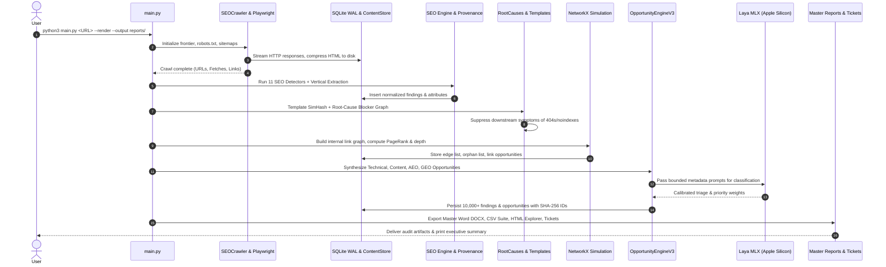
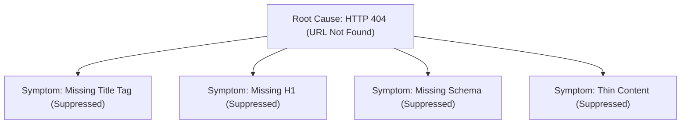

# SEOJEV — Deep System Architecture & Technical Design

**Document Version:** 3.0.0  
**Scope:** Architecture, Core Subsystems, Data Models, Pipeline Lifecycle, Storage, and AI Integration  
**Primary Repository:** `/Users/anny/Desktop/seojev`

---

## 1. Executive Summary: What SEOJEV Does

**SEOJEV** is a unified **Search Intelligence Operating System**. Unlike conventional SEO crawlers that merely output shallow lists of broken links or missing meta descriptions, SEOJEV models the entire structural, semantic, and commercial reality of a website. It connects:

$$\text{Website} \to \text{Template} \to \text{Page} \to \text{Entity} \to \text{Query} \to \text{SERP} \to \text{Link Graph} \to \text{AEO/GEO} \to \text{Actionable Work Orders}$$

### Primary Problem Solved
Traditional enterprise audits suffer from three critical flaws:
1. **Alert Fatigue:** Ten thousand 404 errors or missing tags are reported as independent issues, when in reality 99% of them stem from a single upstream routing bug or a shared layout template.
2. **Predictive Hallucination & Vague Advice:** Agencies and automated tools make unfounded promises ("Do this to rank #1") without verifiable evidence.
3. **Execution Gap:** Recommendations lack developer-ready context (CSS selectors, exact line numbers, code snippets, git/jira work orders).

SEOJEV solves this by implementing **Deterministic Root-Cause Clustering**, an **Evidence Ledger**, **Strict Claims Linting**, and **Automated Work-Order Generation** backed by on-device Apple Silicon AI inference.

---

## 2. Core Architectural Principles & Non-Negotiables

SEOJEV is built under strict operational contracts:

1. **Epistemic Honesty & No Ranking Guarantees:**
   - Strict prohibition of predictive ranking or traffic promises.
   - Allowed vocabulary: *observed problem, evidence-backed hypothesis, recommended action, measurable post-change outcome, scenario*.
   - A deterministic AST/regex **Claims Linter** ([`engine/claims_linter.py`](file:///Users/anny/Desktop/seojev/engine/claims_linter.py)) acts as a final quality gate, rejecting non-compliant reports.

2. **Claim Typing (`OBSERVED`, `DERIVED`, `INFERRED`, `HYPOTHESIS`):**
   - Every metric or finding in the system is explicitly categorized so users know whether a data point is a raw fact, a calculated statistic, an ML classification, or a proposed experiment.

3. **Cryptographic Fingerprinting & Display IDs:**
   - Every issue receives a permanent SHA-256 fingerprint: $\text{hash}(\text{rule\_id} + \text{scope} + \text{subject})$.
   - Human-readable display IDs (e.g. `ENG-SEO-001`, `CONTENT-SEO-042`) provide stable references across crawls and ticketing tools ([`engine/id_system.py`](file:///Users/anny/Desktop/seojev/engine/id_system.py)).

4. **Universal Baseline with Zero Core Hardcoding:**
   - The engine audits any URL out of the box (`python3 main.py https://example.com/`).
   - Domain-specific expertise is isolated cleanly in [`verticals/`](file:///Users/anny/Desktop/seojev/verticals) plugins (e.g., Automotive, YMYL Finance, E-commerce).

5. **Strict 2.0 GB Memory Ceiling & Streaming:**
   - Raw HTML payloads are never retained in RAM. They are compressed with `zlib`/`zstd` and offloaded to a content-addressed disk store ([`store/`](file:///Users/anny/Desktop/seojev/store)).
   - A background memory monitor ([`engine/memory_guard.py`](file:///Users/anny/Desktop/seojev/engine/memory_guard.py)) samples dynamic RSS and triggers garbage collection and stream flushing if memory reaches 80% of the ceiling.

---

## 3. The Six-Layer Intelligence Architecture

SEOJEV structures all logic into six hierarchical layers plus a cross-cutting evidence ledger:

```
┌────────────────────────────────────────────────────────────────────────┐
│ L6: CALIBRATION   - MLX classification, feedback loop, detector tuning │
├────────────────────────────────────────────────────────────────────────┤
│ L5: VERIFICATION  - Executable test specs, snapshots, diffing, watch   │
├────────────────────────────────────────────────────────────────────────┤
│ L4: ACTION        - Developer work orders (ENG/CONTENT), Jira/Linear   │
├────────────────────────────────────────────────────────────────────────┤
│ L3: OPPORTUNITY   - ICE prioritization (Impact, Confidence, Effort)    │
├────────────────────────────────────────────────────────────────────────┤
│ L2: DIAGNOSIS     - Deterministic rules, root causes, graph simulation │
├────────────────────────────────────────────────────────────────────────┤
│ L1: OBSERVATION   - Crawl, raw fetches, DOM, GSC, SERP, AI citations   │
├────────────────────────────────────────────────────────────────────────┤
│ ❖ CROSS-CUTTING EVIDENCE LEDGER & NUMERIC PROVENANCE ENGINE            │
└────────────────────────────────────────────────────────────────────────┘
```

### Layer Details

| Layer | Name | Modules | Responsibilities | Output Entities |
| :--- | :--- | :--- | :--- | :--- |
| **L1** | **Observation** | `crawler/`, `search/`, `performance/`, `store/` | Asynchronous crawling, HTTP fetching, selective Playwright rendering, robots.txt, sitemaps, GSC ingestion, Core Web Vitals sampling, compressed HTML storage. | `urls`, `fetches`, `pages`, `links`, `gsc_rows`, `serp_snapshots` |
| **L2** | **Diagnosis** | `seo/`, `analysis/`, `understanding/`, `technical/`, `simulation/` | 11 SEO detector suites, DOM SimHash template clustering, programmatic family detection, NetworkX link graph (PageRank, click depth, orphans), root-cause blocker clustering, entity consistency validation. | `templates`, `findings`, `issue_clusters`, `root_causes`, `entities` |
| **L3** | **Opportunity** | `engine/opportunity_engine_v3.py`, `engine/priority_model.py` | Multi-factor ICE prioritization, opportunity synthesis across technical, architecture, AEO, GEO, and search fit. | `opportunities` (with SHA-256 fingerprints) |
| **L4** | **Action** | `engine/work_orders.py`, `reporting/ticket_adapters.py` | Translating opportunities into concrete engineering tickets, exact CSS selectors, code replacement snippets, content recipes. | `work_orders`, `github_issues.json`, `jira_import.json`, `linear_import.json` |
| **L5** | **Verification** | `verification/` | Snapshot recording, diffing (FIXED vs REGRESSED), difference-in-differences experiment cohorts, scheduled site monitor. | `snapshots`, `snapshot_diffs`, `experiments` |
| **L6** | **Calibration** | `laya/`, `lab/`, `engine/claims_linter.py` | Local Apple Silicon MLX inference (`aac6fef/laya-mlx`), synthetic 16-defect lab testbench, claims linter. | `laya_decisions`, `detector_stats`, `lint-report.json` |
| **Ledger** | **Evidence & Provenance** | `engine/evidence.py`, `engine/provenance.py` | Mapping every claim to a specific byte/selector/query ID; mapping report figures to SQL query provenance. | `evidence`, `numeric_provenance` |

---

## 4. End-to-End Pipeline Lifecycle

The complete execution lifecycle within [`main.py`](file:///Users/anny/Desktop/seojev/main.py) proceeds through the following sequential phases:



---

## 5. Storage Architecture & High-Scale Design

To crawl and analyze 10,000+ pages on standard developer hardware without memory exhaustion, SEOJEV utilizes a hybrid storage architecture:

### 1. SQLite in WAL Mode
- Located at `data/seo.db`.
- Configured with:
  ```sql
  PRAGMA journal_mode = WAL;
  PRAGMA synchronous = NORMAL;
  PRAGMA cache_size = -64000; -- 64 MB page cache
  PRAGMA temp_store = MEMORY;
  ```
- **Migration Strategy:** Versioned migrations in [`crawler/migrations/`](file:///Users/anny/Desktop/seojev/crawler/migrations) execute automatically on startup, preserving legacy crawl histories while creating V3 tables.

### 2. Content-Addressed Compressed Store ([`engine/content_store.py`](file:///Users/anny/Desktop/seojev/engine/content_store.py))
- Raw HTML is never saved into SQLite blobs or held in memory.
- Pages are hashed via SHA-256 and stored in a two-level directory tree:
  `store/<hash[0:2]>/<hash[2:]>.gz`
- Uses `zlib` (standard library) with automatic upgrade to `zstandard` if available.
- Decompresses on-demand in streaming mode during signal extraction.

### 3. Memory Guard Watchdog ([`engine/memory_guard.py`](file:///Users/anny/Desktop/seojev/engine/memory_guard.py))
- Reads live RSS via `ps -o rss=` (macOS/Linux) to track true process memory.
- Enforces a 2.0 GB ceiling.
- When memory crosses 1.6 GB (80%), it automatically flushes unwritten buffers, forces `gc.collect()`, and switches SQLite queries from bulk buffers to incremental generators.

---

## 6. Deep Dive: Key Subsystems & Components

### 6.1 Crawler & Rendering Engine (`crawler/`)
- **Polite Asynchronous Scheduler:** Token-bucket rate limiting per host, configurable concurrency (default: 10), and random jitter.
- **Trap Detection ([`crawler/traps.py`](file:///Users/anny/Desktop/seojev/crawler/traps.py)):** Identifies repetitive path patterns (`/page/page/`), infinite pagination loops, and exploding query parameters.
- **Selective Playwright Rendering ([`crawler/renderer.py`](file:///Users/anny/Desktop/seojev/crawler/renderer.py)):** Employs headless Chromium only when necessary (e.g., initial HTML word count < 100, specific SPA root tags like `<div id="root"></div>`, or custom user flags), saving massive CPU resources.
- **Soft 404 Detection ([`crawler/soft404.py`](file:///Users/anny/Desktop/seojev/crawler/soft404.py)):** Detects HTTP 200 responses that contain 404 phrases ("page not found", "out of stock", "no longer available") via title, heading, and body heuristics.

### 6.2 Deterministic SEO Engine (`seo/`)
Dispatches raw HTML and DOM trees to 11 modular detector classes:
- [`seo/canonical.py`](file:///Users/anny/Desktop/seojev/seo/canonical.py): Absolute/relative syntax, cross-domain canonicals, self-referencing consistency.
- [`seo/headings.py`](file:///Users/anny/Desktop/seojev/seo/headings.py): Strict heading tree hierarchy, missing H1, empty H-tags, duplicate H1s.
- [`seo/hreflang.py`](file:///Users/anny/Desktop/seojev/seo/hreflang.py): ISO 639-1 / ISO 3166-1 syntax, missing `x-default`, non-reciprocal return tags.
- [`seo/images.py`](file:///Users/anny/Desktop/seojev/seo/images.py): Missing alt text, generic alt text, oversized dimensions, HTTP images on HTTPS.
- [`seo/links.py`](file:///Users/anny/Desktop/seojev/seo/links.py): Nofollow, sponsored, UGC attributes, internal vs external ratios, empty anchor text.
- [`seo/metadata.py`](file:///Users/anny/Desktop/seojev/seo/metadata.py): Pixel-width estimation, title lengths (30-60 chars), meta descriptions (70-155 chars).
- [`seo/robots_meta.py`](file:///Users/anny/Desktop/seojev/seo/robots_meta.py): Page-level indexing directives, X-Robots-Tag HTTP headers, conflicts with robots.txt.
- [`seo/schema.py`](file:///Users/anny/Desktop/seojev/seo/schema.py): Extracts JSON-LD and Microdata; validates required fields for `Product`, `Vehicle`, `FAQPage`, `BreadcrumbList`, `Organization`.
- [`seo/technical.py`](file:///Users/anny/Desktop/seojev/seo/technical.py): HTTP redirect chains (> 1 hop), redirect loops, response time latency.
- [`seo/urls.py`](file:///Users/anny/Desktop/seojev/seo/urls.py): URL length > 100 chars, uppercase letters, unsafe characters.
- [`seo/content.py`](file:///Users/anny/Desktop/seojev/seo/content.py): Word count, thin content thresholds, text-to-HTML ratio.

### 6.3 Root-Cause Analysis & Diagnostics (`technical/root_causes.py`)
SEO issues form dependency graphs. For example, if a page returns HTTP 404:
- Missing title is a symptom.
- Missing H1 is a symptom.
- Missing schema is a symptom.

`RootCauseClusterer` models these relationships:

By suppressing downstream symptoms of upstream blockers, SEOJEV reduces 10,000 noisy findings into a handful of distinct, actionable root causes.

### 6.4 Graph Simulation & Internal Linking (`simulation/`)
- Uses **NetworkX** to construct a directed graph $\mathcal{G} = (V, E)$, where $V$ represents crawled pages and $E$ represents internal hyperlinks.
- **PageRank Computation:** Calculates damping factor $\alpha = 0.85$ structural importance scores.
- **Click Depth & Orphans:** Computes shortest path distance from domain root (`/`). Identifies orphan nodes (indegree = 0) and deep nodes (depth > 4).
- **"What-If" Graph Simulator ([`simulation/graph_simulator.py`](file:///Users/anny/Desktop/seojev/simulation/graph_simulator.py)):** Models the PageRank redistribution of adding or removing internal links before code changes are made.

### 6.5 Search Intelligence & Query Mining (`search/`)
- **GSC Pipeline ([`search/gsc_pipeline.py`](file:///Users/anny/Desktop/seojev/search/gsc_pipeline.py)):** Normalizes Google Search Console export data, segments queries into position brackets (Top 3, 4-10, 11-20, 21-50), and matches queries to crawl URLs.
- **CTR Model ([`search/ctr_model.py`](file:///Users/anny/Desktop/seojev/search/ctr_model.py)):** Fits an isotonic regression curve to actual search performance to identify underperforming pages that get high impressions but below-expected clicks.
- **Cannibalization Detector ([`search/fit_analyzer.py`](file:///Users/anny/Desktop/seojev/search/fit_analyzer.py)):** Detects queries where multiple internal URLs compete for identical SERP rankings, causing position volatility.

### 6.6 Answer Engine & Generative Optimization (`analysis/aeo_v3.py`, `geo_v3.py`)
Evaluates readiness for AI search engines (ChatGPT Search, Google AI Overviews, Perplexity):
- **AEO Readiness:** Analyzes heading directness, bulleted lists, FAQ structures, and concise answer paragraph placement (< 50 words under questions).
- **GEO Readiness:** Evaluates factual claim clarity, data table formatting, entity specification, and source citations.

### 6.7 Local MLX AI Integration (`laya/`)
- Powered by `aac6fef/laya-mlx`, running locally on Apple Silicon unified memory.
- **Role:** Purely analytical and categorical; strictly prohibited from writing hallucinated audit text.
- **Execution Safeguards:**
  - Token-bounded prompts ($\le 500$ tokens of structured JSON metadata, never full HTML).
  - Permanent decision caching in SQLite `laya_decisions` table by input feature-hash.
  - Used for issue tiering, semantic cluster categorization, and borderline rule abstentions.

### 6.8 The Synthetic Benchmark Lab (`lab/`)
SEOJEV includes an integrated testing framework that runs a local HTTP server hosting synthetic sites with **16 planted defect classes**:
1. Canonical Mismatch
2. Redirect Chain
3. Redirect Loop
4. Soft 404 Response
5. Parameter Trap
6. Orphan Page
7. Weak Inlinks
8. Duplicate Page
9. Entity Conflict
10. JS-Only Content
11. Hreflang Error
12. Noindex Leak
13. Sitemap Mismatch
14. Keyword Cannibalization
15. Missing Sections
16. Stale Data

[`lab/scorecard.py`](file:///Users/anny/Desktop/seojev/lab/scorecard.py) evaluates detector precision and recall against the planted ground-truth manifest:
$$\text{Precision} = \frac{TP}{TP + FP} = 100.0\% \quad (\text{Gate: } \ge 95\%)$$
$$\text{Recall} = \frac{TP}{TP + FN} = 100.0\% \quad (\text{Gate: } \ge 85\%)$$

---

## 7. Deliverables & Output Suite

A single audit execution generates a comprehensive suite of deliverables in the `reports/` folder:

| File / Folder | Format | Audience | Contents |
| :--- | :--- | :--- | :--- |
| `reports/seo-audit.docx` | Word DOCX | Executives & Leads | Master 14–28 section comprehensive audit report with charts, tables, and narrative findings. |
| `reports/SEOJEV_EXECUTIVE_SUMMARY.docx` | Word DOCX | C-Suite / VPs | Standalone high-level summary answering 14 core business questions. |
| `reports/html-explorer/index.html` | Standalone HTML | SEO Specialists | Interactive offline dashboard with search, filtering, and template drilldowns. |
| `reports/pages.csv` | CSV | Technical Teams | Complete inventory of every crawled page with 40+ on-page and technical attributes. |
| `reports/issues.csv` | CSV | Engineers | Every detected issue with rule IDs, affected URLs, and severities. |
| `reports/opportunities.csv` | CSV | Product Managers | Prioritized opportunity register scored by ICE (Impact, Confidence, Effort). |
| `reports/internal-links.csv` | CSV | Architects | Full edge list of the internal link graph with anchor text and PageRank values. |
| `reports/performance.csv` | CSV | Devs / SREs | Representative Core Web Vitals samples (TTFB, FCP, LCP, CLS). |
| `reports/tickets/` | JSON | Project Managers | Ready-to-import work orders for **GitHub Issues**, **Jira**, and **Linear**. |
| `reports/summary.json` | JSON | CI/CD Pipelines | Machine-readable metrics summary for automated build gates. |

---

## 8. CLI Usage & Command Reference

```bash
# 1. Full Production Crawl & Audit
python3 main.py https://example.com/ \
    --max-pages 5000 \
    --concurrency 10 \
    --render \
    --performance-sample 50 \
    --output reports/

# 2. Run Diagnostic Analysis on Existing Database (Fast)
python3 main.py https://example.com/ \
    --analyze-only \
    --output reports/

# 3. Inspect a Single URL (14-Dimension Blueprint)
python3 main.py blueprint https://example.com/products/item-123

# 4. Run Synthetic Benchmark Lab
python3 main.py lab

# 5. Verify Site State Diff (Pre- vs. Post-Deployment)
python3 main.py verify --before snapshot_v1.json --after snapshot_v2.json
```
