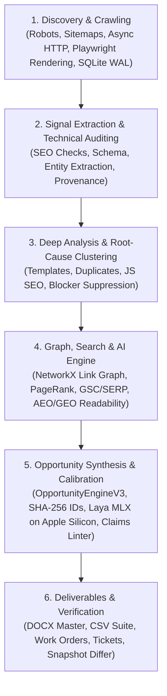

# SEOJEV System Overview & Implementation Map

**System Name:** SEOJEV (Universal Scalable SEO Intelligence & Audit Engine)  
**Status:** Production Ready (V1, V2, V3 Implemented & Audited)  
**Primary Entrypoint:** [`main.py`](file:///Users/anny/Desktop/seojev/main.py)  

---

## 1. System Architecture & Workflow

SEOJEV operates as a high-scale, asynchronous, six-layer intelligence pipeline:

### Detailed Workflow Stages

1. **Discovery & Crawling (`crawler/`):**
   - Fetches and parses `/robots.txt` rules and recursive XML sitemap indexes.
   - Detects parameter traps and soft 404s dynamically.
   - Crawls asynchronously with bounded memory via [`crawler/storage.py`](file:///Users/anny/Desktop/seojev/crawler/storage.py) (SQLite WAL mode) and offloads gzipped raw HTML to disk via [`engine/content_store.py`](file:///Users/anny/Desktop/seojev/engine/content_store.py).
   - Dynamically triggers Playwright headless browser rendering ([`crawler/renderer.py`](file:///Users/anny/Desktop/seojev/crawler/renderer.py)) for thin HTML / client-rendered pages.

2. **Signal Extraction (`seo/`, `extraction/`):**
   - Runs deterministic SEO rule detectors: canonical consistency, heading hierarchies, hreflang reciprocity, image attributes, internal/external links, metadata tags, robots meta tags, Schema.org JSON-LD microdata, and technical HTTP headers.
   - Extracts domain-specific provenance via [`extraction/provenance_extractor.py`](file:///Users/anny/Desktop/seojev/extraction/provenance_extractor.py).

3. **Analysis & Understanding (`analysis/`, `understanding/`, `technical/`):**
   - **Template & Clustering:** Groups URLs into architectural templates via SimHash and path patterns ([`analysis/templates.py`](file:///Users/anny/Desktop/seojev/analysis/templates.py), [`understanding/template_miner.py`](file:///Users/anny/Desktop/seojev/understanding/template_miner.py)).
   - **Vertical Registry:** Detects site vertical (e.g., Automotive, YMYL Finance, Generic) via [`verticals/registry.py`](file:///Users/anny/Desktop/seojev/verticals/registry.py).
   - **Root Cause Clustering:** Discovers upstream root blockers (e.g., 404s, global noindex) and suppresses downstream symptoms using [`technical/root_causes.py`](file:///Users/anny/Desktop/seojev/technical/root_causes.py).
   - **Entity Consistency:** Cross-validates entity claims across page variants using [`understanding/entity_graph.py`](file:///Users/anny/Desktop/seojev/understanding/entity_graph.py).

4. **Simulation & Search Intelligence (`simulation/`, `search/`):**
   - **Link Graph Simulation:** Computes internal PageRank, shortest paths, crawl depth, and orphan status using NetworkX ([`simulation/link_graph.py`](file:///Users/anny/Desktop/seojev/simulation/link_graph.py), [`simulation/graph_simulator.py`](file:///Users/anny/Desktop/seojev/simulation/graph_simulator.py)).
   - **Search & Query Mining:** Analyzes GSC and SERP dynamics, CTR curves, and query fit ([`search/gsc_pipeline.py`](file:///Users/anny/Desktop/seojev/search/gsc_pipeline.py), [`search/query_miner.py`](file:///Users/anny/Desktop/seojev/search/query_miner.py)).
   - **AEO & GEO:** Evaluates AI search engine visibility, extractability, and citation readiness ([`analysis/aeo_v3.py`](file:///Users/anny/Desktop/seojev/analysis/aeo_v3.py), [`analysis/geo_v3.py`](file:///Users/anny/Desktop/seojev/analysis/geo_v3.py)).

5. **Opportunity Synthesis & Governance (`engine/`, `laya/`):**
   - **Opportunity Engine:** Generates prioritized, deduplicated opportunities with stable SHA-256 fingerprints and readable IDs (e.g., `ENG-SEO-001`) via [`engine/opportunity_engine_v3.py`](file:///Users/anny/Desktop/seojev/engine/opportunity_engine_v3.py) and [`engine/id_system.py`](file:///Users/anny/Desktop/seojev/engine/id_system.py).
   - **Local MLX Calibration:** Uses Apple Silicon MLX inference (`aac6fef/laya-mlx`) for on-device reasoning and triage ([`laya/analyzer.py`](file:///Users/anny/Desktop/seojev/laya/analyzer.py)).
   - **Claims Linter:** Enforces strict compliance and guards against fabricated or unbacked claims via [`engine/claims_linter.py`](file:///Users/anny/Desktop/seojev/engine/claims_linter.py).
   - **Memory Guard:** Dynamic RSS sampling and auto-cleanup via [`engine/memory_guard.py`](file:///Users/anny/Desktop/seojev/engine/memory_guard.py).

6. **Reporting & Deliverables (`reporting/`, `verification/`):**
   - Master Word report generation (`docx_report.py`, `executive_docx.py`).
   - Relational CSV suite export (`csv_suite.py`).
   - Interactive HTML audit explorer (`html_explorer.py`).
   - Project management ticket exports (Linear, Jira, GitHub Issues in [`reports/tickets/`](file:///Users/anny/Desktop/seojev/reports/tickets/)).
   - Snapshot diffing and regression testing (`verification/snapshot.py`, `verification/differ.py`).

7. **Synthetic Lab Sandbox (`lab/`):**
   - Multi-defect website generator planting 16 standard SEO defect classes ([`lab/site_generator.py`](file:///Users/anny/Desktop/seojev/lab/site_generator.py)).
   - Comprehensive scorecard evaluation with 100% precision and recall validation ([`lab/scorecard.py`](file:///Users/anny/Desktop/seojev/lab/scorecard.py)).

---

## 2. Complete File Directory & Component Map

### Core Pipeline & Orchestration
- [`main.py`](file:///Users/anny/Desktop/seojev/main.py): CLI interface, argument parser, pipeline runner, subcommands (`crawl`, `analyze`, `report`, `lab`, `blueprint`).
- [`config.yaml`](file:///Users/anny/Desktop/seojev/config.yaml): Crawl thresholds, concurrency, render settings, and weights.
- [`requirements.txt`](file:///Users/anny/Desktop/seojev/requirements.txt): Python dependencies.

### Crawler Engine (`crawler/`)
- [`crawler/crawler.py`](file:///Users/anny/Desktop/seojev/crawler/crawler.py): Orchestrates asynchronous crawling, throttling, and session pooling.
- [`crawler/fetcher.py`](file:///Users/anny/Desktop/seojev/crawler/fetcher.py): HTTP request execution with retries and header rotation.
- [`crawler/normalizer.py`](file:///Users/anny/Desktop/seojev/crawler/normalizer.py): Canonical URL normalization, query stripping, and case standardization.
- [`crawler/renderer.py`](file:///Users/anny/Desktop/seojev/crawler/renderer.py): Playwright headless browser rendering for JS-rendered apps.
- [`crawler/robots.py`](file:///Users/anny/Desktop/seojev/crawler/robots.py): Robots.txt parser and rule matcher.
- [`crawler/scheduler.py`](file:///Users/anny/Desktop/seojev/crawler/scheduler.py): Crawl frontier priority queue.
- [`crawler/sitemap.py`](file:///Users/anny/Desktop/seojev/crawler/sitemap.py): XML sitemap and sitemapindex parser.
- [`crawler/soft404.py`](file:///Users/anny/Desktop/seojev/crawler/soft404.py): Heuristic detection of soft 404 responses.
- [`crawler/storage.py`](file:///Users/anny/Desktop/seojev/crawler/storage.py): SQLite WAL database management and table initialization.
- [`crawler/traps.py`](file:///Users/anny/Desktop/seojev/crawler/traps.py): Infinite loop, pagination trap, and parameter explosion detection.
- [`crawler/migrations.py`](file:///Users/anny/Desktop/seojev/crawler/migrations.py): Schema migration coordinator.
- [`crawler/logs.py`](file:///Users/anny/Desktop/seojev/crawler/logs.py): Structured crawl event logging.

### Specialized SEO Detectors (`seo/`)
- [`seo/engine.py`](file:///Users/anny/Desktop/seojev/seo/engine.py): Dispatches HTML pages across all SEO rule analyzers.
- [`seo/canonical.py`](file:///Users/anny/Desktop/seojev/seo/canonical.py): Canonical tag validity, self-reference, and mismatch checks.
- [`seo/content.py`](file:///Users/anny/Desktop/seojev/seo/content.py): Word count, thin content, and reading complexity analysis.
- [`seo/headings.py`](file:///Users/anny/Desktop/seojev/seo/headings.py): H1-H6 hierarchy, missing H1, and multiple H1 validation.
- [`seo/hreflang.py`](file:///Users/anny/Desktop/seojev/seo/hreflang.py): Hreflang reciprocal validation and language-region tags.
- [`seo/images.py`](file:///Users/anny/Desktop/seojev/seo/images.py): Alt text audit, responsive dimensions, and image asset health.
- [`seo/links.py`](file:///Users/anny/Desktop/seojev/seo/links.py): Anchor text, internal/external distribution, nofollow attributes.
- [`seo/metadata.py`](file:///Users/anny/Desktop/seojev/seo/metadata.py): Title/meta description length, duplication, and pixel width.
- [`seo/robots_meta.py`](file:///Users/anny/Desktop/seojev/seo/robots_meta.py): Page-level robots meta tags (`noindex`, `nofollow`, `noarchive`).
- [`seo/schema.py`](file:///Users/anny/Desktop/seojev/seo/schema.py): Schema.org JSON-LD and microdata parsing and validation.
- [`seo/technical.py`](file:///Users/anny/Desktop/seojev/seo/technical.py): HTTP status codes, redirect chains, MIME types, response times.
- [`seo/urls.py`](file:///Users/anny/Desktop/seojev/seo/urls.py): URL length, path depth, uppercase characters, and special characters.

### Analysis & Intelligence (`analysis/`)
- [`analysis/aggregation.py`](file:///Users/anny/Desktop/seojev/analysis/aggregation.py): Aggregates crawl-wide health metrics and scores.
- [`analysis/templates.py`](file:///Users/anny/Desktop/seojev/analysis/templates.py): Template derivation and template-level issue clustering.
- [`analysis/duplicates.py`](file:///Users/anny/Desktop/seojev/analysis/duplicates.py): Content hashing and duplicate/near-duplicate detection.
- [`analysis/internal_links.py`](file:///Users/anny/Desktop/seojev/analysis/internal_links.py): PageRank scoring and inlink/outlink distribution analysis.
- [`analysis/orphan_pages.py`](file:///Users/anny/Desktop/seojev/analysis/orphan_pages.py): Unlinked sitemap pages and disconnected node isolation.
- [`analysis/crawl_depth.py`](file:///Users/anny/Desktop/seojev/analysis/crawl_depth.py): Click depth calculation from homepage seeds.
- [`analysis/page_types.py`](file:///Users/anny/Desktop/seojev/analysis/page_types.py): Machine heuristic classification of page types.
- [`analysis/product_intelligence.py`](file:///Users/anny/Desktop/seojev/analysis/product_intelligence.py): E-commerce/product catalog specific intelligence.
- [`analysis/freshness_trust.py`](file:///Users/anny/Desktop/seojev/analysis/freshness_trust.py): Content modification timestamps and trust signals.
- [`analysis/aeo.py`](file:///Users/anny/Desktop/seojev/analysis/aeo.py) & [`analysis/aeo_v3.py`](file:///Users/anny/Desktop/seojev/analysis/aeo_v3.py): Answer Engine Optimization readiness.
- [`analysis/geo.py`](file:///Users/anny/Desktop/seojev/analysis/geo.py) & [`analysis/geo_v3.py`](file:///Users/anny/Desktop/seojev/analysis/geo_v3.py): Generative Engine Optimization readiness.
- [`analysis/content_gaps_v3.py`](file:///Users/anny/Desktop/seojev/analysis/content_gaps_v3.py): Missing entities, competitor keyword gaps.
- [`analysis/gsc.py`](file:///Users/anny/Desktop/seojev/analysis/gsc.py) & [`analysis/serp.py`](file:///Users/anny/Desktop/seojev/analysis/serp.py): Search console and SERP data evaluation.
- [`analysis/opportunities.py`](file:///Users/anny/Desktop/seojev/analysis/opportunities.py): Actionable recommendation matrix.

### V3 Engine & Infrastructure (`engine/`)
- [`engine/opportunity_engine_v3.py`](file:///Users/anny/Desktop/seojev/engine/opportunity_engine_v3.py): V3 opportunity formulation, findings population, GEO synthesis.
- [`engine/id_system.py`](file:///Users/anny/Desktop/seojev/engine/id_system.py): SHA-256 fingerprinting, display ID generation (`ENG-SEO-001`), in-memory caching.
- [`engine/priority_model.py`](file:///Users/anny/Desktop/seojev/engine/priority_model.py): Multi-factor scoring (ICE: Impact, Confidence, Effort).
- [`engine/claims_linter.py`](file:///Users/anny/Desktop/seojev/engine/claims_linter.py): Verification linter preventing unevidenced or hallucinated statements.
- [`engine/content_store.py`](file:///Users/anny/Desktop/seojev/engine/content_store.py): Compressed disk-backed content store (`store/xx/xx`).
- [`engine/evidence.py`](file:///Users/anny/Desktop/seojev/engine/evidence.py): Tamper-evident finding verification ledger.
- [`engine/provenance.py`](file:///Users/anny/Desktop/seojev/engine/provenance.py): Numeric provenance tracker for all calculated stats.
- [`engine/memory_guard.py`](file:///Users/anny/Desktop/seojev/engine/memory_guard.py): Live memory RSS monitor and dynamic garbage collector.
- [`engine/blueprint.py`](file:///Users/anny/Desktop/seojev/engine/blueprint.py): Detailed 14-dimension single-page blueprint inspector.
- [`engine/work_orders.py`](file:///Users/anny/Desktop/seojev/engine/work_orders.py): Executable developer work orders for identified issues.

### Site Understanding & Mining (`understanding/`)
- [`understanding/template_miner.py`](file:///Users/anny/Desktop/seojev/understanding/template_miner.py): SimHash DOM clustering.
- [`understanding/entity_graph.py`](file:///Users/anny/Desktop/seojev/understanding/entity_graph.py): Knowledge graph consistency validator.
- [`understanding/index_funnel.py`](file:///Users/anny/Desktop/seojev/understanding/index_funnel.py): Multi-stage funnel (Discovered -> Crawled -> Rendered -> Indexable -> Ranked).
- [`understanding/programmatic.py`](file:///Users/anny/Desktop/seojev/understanding/programmatic.py): Programmatic SEO family detection.
- [`understanding/profile.py`](file:///Users/anny/Desktop/seojev/understanding/profile.py): Holistic site profile generator.

### Search Pipelines (`search/`)
- [`search/gsc_pipeline.py`](file:///Users/anny/Desktop/seojev/search/gsc_pipeline.py): Position bracket segmentation & query reconciliation.
- [`search/serp_pipeline.py`](file:///Users/anny/Desktop/seojev/search/serp_pipeline.py): SERP feature and snippet extraction.
- [`search/query_miner.py`](file:///Users/anny/Desktop/seojev/search/query_miner.py): Intent classification and high-opportunity query identification.
- [`search/ctr_model.py`](file:///Users/anny/Desktop/seojev/search/ctr_model.py): Expected vs. actual CTR curve modeling.
- [`search/fit_analyzer.py`](file:///Users/anny/Desktop/seojev/search/fit_analyzer.py): Intent-to-page content fit scoring.
- [`search/ai_observations.py`](file:///Users/anny/Desktop/seojev/search/ai_observations.py): AI overview citations & visibility monitor.

### Simulation (`simulation/`)
- [`simulation/link_graph.py`](file:///Users/anny/Desktop/seojev/simulation/link_graph.py): NetworkX graph model of internal architecture.
- [`simulation/graph_simulator.py`](file:///Users/anny/Desktop/seojev/simulation/graph_simulator.py): "What-if" simulations of link structure modifications.
- [`simulation/recommender.py`](file:///Users/anny/Desktop/seojev/simulation/recommender.py): Graph-optimized internal linking recommendations.

### Vertical Specializations (`verticals/`)
- [`verticals/registry.py`](file:///Users/anny/Desktop/seojev/verticals/registry.py): Vertical classification and dispatcher.
- [`verticals/base.py`](file:///Users/anny/Desktop/seojev/verticals/base.py): Base class for vertical audits.
- [`verticals/automotive.py`](file:///Users/anny/Desktop/seojev/verticals/automotive.py): Automotive domain rules (VIN, trims, specifications).
- [`verticals/ymyl_finance.py`](file:///Users/anny/Desktop/seojev/verticals/ymyl_finance.py): Financial / YMYL compliance and disclosure audits.
- [`verticals/generic.py`](file:///Users/anny/Desktop/seojev/verticals/generic.py): Universal fallback auditor.

### Technical & Diagnostics (`technical/`)
- [`technical/root_causes.py`](file:///Users/anny/Desktop/seojev/technical/root_causes.py): Blocker/symptom dependency graph and symptom suppression.
- [`technical/js_seo.py`](file:///Users/anny/Desktop/seojev/technical/js_seo.py): DOM hydration diffing (pre- vs. post-JS DOM).

### Performance (`performance/`)
- [`performance/sampler.py`](file:///Users/anny/Desktop/seojev/performance/sampler.py): Stratified sampling across page templates.
- [`performance/lighthouse.py`](file:///Users/anny/Desktop/seojev/performance/lighthouse.py): Real browser Web Vitals collection (TTFB, FCP, LCP, CLS).

### Laya Local MLX Inference (`laya/`)
- [`laya/analyzer.py`](file:///Users/anny/Desktop/seojev/laya/analyzer.py): Runs Apple Silicon MLX inference with `aac6fef/laya-mlx`.
- [`laya/questions.py`](file:///Users/anny/Desktop/seojev/laya/questions.py): Prompt templates for audit triage.
- [`laya/metrics.py`](file:///Users/anny/Desktop/seojev/laya/metrics.py): Latency, throughput, and token efficiency metrics.

### Reporting & Deliverables (`reporting/`)
- [`reporting/docx_master.py`](file:///Users/anny/Desktop/seojev/reporting/docx_master.py) & [`reporting/docx_report.py`](file:///Users/anny/Desktop/seojev/reporting/docx_report.py): 14-section Word document generation.
- [`reporting/executive_docx.py`](file:///Users/anny/Desktop/seojev/reporting/executive_docx.py): C-suite executive summary generator.
- [`reporting/csv_suite.py`](file:///Users/anny/Desktop/seojev/reporting/csv_suite.py) & [`reporting/csv_report.py`](file:///Users/anny/Desktop/seojev/reporting/csv_report.py): Relational CSV exports.
- [`reporting/html_explorer.py`](file:///Users/anny/Desktop/seojev/reporting/html_explorer.py): Self-contained interactive HTML audit dashboard.
- [`reporting/json_report.py`](file:///Users/anny/Desktop/seojev/reporting/json_report.py): Machine-readable audit exports.

### Verification & Monitoring (`verification/`)
- [`verification/snapshot.py`](file:///Users/anny/Desktop/seojev/verification/snapshot.py): Audit state point-in-time snapshotting.
- [`verification/differ.py`](file:///Users/anny/Desktop/seojev/verification/differ.py): Snapshot-to-snapshot change detection.
- [`verification/runner.py`](file:///Users/anny/Desktop/seojev/verification/runner.py): Verification test executor.
- [`verification/watch.py`](file:///Users/anny/Desktop/seojev/verification/watch.py): Continuous monitoring and alerting.
- [`verification/experiment.py`](file:///Users/anny/Desktop/seojev/verification/experiment.py): A/B SEO experiment tracking.

### Synthetic Benchmark Lab (`lab/`)
- [`lab/site_generator.py`](file:///Users/anny/Desktop/seojev/lab/site_generator.py): Injects 16 standard SEO defects for validation.
- [`lab/scorecard.py`](file:///Users/anny/Desktop/seojev/lab/scorecard.py): Evaluates detection accuracy (Precision & Recall).
- [`lab/gsc_generator.py`](file:///Users/anny/Desktop/seojev/lab/gsc_generator.py): Synthetic GSC data generation for testing.
- [`lab/feedback.py`](file:///Users/anny/Desktop/seojev/lab/feedback.py): Closed-loop detector feedback tuning.

### Test Suite (`tests/`)
17 test modules covering crawler, normalizer, SEO detectors, sitemaps, intelligence, search, SERP, simulation, technical, understanding, verification, and verticals.
