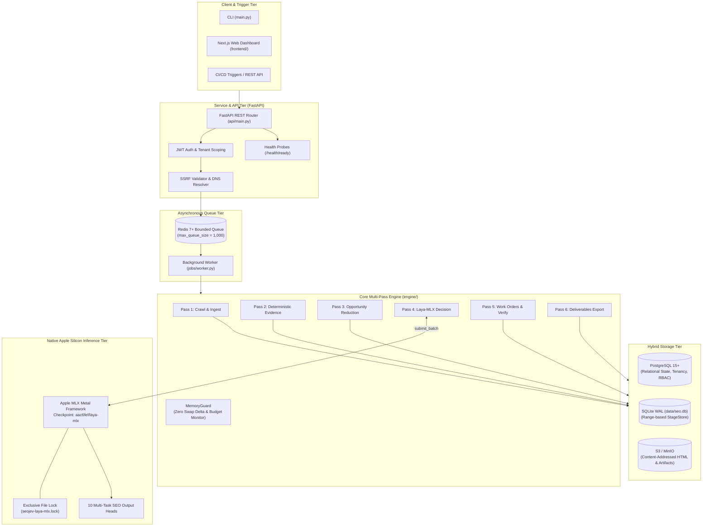
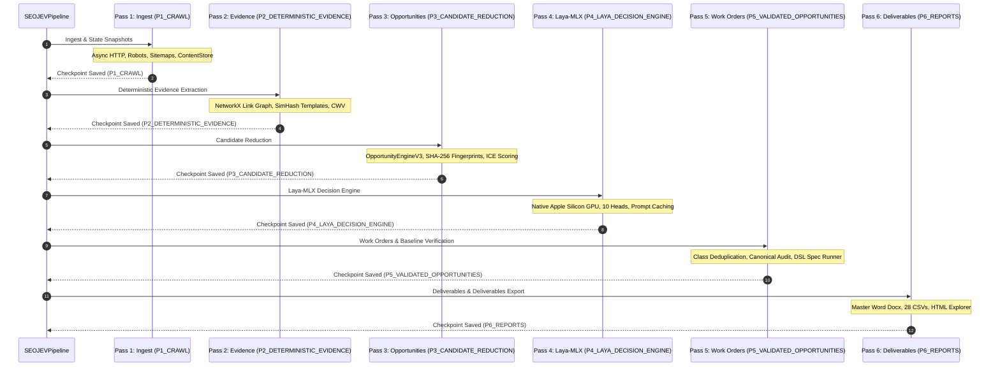
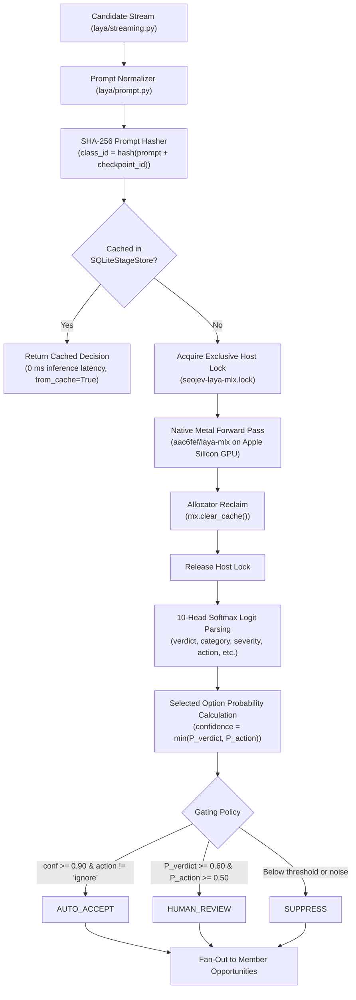
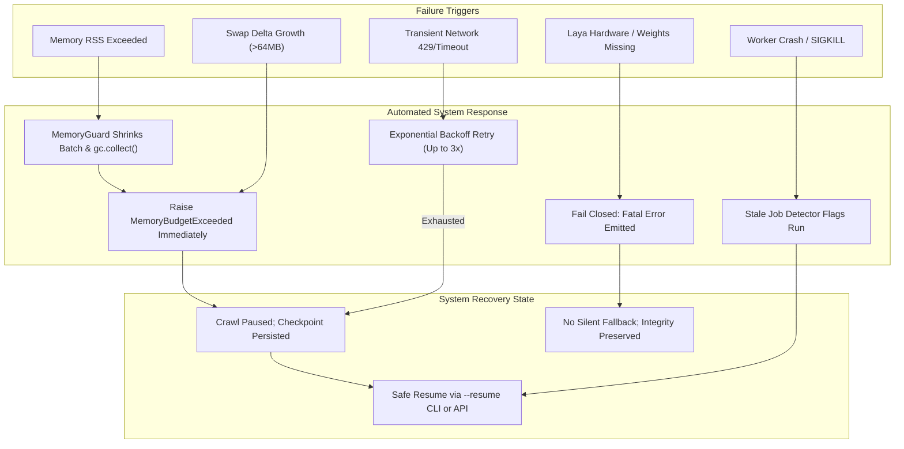

# SEOJEV System Architecture & Technical Specification

This document provides a concise architectural specification of **SEOJEV**, detailing component interactions, data flows, storage topology, security boundaries, and failure-handling mechanics.

---

## 1. System Overview

SEOJEV is an automated search intelligence operating system designed to eliminate "alert fatigue" in enterprise technical SEO. Rather than emitting thousands of disconnected page-level warnings, SEOJEV groups web pages into structural template families, clusters low-level findings into upstream root causes, and routes candidates through an on-device Apple Silicon machine learning model (`laya-mlx`) to emit deduplicated, verifiable engineering work orders.

### Core Architecture Principles
- **Separation of Evidence and Inference:** Deterministic facts (HTTP status codes, DOM elements, link graphs, SimHash tokens) are strictly segregated from machine learning classifications.
- **Fail-Closed AI Safety:** Laya-MLX is the exclusive decision maker. If Metal hardware or model weights are missing, the system halts immediately. No fallback or mock models are permitted.
- **Memory Boundedness:** A dedicated `MemoryGuard` actively monitors process-tree RSS and swap delta growth to maintain system stability on 16 GB Apple Silicon hosts.
- **Reproducible Provenance:** Every decision and work order carries permanent SHA-256 issue fingerprints and Git checkpoint IDs.

---

## 2. High-Level Architecture Diagram



---

## 3. Component Architecture

| Subsystem | Modules | Responsibilities | Key Invariants |
| :--- | :--- | :--- | :--- |
| **API Gateway** | `api/` | Authentication, RBAC, tenant routing, SSRF defense, health checks | Refuses startup without strong secrets; blocks private/loopback IP requests. |
| **Queue Manager** | `jobs/queue.py`, `jobs/worker.py` | Task scheduling, concurrency control, worker execution | Rejects tasks when queue reaches `REDIS_MAX_QUEUE_SIZE`; recovers stale runs. |
| **Crawler Engine** | `crawler/` | Async HTTP requests, robots/sitemaps, trap filtering, Playwright rendering | Throttles per-host; halts and requeues URLs on `MemoryBudgetExceeded`. |
| **Evidence Engine** | `analysis/`, `extraction/` | Internal link graph (NetworkX), SimHash clustering, CWV sampling | Fully deterministic; operates without AI models or external API calls. |
| **Opportunity Synthesizer**| `engine/opportunity_engine_v3.py` | Consolidates issues into root-cause candidates with ICE scores | Assigns permanent SHA-256 fingerprints to all opportunities. |
| **Laya-MLX Engine** | `laya/` | 10-head classification, gating, prompt caching | Fail-closed; enforces single-process host lock; uses selected option probabilities. |
| **Work Order Manager** | `engine/work_orders.py` | Generates engineering and content work orders from validated decisions | Class deduplication; verifies canonical schema; runs baseline test DSL. |
| **Claims Linter** | `engine/claims_linter.py` | AST/regex quality gate rejecting unsubstantiated ranking promises | Rejects non-compliant work orders before export. |
| **Storage Coordinator** | `database/`, `services/object_store.py` | Manages PostgreSQL, SQLite WAL, and S3/MinIO persistence | Enforces `organization_id` scoping across all database operations. |

---

## 4. End-to-End Data Flow

```
Target URL
   │
   ▼
[1. URL Normalization & SSRF Defense]
   │
   ▼
[2. Robots.txt & Sitemap Traversal]
   │
   ▼
[3. Asynchronous HTTP Fetching & Playwright Fallback]
   │
   ├─► Compressed HTML ──► ContentStore / S3 ({sha256[:2]}/{sha256}.gz)
   └─► Page Metadata   ──► SQLite `pages` / PostgreSQL `pages`
   │
   ▼
[4. Deterministic Signal & Graph Extraction]
   ├─► Link Edges     ──► NetworkX Graph (PageRank, Click Depth, Orphans)
   ├─► DOM Structure  ──► 64-bit SimHash Clusters (Template Discovery)
   └─► Rule Detectors ──► Raw Issues (`issues` table)
   │
   ▼
[5. Root-Cause Blocker Suppression & Opportunity Synthesis]
   │ (Suppresses symptoms of upstream 404s/noindex; generates SHA-256 fingerprints)
   ▼
[6. Streaming Candidate Normalization]
   │ (Yields 1 candidate at a time; computes normalized prompt hash)
   ▼
[7. Laya-MLX Native Metal Inference]
   ├─► Check Cache ──► Hit: Return prior decision (0 ms GPU time)
   └─► Cache Miss  ──► MLX GPU Forward Pass (10 heads) ──► Selected Probability Gating
   │
   ▼
[8. Class Deduplication & Work Order Creation]
   ├─► Engineering Tickets (`WO-ENG-...`)
   └─► Content Tickets (`WO-CNT-...`)
   │
   ▼
[9. Baseline Acceptance Verification]
   │ (Evaluates verify DSL specs against stored crawl HTML)
   ▼
[10. Deliverables Compilation]
   ├─► Master Word Audit Report (.docx)
   ├─► Executive Summary (.docx)
   ├─► 28 CSV Relational Tables
   └─► Interactive HTML Explorer (explorer.html)
```

---

## 5. Pipeline Pass Architecture

SEOJEV structures execution into six discrete sequential passes:



Each pass is idempotent. Resuming an incomplete or paused crawl skips previously completed passes by verifying records in `stage_checkpoints`.

---

## 6. Laya-MLX Inference Architecture



---

## 7. Storage Architecture

SEOJEV implements a tiered storage model designed for performance and scale:

```
┌────────────────────────────────────────────────────────────────────────┐
│ Relational Tier (PostgreSQL 15+ / SQLite WAL)                          │
│ - Organizations, Users, Sites, Runs                                    │
│ - Pages (Metadata, Status, Canonical, Titles)                          │
│ - Links (Directed Graph Edges)                                         │
│ - Issues & Issue Clusters                                              │
│ - Opportunities (Fingerprints, ICE Scores, Gating Status)              │
│ - Laya Decisions (10-Head Outputs, Probabilities, Checkpoint SHA)      │
│ - Work Orders (Engineering & Content Tickets, Acceptance Specs)        │
│ - Verifications (Baseline DSL Spec Audit Records)                      │
│ - Stage Checkpoints (Crawl State Machine)                              │
├────────────────────────────────────────────────────────────────────────┤
│ Object & Blob Tier (S3 / MinIO / Local ContentStore)                   │
│ - Content-Addressed HTML Payloads: store/{hash[:2]}/{hash}.gz          │
│ - Export Bundles: reports/{run_id}/SEOJEV_V3_AUDIT_REPORT.docx         │
│ - Dataset Suite: reports/{run_id}/csv/*.csv (28 tables)                │
│ - Static Explorers: reports/{run_id}/explorer.html                     │
├────────────────────────────────────────────────────────────────────────┤
│ Transient & Cache Tier (Redis 7+ / SQLiteStageStore)                   │
│ - Bounded Job Queues (jobs:default)                                    │
│ - Active Run Mutex Locks (run:{id}:lock)                               │
│ - Range-Addressed Stage Chunks & Prompt Hash Decision Caching          │
└────────────────────────────────────────────────────────────────────────┘
```

---

## 8. Security Boundary

```
[ Public Network / User Requests ]
               │
               ▼
┌────────────────────────────────────────────────────────────────────────┐
│ REST API Security Boundary (api/main.py)                               │
│ • TLS 1.3 Termination                                                  │
│ • JWT Authentication (High-entropy 32+ char secret)                    │
│ • Role-Based Access Control (Admin, Editor, Viewer)                    │
│ • CORS Restriction (Explicit origins; no wildcard + credentials)       │
│ • Multi-Tenant Scoping: Automatic organization_id query injection      │
└────────────────────────────────────────────────────────────────────────┘
               │
               ▼
┌────────────────────────────────────────────────────────────────────────┐
│ Crawler SSRF Defense Boundary (crawler/crawler.py)                     │
│ • Hostname Pre-Resolution (DNS lookup before socket connection)         │
│ • Private IP Blacklist: 10.0.0.0/8, 172.16.0.0/12, 192.168.0.0/16       │
│ • Loopback Blacklist: 127.0.0.0/8, localhost, ::1, 0.0.0.0             │
│ • Cloud Metadata Blacklist: 169.254.169.254, [fd00:ec2::254]           │
│ • Scheme Blacklist: Blocks file://, gopher://, ftp://                  │
└────────────────────────────────────────────────────────────────────────┘
               │
               ▼
┌────────────────────────────────────────────────────────────────────────┐
│ Storage & File System Boundary                                         │
│ • SHA-256 Path Generation: store/{hash[:2]}/{hash}.gz                  │
│ • Commonpath Directory Traversal Defense on all download routes        │
│ • Zero hardcoded credentials; default minioadmin blocked in production │
└────────────────────────────────────────────────────────────────────────┘
```

---

## 9. Deployment Topologies

### Topology 1: Local Apple Silicon Workstation
- **Host OS:** macOS 14+ Darwin `arm64` (MacBook Pro / Mac Studio).
- **Execution:** Native Python virtual environment directly on Apple Silicon Metal.
- **Supporting Services:** Local PostgreSQL and Redis running natively or via Homebrew/Docker.
- **Use Case:** Single-operator technical audits and offline development.

### Topology 2: Dedicated Apple Silicon Server
- **Host OS:** macOS Sonoma or Sequoia on dedicated Mac Studio / Mac Pro hardware.
- **Supervision:** macOS `launchd` daemons managing API and background worker processes.
- **Storage:** Dedicated PostgreSQL 15+, Redis 7+, and MinIO/S3.
- **Concurrency:** Single-owner lock manages GPU inference; multi-core CPU workers handle async crawling and evidence extraction.
- **Use Case:** Production multi-tenant SaaS platform.

### Topology 3: Hybrid Cloud Topology
- **Cloud Infrastructure (Linux/AWS/GCP):** Dockerized PostgreSQL, Redis, S3, and API services running in container orchestrators (Kubernetes / ECS).
- **Inference Worker (Apple Silicon host):** Connects to remote Redis queue and PostgreSQL, pulls Pass 4 candidate batches, executes native Metal inference on host hardware, and persists decisions back to the cloud database.
- **Rationale:** Circumvents Docker Metal virtualization constraints while leveraging cloud-managed database and storage infrastructure.

---

## 10. Failure & Recovery Architecture



All failure states in SEOJEV are recoverable, deterministic, and fail-closed.
