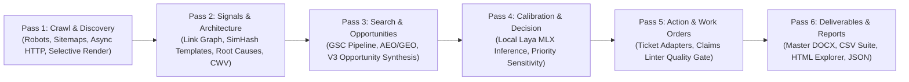

# SEOJEV Phase 2: Engine-to-Platform Audit & Library Seam Specification

**Document Version:** 1.0.0  
**Phase:** Phase 2 (From Engine to Platform)  
**Reference Stage:** Stage 0 (Wrap Engine as Importable Library)  
**Date:** 2026-09-26  

---

## 1. Executive Assessment of the 9 Platform Gaps

The SEOJEV V3 engine provides a rigorous foundation: six-layer architecture, evidence ledger, root-cause blocker clustering, deterministic fingerprints, compressed content storage, memory watchdog, and a synthetic defect testbench. However, before deploying it as a hosted multi-user service, nine architectural gaps must be closed:

| # | Gap Name | Current State (V3 Engine) | Target Platform State (Phase 2) | Resolution Plan & Stage |
|---|---|---|---|---|
| **1** | **Lab Generalization** | 16 defect classes evaluated with 100% precision/recall on self-planted generator only. | Add held-out synthetic set unseen during detector development + hand-labeled sample from a real crawl. | Stage 0 / Section 8 quality gate. |
| **2** | **ICE Scoring Transparency** | Impact/Confidence/Effort stored but aggregated into a single priority score. | Expose underlying 7 factors (`visibility`, `gap`, `page_importance`, `template_scope`, `technical_severity`, `ctr_headroom`, `link_gap`), confidence grade (E0–E4), and effort reason (config vs component vs pipeline). | Stage 1 (Postgres schema) & Stage 6 (UI). |
| **3** | **Continuous Time Series** | Snapshots compare isolated before/after pairs; no historical trend persistence. | Continuous time-series table (`site_id, metric, date, value`) tracking issue and template trends over months. | Stage 1 (Postgres schema) & Stage 9 (Feature 6.1). |
| **4** | **Web-Facing Surface** | Local CLI and file output only (`main.py`, `.docx`, `.csv`). | Full Next.js (React, TypeScript, Tailwind) UI + FastAPI REST/SSE backend. | Stages 2–7. |
| **5** | **Cloud-Portable Laya** | `aac6fef/laya-mlx` runs strictly on Apple Silicon Mac hardware via MLX. | Pluggable backend interface (`laya/backends/{mlx, llama_cpp, api}`) selectable via configuration. | Stage 9 / Stage 11 (Feature 6.5). |
| **6** | **Bidirectional Ticket Sync** | Exports Jira, Linear, and GitHub JSONs; no feedback on whether tickets were actioned. | Polling/webhook integration; auto-executes work order verification spec on ticket resolution. | Stage 9 (Feature 6.3). |
| **7** | **Watch Notification Delivery** | Site watcher writes JSON check results to disk; no human alerting. | Event dispatcher fanning out alerts (`run.failed`, `regression.detected`, `watch.alert`) to Slack and email. | Stage 8. |
| **8** | **Configuration Management** | Configuration restricted to CLI flags and `config.yaml`. | Per-site database configs managed and validated via web UI and API. | Stages 1 & 2. |
| **9** | **Multi-Tenant Isolation** | Single local SQLite (`data/seo.db`); no org boundary. | Row-level `org_id` isolation across all PostgreSQL metadata tables. | Stage 1 (Schema) & Stage 10 (Hardening). |

---

## 2. Library Seam & Engine Wrapper Design

To allow background workers (Celery/RQ) and the FastAPI server to trigger audits directly without spawning fragile shell subprocesses or parsing stdout logs, the engine has been refactored into a callable library interface: [`engine/pipeline.py`](file:///Users/anny/Desktop/seojev/engine/pipeline.py).

### 2.1 The Six Discrete Pipeline Passes



Each pass is encapsulated as an asynchronous method on `SEOJEVPipeline`:
1. `run_pass_1_crawl()`: 0.0% → 25.0% progress.
2. `run_pass_2_signals()`: 25.0% → 50.0% progress.
3. `run_pass_3_search_opportunities()`: 50.0% → 70.0% progress.
4. `run_pass_4_calibration()`: 70.0% → 80.0% progress.
5. `run_pass_5_work_orders()`: 80.0% → 90.0% progress.
6. `run_pass_6_deliverables()`: 90.0% → 100.0% progress.
7. `run_all()`: Orchestrates P1–P6 end-to-end with cooperative cancellation checks.

### 2.2 Progress Callback Contract

Progress updates are emitted via a standardized callback interface:

```python
Callable[[str, float, str, Optional[Dict[str, Any]]], None]
# Arguments: (pass_name: str, pct: float, message: str, meta: Optional[dict])
```

- `pass_name`: One of `P1_CRAWL`, `P2_SIGNALS`, `P3_SEARCH_OPPORTUNITIES`, `P4_CALIBRATION`, `P5_WORK_ORDERS`, `P6_DELIVERABLES`, `CANCELLED`, `FAILED`.
- `pct`: Monotonically increasing percentage (`0.0` to `100.0`).
- `message`: User-friendly human-readable status line.
- `meta`: Detailed pass metadata (e.g. `crawled`, `discovered`, `current_url`, `opportunities_count`, `violations_count`).

In the Celery worker (Stage 3), this callback forwards directly into Redis pub/sub (`run:{run_id}:progress`), which the FastAPI SSE endpoint pushes to the browser in real time.

### 2.3 Cooperative Cancellation Semantics

Background jobs can be stopped gracefully via `cancel_check: Callable[[], bool]`:
- **Crawler Level:** In [`crawler/crawler.py`](file:///Users/anny/Desktop/seojev/crawler/crawler.py), each worker checks `cancel_check()` between URLs. If triggered, the scheduler stops immediately and active tasks drain without leaking file descriptors or hanging connections.
- **Pipeline Level:** In [`engine/pipeline.py`](file:///Users/anny/Desktop/seojev/engine/pipeline.py), `check_cancelled()` is evaluated before and between every pass and iteration.
- **State Transition:** When cancellation occurs, `PipelineCancelledException` is caught, the crawl status in SQLite is updated to `cancelled`, and a structured result `{"status": "cancelled", ...}` is returned.

---

## 3. Storage Strategy & Data Boundary

SEOJEV Phase 2 maintains a dual-storage model:

1. **Engine Scratch Space (SQLite WAL + `store/`):**
   - Each run retains its local SQLite file (`data/seo.db` or isolated per-run file) and disk-compressed HTML store (`store/xx/xx.gz`).
   - Existing engine tables, indexes, and queries remain untouched.
2. **Platform Persistence (PostgreSQL):**
   - After `P6_DELIVERABLES` completes, an idempotent ETL job copies high-level results (`findings`, `opportunities`, `work_orders`, `templates`, `gsc_summary`) into PostgreSQL.
   - All multi-run, cross-site, time-series, and UI queries query PostgreSQL, isolating the web server from SQLite file locking and disk I/O.
   - Every Postgres table carries `org_id` for multi-tenant data separation.

---

## 4. Stage 0 Verification Checklist

- [x] Engine wrapped as an importable library (`SEOJEVPipeline` in `engine/pipeline.py`).
- [x] No shell subprocesses needed to trigger or orchestrate audits.
- [x] Progress callbacks fire across all passes (P1–P6) and URL-level crawling.
- [x] Cooperative cancellation verified in crawler loop and pipeline passes.
- [x] Full backward compatibility for `main.py` CLI and subcommands.
- [x] Assumptions recorded in `docs/PHASE2_ASSUMPTIONS.md`.
- [x] Unit tests written in `tests/test_pipeline.py`.
