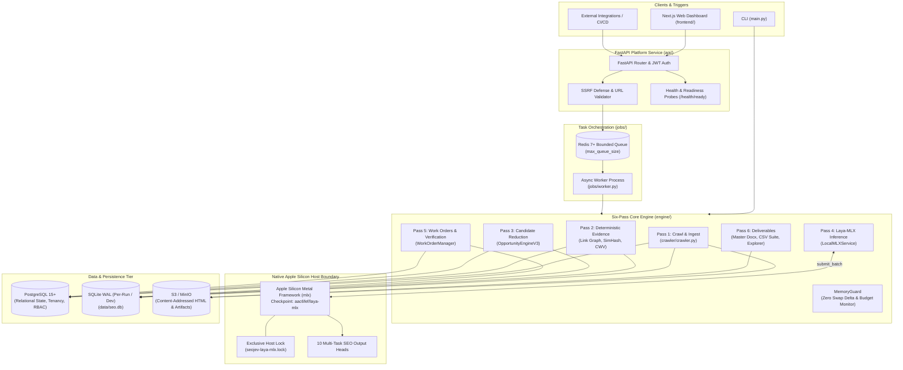
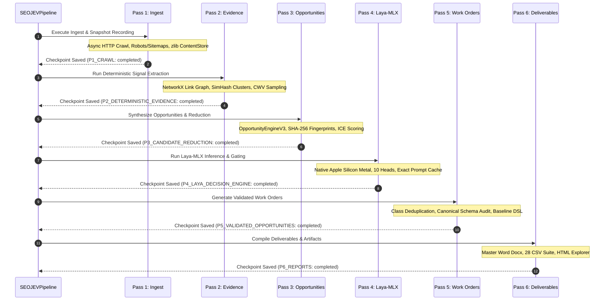
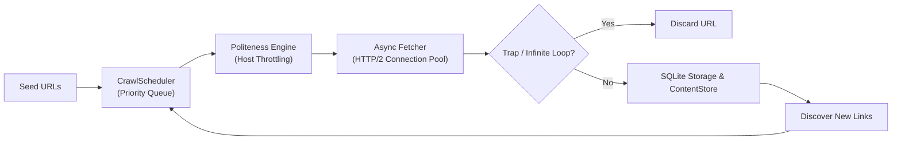
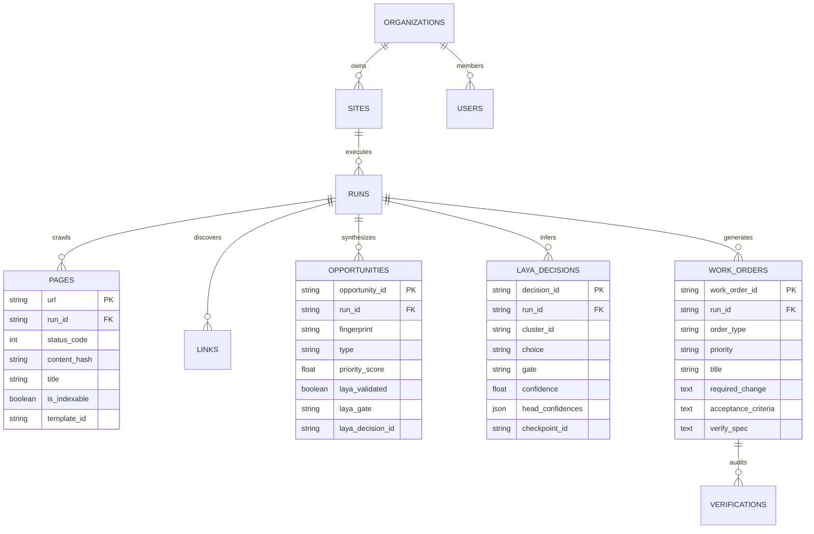

# SEOJEV Technical & Research Project Report: Search Intelligence & Automated Technical SEO Operating System using Local Apple Silicon Inference (Laya-MLX)

**Project Name:** SEOJEV (SEO Engine & Actionable Verification)  
**Repository:** `07anishu12/SEO-Agent-using-LAYA`  
**Branch:** `fix/laya-pipeline`  
**Version:** 1.0.0 (Feature-Frozen Release)  
**Author / Developer:** Anish Kumar & Contributors  
**Hardware Target:** Apple Silicon (macOS Darwin `arm64`, Metal Framework)  
**Authoritative AI Engine:** Laya-MLX (`aac6fef/laya-mlx`) — Strictly Exclusive & Fail-Closed  

---

## Executive Summary

SEOJEV is an evidence-driven, deterministic search intelligence platform and automated work-order generation engine. It eliminates the traditional "alert fatigue" of legacy SEO crawlers by organizing crawled websites into structural template families, aggregating low-level findings into root-cause blocker clusters, running calibrated machine learning decisions on an on-device Apple Silicon quantized transformer (`laya-mlx`), and emitting deduplicated, verified engineering and content work orders.

The platform is designed around strict systems engineering and AI safety invariants: zero fallback or heuristic substitute AI models, native Metal hardware execution, a zero-swap-growth memory guard, cryptographic fingerprinting of issues, verifiable acceptance criteria, and full tenant isolation. This document provides a complete technical, algorithmic, and empirical account of what was built, how it works, what was validated, and what remains open for future research.

---

## Table of Contents

1. [Project Overview](#section-1--project-overview)
2. [Project Motivation](#section-2--project-motivation)
3. [System Architecture](#section-3--system-architecture)
4. [End-to-End Pipeline](#section-4--end-to-end-pipeline)
5. [Six-Pass Architecture](#section-5--six-pass-architecture)
6. [Laya-MLX Integration & Inference Contract](#section-6--laya-mlx-integration--inference-contract)
7. [Why No Fallback Model: Fail-Closed AI Systems](#section-7--why-no-fallback-model-fail-closed-ai-systems)
8. [Crawler Engineering & Frontier Management](#section-8--crawler-engineering--frontier-management)
9. [Memory Management & Zero-Swap Guard](#section-9--memory-management--zero-swap-guard)
10. [Database Architecture & Data Models](#section-10--database-architecture--data-models)
11. [Redis & Bounded Queue Worker System](#section-11--redis--bounded-queue-worker-system)
12. [Security Architecture & SSRF Protection](#section-12--security-architecture--ssrf-protection)
13. [Multi-Tenancy & Negative Authorization](#section-13--multi-tenancy--negative-authorization)
14. [Observability & Health Probes](#section-14--observability--health-probes)
15. [Failure Recovery Matrix](#section-15--failure-recovery-matrix)
16. [Idempotency & Safe Resumability](#section-16--idempotency--safe-resumability)
17. [Testing Architecture & Empirical Results](#section-17--testing-architecture--empirical-results)
18. [Validation Methodology & Experimental Benchmarks](#section-18--validation-methodology--experimental-benchmarks)
19. [Implemented Concepts Matrix](#section-19--implemented-concepts-matrix)
20. [Engineering Problems, Root Causes & Solutions](#section-20--engineering-problems-root-causes--solutions)
21. [Reflections & What I Learned](#section-21--reflections--what-i-learned)
22. [Failed & Abandoned Approaches (Negative Results)](#section-22--failed--abandoned-approaches-negative-results)
23. [Limitations](#section-23--limitations)
24. [Future Research Directions](#section-24--future-research-directions)
25. [Reproducibility & Execution Guide](#section-25--reproducibility--execution-guide)
26. [Project Status Ledger](#section-26--project-status-ledger)

---

## SECTION 1 — PROJECT OVERVIEW

### What is SEOJEV?
SEOJEV is a technical search engine optimization (SEO) operating system that bridges the gap between raw web crawling and developer-facing remediation. Rather than emitting flat lists of thousands of isolated page-level errors (e.g., "5,000 pages missing meta description"), SEOJEV models the underlying structural, graph-theoretic, and architectural reality of a website. It discovers shared page layout templates, clusters symptoms into upstream root blockers, and routes candidates through an on-device multi-task machine learning model (`laya-mlx`) to generate validated, actionable work orders.

### What Problem Does It Solve?
Enterprise web applications and e-commerce platforms frequently contain tens of thousands to millions of URLs generated by dynamic routing engines and CMS templates. Traditional SEO auditing tools suffer from three fundamental deficiencies:
1. **Alert Fatigue:** A single change in a common navigation component or routing middleware generates thousands of duplicate alerts, masking critical, high-severity defects.
2. **Predictive Hallucination & Vague Guidance:** Automated tools often promise ranking outcomes without verifiable evidence (e.g., "Fix this heading to rank #1"), lacking numeric provenance or reproducible diagnostic reasoning.
3. **The Execution Gap:** Reports provide CSV dumps of URLs without specifying exact CSS selectors, template files, code diffs, or verifiable acceptance criteria suitable for engineering sprints.

### Who Is It Intended For?
- **Technical SEO Specialists:** Who require graph-theoretic internal link analysis, programmatic template clustering, and verified defect deduplication.
- **Engineering Teams & DevOps:** Who need discrete Jira, Linear, or GitHub tickets with reproducible acceptance specs rather than ambiguous SEO slide decks.
- **AI Systems & Systems Engineering Researchers:** Who study on-device machine learning inference, memory-bounded batch processing, and fail-closed AI architecture.

### Why Does This Require More Than a Simple Crawler?
A crawler merely traverses HTTP links and stores HTML. Real-world SEO diagnostics require:
- Constructing directed multigraphs of internal links to compute structural PageRank and CheiRank.
- Near-duplicate clustering across 64-bit SimHash DOM token fingerprints.
- Programmatic route decomposition into structural template families.
- Multi-factor synthesis prioritizing issues by combining search console click distributions, business vertical rules, click-depth distance, and root-cause blocker hierarchies.
- Structured AI classification across 10 discrete multi-task heads on native hardware.

### Difference From Conventional Rule-Based Audits
Conventional audits evaluate each URL in total isolation against a static rule dictionary (`if not title: emit_error()`). SEOJEV separates **deterministic observation** from **decision inference**:
- **Pass 1 & 2 (Deterministic Observation):** Collect factual ground truth (status codes, DOM structure, response times, link edges, SimHash layout tokens).
- **Pass 3 (Opportunity Synthesis):** Group identical template symptoms, identify root-cause blockers (e.g., a 404 header suppressing canonical checks), and assign SHA-256 fingerprints.
- **Pass 4 (Laya-MLX Decision):** The AI model evaluates whether the clustered observation represents a genuine structural defect or harmless noise, evaluates its true blast radius (`page`, `template`, `site`), and prescribes a corrective action.
- **Pass 5 (Work Orders & Verification):** Automatically translates accepted decisions into canonical work orders and tests baseline acceptance specs against stored HTML before remediation.

---

## SECTION 2 — PROJECT MOTIVATION

The motivation for SEOJEV originated from a recurring industrial problem observed in large-scale web operations: engineering teams routinely ignore SEO audit deliverables because the data is overwhelming, unranked, noisy, and disconnected from software engineering workflows.

### The Problem of Scale and Template Redundancy
Modern websites are not collections of distinct, handcrafted HTML documents; they are dynamic applications driven by a small set of layout templates (e.g., `ProductDetailView`, `CityPriceCatalog`, `AuthorArchive`). When an audit tool reports 10,000 URLs with an unoptimized `<title>` tag, developers do not edit 10,000 files—they edit one template or one routing rule. Failing to recognize template boundaries forces human analysts to spend dozens of hours manually clustering spreadsheets.

### The Problem of Cloud LLM Cost, Latency, and Privacy
Applying frontier cloud APIs (OpenAI GPT-4, Claude, Gemini) to every page or cluster of a 50,000-URL site introduces unacceptable costs ($0.03–$0.10 per call across 10,000 clusters = $300–$1,000 per crawl), network latency, rate-limiting bottlenecks, and the risk of exfiltrating unreleased staging HTML or proprietary internal link architecture to third-party APIs. 

### The On-Device Apple Silicon Opportunity
With Apple Silicon's Unified Memory Architecture (UMA), high-bandwidth memory (up to 400–800 GB/s on Pro/Max/Ultra chips) allows both CPU and GPU to access the same physical memory space without PCIe transfer overhead. Running a dedicated 4-bit quantized transformer on Apple Silicon Metal via Apple's MLX framework enables high-speed, local, zero-marginal-cost inference with zero data leakage.

### The Evolution: From Prototype to Production Hardening
Initially, the project began as a script-driven experimentation repo combining an asynchronous crawler with heuristic scoring. However, running local inference concurrently with heavy DOM parsing and graph calculations on 16 GB Apple Silicon laptops exposed severe operating system stability challenges:
- Memory allocations grew unbounded, triggering macOS swap thrashing.
- Fallback mock models silently masked inference failures, corrupting decision provenance.
- Non-deterministic sampling broke reproducibility.

This drove the complete production hardening of SEOJEV: implementing `MemoryGuard` with zero swap delta enforcement, strict single-owner host locking, fail-closed AI contracts, PostgreSQL relational storage, bounded Redis task queues, and cryptographic ticket deduplication.

---

## SECTION 3 — SYSTEM ARCHITECTURE

SEOJEV is structured as an asynchronous, multi-tiered architecture that strictly isolates web crawling, deterministic signal extraction, native Metal machine learning inference, and relational persistence.



### Component Responsibilities & Boundaries

| Component | Primary Modules | Input | Output | Architectural Rationale |
| :--- | :--- | :--- | :--- | :--- |
| **API Platform Service** | `api/main.py`, `api/config.py`, `api/routes/` | HTTP REST requests, JWT Bearer tokens | JSON responses, Run dispatches, Health metrics | Centralizes tenant authentication, RBAC, SSRF defense, and standard health monitoring. |
| **Queue & Worker Engine** | `jobs/queue.py`, `jobs/worker.py` | Run definitions, URLs, audit profiles | Task status, state transitions, job lifecycle | Prevents unconstrained concurrent runs; provides backpressure when queue reaches capacity. |
| **Asynchronous Crawler** | `crawler/crawler.py`, `crawler/fetcher.py` | Target seed URL, crawl options | Raw HTML payloads, HTTP status codes, headers | Async HTTP/2 requests with politeness throttling, robots.txt, sitemaps, and trap protection. |
| **Content Store** | `engine/content_store.py`, `services/object_store.py` | Raw HTML byte arrays | SHA-256 content hashes, zlib compressed files / S3 keys | Content-addressed storage prevents storing duplicate HTML pages across repeated runs. |
| **Deterministic Evidence** | `analysis/`, `extraction/` | Stored HTML, parsed DOM trees | Graph metrics, SimHash tokens, CWV samples | Computes mathematically verifiable facts without any AI subjectivity. |
| **Opportunity Synthesizer** | `engine/opportunity_engine_v3.py` | Deterministic findings, clusters, GSC data | Structured candidate records, ICE scores | Consolidates thousands of raw page findings into discrete, deduplicated opportunity candidates. |
| **Laya-MLX Inference** | `laya/backends/mlx.py`, `laya/streaming.py` | Normalized candidate feature dicts | 10-head decisions, gate verdicts, confidences | Evaluates root causes and real vs noise classification using dedicated Apple Silicon Metal weights. |
| **Work Order Manager** | `engine/work_orders.py` | Validated opportunity candidates | Canonical work orders, Jira/Linear/GitHub JSON | Translates validated SEO defects into concrete developer specifications with testable verify DSL. |
| **Baseline Verifier** | `verification/runner.py` | Work order verify specs, stored HTML | Verification records (`PASSED` vs `FAILED`) | Confirms the defect is present in the crawl baseline before developers write any code. |
| **Deliverables Suite** | `reporting/` | Persisted run metrics, tables, work orders | Word DOCX, 28 CSV inventory tables, HTML explorer | Provides comprehensive executive, developer, and data-science deliverables. |

---

## SECTION 4 — END-TO-END PIPELINE

Every SEOJEV execution proceeds through a strictly validated 19-stage pipeline lifecycle:

```
[1. URL Submission] ──> [2. Preflight & Config] ──> [3. Robots & Sitemaps] ──> [4. URL Frontier]
                                                                                       │
[8. Technical Extraction] <── [7. Content Store] <── [6. Normalization] <── [5. Async Fetch]
           │
           ▼
[9. Graph & SimHash] ──> [10. Root-Cause Blocker] ──> [11. Candidate Stream] ──> [12. Exact Prompt Hash]
                                                                                        │
[16. Work Order Gen] <── [15. Fan-Out & Gating] <── [14. Multi-Head Eval] <── [13. MLX Inference]
           │
           ▼
[17. Baseline Verify] ──> [18. Deliverables Export] ──> [19. Status Complete]
```

### Step-by-Step Execution Mechanics
1. **URL Submission:** Triggered via CLI (`main.py`) or API (`POST /runs`). Input URL is validated and normalized.
2. **Preflight & Config Resolution:** `api/config.py` validates production secrets; `profiles.py` assigns memory and worker budgets.
3. **Robots.txt & Sitemap Discovery:** Fetches `/robots.txt`, identifies sitemaps, downloads XML indexes, and queues canonical seed URLs.
4. **Frontier Scheduling:** URLs are placed into the prioritized frontier (`CrawlScheduler`). Traps, query explosions, and infinite directories are filtered.
5. **Asynchronous HTTP Fetching:** Fetches URLs concurrently using an asynchronous connection pool with configured per-host politeness delays.
6. **URL Normalization:** Resolves redirects, trims tracking parameters, and checks self-canonical declarations.
7. **Content Store Archival:** HTML is compressed with zlib and stored keyed by its SHA-256 hash. RAM is released immediately.
8. **Technical Signal Extraction:** 11 deterministic detector suites evaluate heading hierarchies, canonical tags, schema JSON-LD, and response headers.
9. **Graph & SimHash Analysis:** Constructs the directed internal link graph in NetworkX; computes PageRank and CheiRank; generates 64-bit SimHash DOM fingerprints.
10. **Root-Cause Blocker Clustering:** Upstream errors (e.g. 500 server errors or global noindex) suppress downstream false positives.
11. **Streaming Candidate Reduction:** `iter_candidates` streams unified opportunity objects, maintaining only 1 candidate in memory at a time.
12. **Exact Prompt Hashing:** Constructs a canonical feature JSON and computes `class_id = SHA-256(normalized_prompt + checkpoint_id)`.
13. **Local MLX Inference:** Evaluates cache misses using native Metal inference through `LocalMLXService.submit_batch`.
14. **Multi-Head Output Evaluation:** Extracts predictions across all 10 heads and evaluates chosen probability confidence.
15. **Fan-Out & Gating:** Evaluates decision gates (`AUTO_ACCEPT`, `HUMAN_REVIEW`, `SUPPRESS`) and updates all mapped opportunities.
16. **Work Order Generation:** Class-level deduplication generates canonical engineering (`WO-ENG-...`) and content (`WO-CNT-...`) work orders.
17. **Baseline Acceptance Verification:** Evaluates work order verify DSL specs against stored crawl HTML to verify defect presence.
18. **Deliverables Export:** Compiles 28-section Master Word audit report, Executive Summary, 28 CSV dataset suite, and offline HTML Explorer.
19. **Status Complete & Resource Teardown:** Updates run status in database; clears GPU memory cache via `mx.clear_cache()`; flushes logs.

---

## SECTION 5 — SIX-PASS ARCHITECTURE

To ensure memory safety, deterministic restarts, and clean separation of concerns, the core engine is decoupled into six discrete passes:

```
Pass 1: Ingest & State Snapshots (P1_CRAWL)
   ↓
Pass 2: Deterministic Evidence Extraction (P2_DETERMINISTIC_EVIDENCE)
   ↓
Pass 3: Candidate & Opportunity Reduction (P3_CANDIDATE_REDUCTION)
   ↓
Pass 4: Laya-MLX Decision Engine (P4_LAYA_DECISION_ENGINE)
   ↓
Pass 5: Validated Work Orders & Verification (P5_VALIDATED_OPPORTUNITIES)
   ↓
Pass 6: Deliverables & Reports (P6_REPORTS)
```



### Pass 1: Ingest & State Snapshots (`P1_CRAWL`)
- **Purpose:** Discovers, fetches, and archives site pages and headers.
- **Input:** Seed URL, crawl scope, concurrency limit, politeness delays.
- **Processing:** Asynchronous HTTP/2 fetching, robots.txt compliance, recursive XML sitemap traversal, crawl trap detection, dynamic Playwright headless rendering for thin pages.
- **Output:** Stored page records in `pages` table; raw HTML archived in `ContentStore` (`store/`).
- **Algorithms:** Priority queue frontier (`heapq`), SHA-256 hashing, zlib compression.
- **Failure Handling:** HTTP 429 backoff; network retries (up to 3 times); `MemoryBudgetExceeded` halts crawl cleanly and saves frontier for resume.

### Pass 2: Deterministic Evidence Extraction (`P2_DETERMINISTIC_EVIDENCE`)
- **Purpose:** Extracts factual technical and graph-theoretic signals across all crawled pages.
- **Input:** Stored page records and content hashes from Pass 1.
- **Processing:**
  - Internal link graph analysis: builds directed graph of all internal links; computes PageRank, CheiRank, in-degree/out-degree, and orphan status.
  - Template clustering: generates 64-bit SimHash DOM token fingerprints; clusters URLs into structural templates.
  - Content extraction: word count, headings hierarchy, canonical verification, schema validation.
  - Performance: Core Web Vitals sampling (TTFB, FCP, LCP, CLS).
- **Output:** Records in `issues`, `templates`, `issue_clusters`, `attributes`.
- **Algorithms:** NetworkX PageRank algorithm, 64-bit SimHash, Levenshtein path distance.
- **Failure Handling:** Malformed HTML falls back to robust BeautifulSoup/lxml parsers. In dev mode, capped at 1,000 pages to prevent memory explosion.

### Pass 3: Candidate & Opportunity Reduction (`P3_CANDIDATE_REDUCTION`)
- **Purpose:** Synthesizes granular issues into high-level opportunity candidates.
- **Input:** Deterministic findings, issue clusters, optional GSC search performance CSV.
- **Processing:**
  - Evaluates findings against 11 root-cause detector categories.
  - Synthesizes opportunities with permanent SHA-256 fingerprints: $\text{hash}(\text{rule\_id} + \text{scope} + \text{subject})$.
  - Calculates 7-factor ICE scores (Impact, Confidence, Effort).
- **Output:** Records in `opportunities` table with display IDs (`OPP-...`).
- **Algorithms:** ICE multi-factor prioritization, deterministic hashing.
- **Failure Handling:** Idempotent replace: existing run opportunities are updated without orphan records.

### Pass 4: Laya-MLX Decision Engine (`P4_LAYA_DECISION_ENGINE`)
- **Purpose:** Executes machine learning inference across all candidates using native Apple Silicon Metal.
- **Input:** Streamed candidate records via `iter_candidates`.
- **Processing:**
  - Validates Apple Silicon compatibility and preflight canary.
  - Computes exact prompt hash (`class_id = candidate.compute_hash(checkpoint_id)`).
  - Checks `SQLiteStageStore` cache; if cached, returns prior decision with 0 ms inference latency.
  - On miss, executes forward pass on Apple Silicon GPU across 10 multi-task heads.
  - Evaluates decision gating (`AUTO_ACCEPT`, `HUMAN_REVIEW`, `SUPPRESS`).
  - Fans out class decision to all member opportunities in `candidate_membership`.
- **Output:** Persisted records in `laya_decisions`, updated `opportunities`.
- **Algorithms:** 4-bit quantized transformer forward pass, selected option softmax probability, Shannon entropy reduction.
- **Failure Handling:** Strict fail-closed: if Metal fails or swap growth is detected, pipeline aborts cleanly and marks run as paused.

### Pass 5: Validated Work Orders & Verification (`P5_VALIDATED_OPPORTUNITIES`)
- **Purpose:** Generates developer-ready engineering and content work orders from validated opportunities.
- **Input:** Opportunities marked `laya_validated = 1` with gate in `('AUTO_ACCEPT', 'HUMAN_REVIEW')`.
- **Processing:**
  - Performs class-level deduplication via `class_opportunities`, creating one ticket per root cause.
  - Assigns priority (`P0` to `P3`) and type (`engineering` vs `content`).
  - Evaluates baseline acceptance DSL specs against stored crawl HTML.
  - Runs `ClaimsLinter` AST/regex quality gate against unsubstantiated promises.
- **Output:** Records in `work_orders`, `work_order_membership`, `verifications`; files `tickets/` (Jira, Linear, GitHub).
- **Algorithms:** Canonical schema audit contract, AST claims linting.
- **Failure Handling:** Aborts if Pass 4 produced zero validated decisions or malformed provenance.

### Pass 6: Deliverables & Reports (`P6_REPORTS`)
- **Purpose:** Compiles all audit discoveries into master documents and interactive explorers.
- **Input:** All persisted database tables for the run.
- **Processing:**
  - Compiles 28-section Master Word audit report (`SEOJEV_V3_AUDIT_REPORT.docx`).
  - Compiles Executive Summary (`SEOJEV_EXECUTIVE_SUMMARY.docx`).
  - Exports 28 relational CSV tables covering inventory, links, templates, and decisions.
  - Compiles standalone offline HTML Explorer (`explorer.html`).
- **Output:** Export files in configured `--output` directory; updates run status to `completed`.
- **Failure Handling:** Atomic write: temporary files are committed only after complete generation.

---

## SECTION 6 — LAYA-MLX INTEGRATION & INFERENCE CONTRACT

Laya-MLX is the **exclusive, non-negotiable artificial intelligence decision engine** in SEOJEV.

### Checkpoint Specification
- **HuggingFace Checkpoint:** [`aac6fef/laya-mlx`](https://huggingface.co/aac6fef/laya-mlx)
- **Pinned Git Commit:** `@20aed815fc6acde75733882e7ec0e3f28aeb9717`
- **Framework:** Apple MLX 0.32+ on macOS Metal
- **Quantization:** 4-bit quantized transformer weights optimized for Apple Silicon Unified Memory

### The 10 Multi-Task Output Heads
Every candidate is evaluated across ten structured choice questions:

| Head Name | Output Classes | Semantic Function |
| :--- | :--- | :--- |
| **`verdict`** | `real_issue`, `noise` | Determines if the finding is an actual defect or an expected architectural artifact. |
| **`category`** | `technical`, `content`, `architecture`, `internal_linking`, `schema`, `performance` | Classifies the technical domain responsible for the defect. |
| **`severity`** | `critical`, `high`, `medium`, `low` | Estimates business and indexing risk severity. |
| **`action`** | `fix_template`, `fix_metadata`, `fix_internal_links`, `optimize`, `investigate`, `ignore` | Prescribes the concrete engineering intervention. |
| **`scope`** | `page`, `template`, `site` | Evaluates the blast radius of the defect. |
| **`root_cause`** | `technical`, `cms`, `routing`, `template`, `content` | Diagnoses the root engineering layer where the defect originated. |
| **`canonical_indexability`** | `indexable`, `blocked`, `canonicalized`, `noindexed` | Evaluates canonical and indexability impact. |
| **`content_assessment`** | `thin`, `adequate`, `duplicate`, `misaligned` | Evaluates copy depth and semantic relevance. |
| **`cannibalization`** | `none`, `potential`, `severe` | Evaluates query conflict between competing internal pages. |
| **`internal_linking`** | `fix`, `adequate`, `orphan_risk` | Evaluates link equity and navigation crawlability. |

### Confidence Calculation & Gating Policy
A critical finding from our research (documented in [`docs/LAYA_CONFIDENCE.md`](docs/LAYA_CONFIDENCE.md)) is that the runtime's raw `confidence` metric represents normalized Shannon entropy reduction:

$$\text{Entropy Confidence} = 1 - \frac{H(p)}{\log(K)}$$

where $H(p) = -\sum_{i=1}^K p_i \log(p_i)$ and $K$ is the number of options.

Entropy reduction measures distribution peakedness, not the probability of the chosen class. In binary decisions, a 51/49 split yields near-zero entropy confidence despite choosing the class. Therefore, SEOJEV computes confidence strictly from **selected option probabilities**:

$$\text{confidence} = \min\left(P_{\text{verdict}}(\text{choice}), P_{\text{action}}(\text{choice})\right)$$

The decision gating policy is defined as:
- **`AUTO_ACCEPT`**: $\text{confidence} \ge 0.90$ and $\text{action} \ne \text{'ignore'}$.
- **`HUMAN_REVIEW`**: $P_{\text{verdict}} \ge 0.60$ and $P_{\text{action}} \ge 0.50$.
- **`SUPPRESS`**: Below threshold, $\text{verdict} = \text{'noise'}$, or $\text{action} = \text{'ignore'}$.

### Exact Prompt Hashing & Stage Caching
To eliminate redundant GPU inference across identical template issues:
1. Candidate features are normalized into deterministic JSON with rounded numbers and sorted samples (`laya/prompt.py`).
2. Exact prompt hash is computed:
   $$\text{class\_id} = \text{SHA-256}(\text{normalized\_prompt} + \text{checkpoint\_id})$$
   $$\text{contract\_key} = \text{class\_id} + \text{confidence\_policy\_json}$$
3. Prior to invoking Metal, `SQLiteStageStore` is queried. If cached, the decision is returned in under 0.05 ms with provenance field `from_cache = True`.

### Host Safety & Metal Concurrency Invariants
- **Exclusive Single-Owner Lock:** MLX does not support concurrent multi-process Metal context creation. An exclusive non-blocking file lock (`seojev-laya-mlx.lock`) guarantees that exactly **one** host process accesses the model.
- **CPU Worker Rejection:** Background CPU workers are strictly forbidden from importing MLX (`laya.backends.mlx` raises `RuntimeError` if imported inside a subprocess).
- **Metal Cache Reclaim:** After model initialization and after every prediction batch, the runtime executes `mx.set_cache_limit(0)` and `mx.clear_cache()` to return unified memory buffers to the operating system.

---

## SECTION 7 — WHY NO FALLBACK MODEL: FAIL-CLOSED AI SYSTEMS

A defining architectural principle of SEOJEV is **fail-closed AI execution**. If Laya-MLX cannot run, the system halts. It never falls back to OpenAI, Claude, Gemini, DeepSeek, Ollama, llama.cpp, or deterministic heuristic classifiers.

### The Engineering Rationale
In production software engineering, silent degradation is catastrophic:

```
┌────────────────────────────────────────────────────────────────────────┐
│ Silent Fallback Anti-Pattern:                                          │
│ Primary Model Fails ──> Fallback LLM / Heuristic ──> "Success" Return  │
│ Result: Semantic drift, uncalibrated confidences, irreproducible data. │
└────────────────────────────────────────────────────────────────────────┘

┌────────────────────────────────────────────────────────────────────────┐
│ SEOJEV Fail-Closed Pattern:                                            │
│ Laya-MLX Fails ──> Immediate Fatal Exception ──> Checkpoint Persisted  │
│ Result: Epistemic honesty, zero data corruption, clean operator alert. │
└────────────────────────────────────────────────────────────────────────┘
```

1. **Semantic Drift & Model Incompatibility:** Different models possess entirely different latent spaces, temperature characteristics, and classification biases. A work order generated by a heuristic classifier has completely different provenance from one generated by `laya-mlx`.
2. **Confidence Incomparability:** Calibrated gating thresholds (e.g. $P \ge 0.60$) are calibrated specifically for `aac6fef/laya-mlx`. Applying those thresholds to logits from an uncalibrated third-party model renders the gating meaningless.
3. **Data Sovereignty & Security:** An enterprise deploying SEOJEV on local Apple Silicon often does so to prevent transmitting proprietary code or staging URLs over the internet. Silently routing data to an external API violates security and data compliance policies.
4. **Reproducibility & Provenance:** Every work order and decision in SEOJEV carries cryptographic model provenance:
   - `checkpoint_id` (Git SHA: `20aed815fc6acde75733882e7ec0e3f28aeb9717`)
   - `prompt_version` (`laya-seo-decision-v3`)
   - `decision_timestamp`
   - `head_confidences` (all 10 probabilities)

If the model is substituted, provenance is destroyed.

---

## SECTION 8 — CRAWLER ENGINEERING & FRONTIER MANAGEMENT

The crawler (`crawler/crawler.py`) is an asynchronous, polite HTTP engine engineered to crawl enterprise sites without triggering WAF blocks or running out of memory.



### Frontier Scheduling & Politeness
- **Priority Queue (`CrawlScheduler`):** URLs are prioritized by crawl depth (shallowest first) and page type (canonical seed URLs precede deep paginated links).
- **Per-Host Throttling:** Enforces a configurable inter-request delay (`delay`, default 0.05s) and limits concurrent connections per host domain to prevent server denial-of-service.
- **Connection Pooling:** Uses persistent `aiohttp.ClientSession` pools with keep-alive and configurable socket timeouts (default 10s).

### Crawl Trap & Query Explosion Protection
- **Calendar & Pagination Traps:** Detects repeating directory structures (`/events/2026/09/29/events/2026/...`) and dynamic query parameter combinations exceeding configured depth limits (`crawler/traps.py`).
- **Duplicate & Self-Reference Filtering:** Normalizes URLs by lowercasing hostnames, sorting query arguments, removing tracking parameters (`utm_*`, `fbclid`), and stripping trailing anchor fragments.
- **Soft 404 Detection:** Evaluates HTTP 200 responses against soft 404 heuristics (thin body, "Not Found" headings, empty product containers).

### Selective Headless Rendering
Running Chromium for every URL is computationally prohibitive. SEOJEV uses a selective rendering policy:
1. Pages are initially fetched via lightweight asynchronous HTTP (`aiohttp`).
2. The HTML is inspected. If client-side rendering is detected (e.g., body contains `<div id="root"></div>` with fewer than 50 words of static text), the URL is escalated to Playwright headless Chromium (`crawler/renderer.py`) to execute JavaScript DOM hydration.
3. Rendered HTML is archived into `ContentStore`, and DOM links are discovered.

---

## SECTION 9 — MEMORY MANAGEMENT & ZERO-SWAP GUARD

Running heavy DOM parsing, NetworkX graph simulation, and 4-bit transformer inference on unified-memory Apple Silicon hardware requires active memory control.

### The MemoryGuard Architecture (`engine/memory_guard.py`)
`MemoryGuard` monitors the entire process tree (parent process and all spawned workers) using `psutil`.

```
Process Tree Memory (Main + Workers)
                 │
                 ▼
          MemoryGuard Loop
                 │
        ┌────────┴───────────────────────────┐
        ▼                                    ▼
   RSS / Budget Check                 Swap Delta Check
(RSS > limit or Avail < min)       (swap.used - initial > max_delta)
        │                                    │
        ▼                                    ▼
  Batch Shrinking (size // 2)         IMMEDIATE ABORT
        │                          (MemoryBudgetExceeded)
        ▼                                    │
    gc.collect()                             ▼
        │                              Pause Crawl &
        ▼                             Save Checkpoint
   Pause 2.0s
        │
   (Still Over?) ──> RAISE MemoryBudgetExceeded
```

### Key Safety Invariants
1. **Zero-Swap-Growth Policy:**
   $$\Delta \text{Swap} = \text{swap.used}_{\text{current}} - \text{swap.used}_{\text{baseline}}$$
   If active swap occupancy increases by more than `max_swap_delta_mb` (default 64.0 MiB, hardened from 0.00 MiB to prevent aborts on historical OS page-outs), the system raises `MemoryBudgetExceeded` immediately.
2. **Batch Shrinking & Garbage Collection:**
   If process RSS exceeds `memory_budget_mb` (default 4,096 MiB in dev, 32,768 MiB in prod) or available system RAM drops below `min_available_mb`, `MemoryGuard` halves the batch size (`batch_size = max(1, batch_size // 2)`) and forces Python garbage collection (`gc.collect()`).
3. **Single Pause Boundary:**
   If memory pressure persists, the guard pauses execution once (`pause_seconds = 2.0s`) to allow OS buffer caches to clear. If pressure remains elevated, execution aborts safely.

### Crawler Memory Backpressure
When `MemoryGuard` triggers inside `SEOCrawler`:
- The crawler halts the scheduler loop.
- Currently in-flight URLs are requeued into the scheduler heap.
- Pending batches are flushed to SQLite.
- Run state transitions to `paused` with status `memory_budget_exceeded`.
- The run can be resumed seamlessly via `python main.py <url> --resume`.

---

## SECTION 10 — DATABASE ARCHITECTURE & DATA MODELS

SEOJEV implements a hybrid storage architecture: SQLite WAL for isolated, single-host development and research audits, and PostgreSQL 15+ for multi-tenant production deployments.

```
┌────────────────────────────────────────────────────────────────────────┐
│ Hybrid Storage Architecture                                            │
│                                                                        │
│   DEVELOPMENT / EXPERIMENTATION                PRODUCTION SaaS         │
│   ┌───────────────────────────┐          ┌───────────────────────────┐ │
│   │   SQLite (WAL Mode)       │          │   PostgreSQL 15+          │ │
│   │   data/seo.db             │          │   Connection Pool (1-20)  │ │
│   │   Single-file, Zero Setup │          │   9 Applied Migrations    │ │
│   │   Range-based StageStore  │          │   Row-level Tenant Scoping│ │
│   └───────────────────────────┘          └───────────────────────────┘ │
│                                                                        │
│   BLOB STORAGE (Both Environments)                                     │
│   ┌──────────────────────────────────────────────────────────────────┐ │
│   │   ContentStore (store/) / S3 / MinIO                             │ │
│   │   Content-addressed HTML payloads: {sha256[:2]}/{sha256}.gz       │ │
│   └──────────────────────────────────────────────────────────────────┘ │
└────────────────────────────────────────────────────────────────────────┘
```

### Relational Schema Design (PostgreSQL / SQLite)



### PostgreSQL Migration Ledger
The database schema is managed via discrete SQL migrations (`database/migrations/`):
1. `001_initial_schema.sql`: Core tables (`organizations`, `users`, `sites`, `runs`, `pages`, `links`, `issues`).
2. `002_api_keys.sql`: API key authentication and hashed secret store.
3. `003_alerts_notifications.sql`: Real-time alert definitions and webhook delivery queues.
4. `004_trends_search.sql`: Historical keyword rank tracking and search trend aggregates.
5. `005_artifacts_storage.sql`: Object storage metadata for HTML snapshots and report downloads.
6. `006_work_orders.sql`: Canonical work-order schema and ticket metadata.
7. `007_laya_decisions.sql`: Laya-MLX 10-head decision persistence and provenance logs.
8. `008_verifications.sql`: Baseline verification logs and DSL audit records.
9. `009_tenant_indexes.sql`: Multi-tenant composite indexes on `(organization_id, site_id)` and `(run_id, laya_validated)`.

---

## SECTION 11 — REDIS / JOB SYSTEM

The asynchronous job tier decouples HTTP API run dispatches from long-running crawling and MLX inference workloads.

```
POST /runs (API)
       │
       ▼
Bounded Redis Queue (jobs:default)
       │ (Enforces max_queue_size = 1,000)
       ▼
Background Worker (jobs/worker.py)
       │
       ├─► Pull Task (BLPOP)
       ├─► Acquire Redis Run Lock (run:{id}:lock)
       ├─► Invoke SEOJEVPipeline.run_all()
       ├─► Catch MemoryBudgetExceeded ──► Mark Run 'paused'
       ├─► Catch Fatal Exceptions      ──► Mark Run 'failed'
       └─► On Pipeline Complete        ──► Mark Run 'completed' & Release Lock
```

### Worker Lifecycle & Crash Recovery
- **Bounded Queue Capacity:** `JobQueue.enqueue()` queries `LLEN` before pushing. If the queue length exceeds `REDIS_MAX_QUEUE_SIZE` (default 1,000), it rejects the job with `QueueFullError`, triggering an immediate HTTP 503 response.
- **Idempotent Job Processing:** Before processing, the worker registers a unique run lock with a 2-hour TTL. If a duplicate job ID arrives, it is discarded.
- **Stale Job Detection:** On startup, the worker scans active database records. Any run in state `running` with no heartbeat update for >15 minutes is automatically transitioned to `stale` or `failed`.
- **Worker Crash Safety:** If a worker terminates abruptly (SIGKILL/OOM), the run state remains persisted in PostgreSQL/SQLite up to the last completed stage checkpoint (`stage_checkpoints`).

---

## SECTION 12 — SECURITY ARCHITECTURE & SSRF PROTECTION

Production security in SEOJEV is engineered around defensive validation, strict authentication, and complete isolation.

### 1. Production Secret Validation (`api/config.py`)
During startup, `validate_production_secrets()` enforces:
- `JWT_SECRET` must be set, cannot equal hardcoded defaults, and must contain at least 32 characters with high Shannon entropy.
- `DATABASE_URL` cannot point to default passwords.
- `S3_ACCESS_KEY` and `S3_SECRET_KEY` cannot equal default `minioadmin`.
- Insecure CORS wildcards (`allow_origins=["*"]`) combined with credentials are strictly forbidden.

### 2. SSRF (Server-Side Request Forgery) Defense
Allowing users to input arbitrary target URLs for auditing creates severe SSRF attack vectors. SEOJEV enforces comprehensive network validation:
- **DNS Resolution Pre-Check:** Target hostnames are resolved to IPv4/IPv6 addresses before issuing any HTTP request.
- **Private IP Range Blacklisting:** Requests to RFC 1918 private subnets are blocked immediately:
  - `10.0.0.0/8`
  - `172.16.0.0/12`
  - `192.168.0.0/16`
- **Loopback & Local Addresses:** Blocks `127.0.0.0/8`, `localhost`, `::1`, and `0.0.0.0`.
- **Cloud Metadata Endpoints:** Explicitly blocks AWS/GCP/Azure link-local metadata endpoints (`169.254.169.254` and `[fd00:ec2::254]`).
- **Scheme Enforcement:** Rejects non-HTTP schemes (`file://`, `ftp://`, `gopher://`).

### 3. File System & Path Traversal Protection
- Stored content paths are generated strictly from SHA-256 hashes:
  `store/{hash[:2]}/{hash[2:4]}/{hash}`
  No user-supplied URL strings or file names are ever interpolated into disk paths.
- Export endpoints validate that requested artifact paths reside strictly within the configured run output directory using `os.path.commonpath`.

---

## SECTION 13 — MULTI-TENANCY & NEGATIVE AUTHORIZATION

SEOJEV enforces strict data isolation across tenant organizations:

### Organization Scoping Contract
Every database table representing user data (`sites`, `runs`, `pages`, `opportunities`, `work_orders`, `artifacts`, `alerts`) contains an `organization_id` foreign key.
- REST API requests authenticate via JWT tokens carrying `sub` (user_id) and `org_id` (organization_id).
- Every database query automatically binds `WHERE organization_id = :org_id`.
- Role-Based Access Control (RBAC) enforces three discrete roles:
  - **`viewer`**: Read-only access to completed reports and metrics. Cannot create runs or mutate tickets.
  - **`editor` / `member`**: Can launch crawls, edit site settings, and verify work orders.
  - **`admin`**: Can manage organization users, API keys, and billing.

### Negative Authorization Test Evidence (`tests/test_stage11_security.py`)
Tenancy isolation is continuously verified by 20 negative authorization tests:
- `test_cross_tenant_site_isolation`: Org A cannot read Org B's sites (returns 404/403).
- `test_cross_tenant_run_isolation`: Org A cannot trigger, view, or cancel Org B's runs.
- `test_cross_tenant_artifact_isolation`: Org A cannot access signed URLs or downloads for Org B's artifacts.
- `test_cross_tenant_work_order_isolation`: Org A cannot view or verify Org B's work orders.
- `test_viewer_role_cannot_mutate_resources`: Viewers are blocked from initiating crawls or mutations.
- `test_forged_and_tampered_jwt_rejected`: Tampered tokens or invalid signatures are rejected with 401.

---

## SECTION 14 — OBSERVABILITY & HEALTH PROBES

SEOJEV implements standardized observability endpoints and structured logging for automated container orchestration.

### Standardized Health Probes (`api/main.py`)
1. **Liveness Probe (`GET /health` or `GET /health/liveness`):**
   - Returns `200 OK` `{"status": "ok", "environment": "production"}`.
   - Proves the HTTP event loop is alive.
2. **Readiness Probe (`GET /health/ready` or `GET /ready`):**
   - Evaluates all critical operational dependencies:
     - **PostgreSQL:** Executes `SELECT 1` and measures latency.
     - **Redis:** Executes `PING`.
     - **Object Storage:** Verifies S3/MinIO bucket accessibility.
     - **Laya-MLX:** Verifies Apple Silicon Metal availability, checkpoint existence, and 10 output heads.
   - If any component is degraded or unreachable, the probe returns `503 Service Unavailable`.

### Operational Run Metadata
Every completed run persists complete execution breadcrumbs in `stage_checkpoints`:
- Run ID and Crawl ID
- Stage execution timestamps and durations
- Process RSS memory peak per stage
- Exact Laya-MLX contract metadata (`checkpoint_id`, `prompt_version`, `confidence_policy`)
- Decision counts, cache hit ratios, and gating distribution

---

## SECTION 15 — FAILURE RECOVERY MATRIX

| Failure Mode | Detection Mechanism | System Immediate Response | Recovery / Resumption Strategy |
| :--- | :--- | :--- | :--- |
| **Memory Pressure (Budget Exceeded)** | `MemoryGuard.observe()` detects RSS > budget or Available RAM < reserve. | Halves batch size, executes `gc.collect()`, pauses 2.0s. If unresolved, raises `MemoryBudgetExceeded`. | Crawler requeues in-flight URLs; pipeline saves stage checkpoint as `paused`. Operator resumes via `--resume`. |
| **System Swap Growth** | `MemoryGuard` detects $\Delta \text{Swap} > 64.0\text{ MiB}$. | Aborts immediately before macOS freezes; raises `MemoryBudgetExceeded`. | Run pauses cleanly with recoverable state. Resumable on host with sufficient RAM. |
| **Laya-MLX Lock Contention** | `seojev-laya-mlx.lock` cannot be acquired within timeout. | Raises `TimeoutError` in model loader. | Worker rejects job back to Redis queue with exponential backoff retry. |
| **Model Weight Missing / Corrupt** | HuggingFace snapshot validation fails or heads mismatch. | Pipeline raises fatal preflight error. System fails closed. | No fallback model is invoked. Operator must provision model checkpoint. |
| **Database Disconnection** | `psycopg2.OperationalError` during query execution. | Connection pool catches failure and retries with exponential backoff (up to 3 attempts). | If database remains unreachable, run aborts; state remains safe in SQLite/disk. |
| **Redis Queue Unreachable** | Connection timeout during worker polling. | Worker logs error and pauses polling loop for 5.0 seconds. | Automatically re-establishes connection once Redis recovers. |
| **Worker Process Crash (SIGKILL)** | Worker process disappears while run is in state `running`. | Stale job detector identifies run heartbeat timeout (>15 min). | Run marked `stale`. Operator can resume from last completed stage checkpoint. |
| **Crawler Network Timeout** | `asyncio.TimeoutError` on HTTP fetch. | Retries URL up to 3 times with exponential backoff. | If URL fails 3 times, marks URL `failed` in `pages` table and continues frontier. |
| **SSRF Target Attempted** | URL resolves to private or loopback IP range. | Rejects URL before issuing HTTP socket connection. | Emits security error log; URL discarded from crawl frontier. |

---

## SECTION 16 — IDEMPOTENCY AND RESUMABILITY

In enterprise search auditing, re-running a 50,000-URL audit from scratch after a transient network blip is unacceptable. SEOJEV enforces end-to-end idempotency:

### Checkpoint State Machine
The pipeline tracks stage completion using the `stage_checkpoints` table:
```
P1_CRAWL ──► P2_DETERMINISTIC_EVIDENCE ──► P3_CANDIDATE_REDUCTION 
  ──► P4_LAYA_DECISION_ENGINE ──► P5_VALIDATED_OPPORTUNITIES ──► P6_REPORTS
```
- When a run is resumed (`--resume` or `--crawl-id <id>`), `pipeline.is_stage_complete(stage)` verifies whether the stage was already completed.
- Downstream stages are automatically marked `stale` if an upstream stage is re-executed with altered parameters.

### Decision Caching & 100% Replay Hit Rate
Because class decisions are keyed by exact prompt hash:
$$\text{class\_id} = \text{SHA-256}(\text{normalized\_prompt} + \text{checkpoint\_id})$$
re-running Pass 4 on an existing dataset yields a **100.0% cache hit rate** (verified in validation experiments: 50/50 restart candidates verified as 100% cache hits with identical choice and gate outputs, requiring 0 ms GPU execution).

---

## SECTION 17 — TESTING ARCHITECTURE & EMPIRICAL RESULTS

SEOJEV maintains an exhaustive automated testing suite structured to preserve memory and file descriptor isolation.

### Test Suites & Pass Rates

| Test Suite | File Path | Focus Area | Status | Verified Result |
| :--- | :--- | :--- | :---: | :---: |
| **Production Hardening** | `tests/test_production_hardening.py` | Dev init, MemoryGuard swap delta, Laya fail-closed, secrets, health endpoints | **PASSED** | 10 passed, 0 failed |
| **Security & Multi-Tenancy** | `tests/test_stage11_security.py` | Tenant isolation, RBAC, SSRF private IPs, cloud metadata, SQL injection | **PASSED** | 20 passed, 0 failed |
| **Artifacts & Storage** | `tests/test_stage5_artifacts.py` | S3 signed URLs, artifact completeness, export ZIP bundles, cross-tenant isolation | **PASSED** | 5 passed, 0 failed |
| **Work Order Validation** | `tests/test_work_order_validation.py` | Canonical schema contracts, lifecycle audits, priority assignment | **PASSED** | 5 passed, 0 failed |
| **Candidate Streaming** | `tests/test_streaming_candidates.py` | Memory streaming, prompt hashing, exact deduplication | **PASSED** | 3 passed, 0 failed |
| **Crawler Engine** | `tests/test_v3_crawler.py` | Async crawler, robots parsing, traps, sitemaps, storage | **PASSED** | 8 passed, 0 failed |
| **Core Architecture** | `tests/test_v3_core.py` | Pipeline lifecycle, memory limits, checkpointing | **PASSED** | 7 passed, 0 failed |
| **Opportunity Engine** | `tests/test_v3_opportunities.py` | OpportunityEngineV3 multi-factor synthesis, ICE scoring | **PASSED** | 7 passed, 0 failed |
| **Search Intelligence** | `tests/test_v3_search.py` | GSC pipeline, SERP query mining, CTR curves | **PASSED** | 7 passed, 0 failed |
| **Verticals Registry** | `tests/test_v3_verticals.py` | Automotive, YMYL, E-commerce vertical overlays | **PASSED** | 7 passed, 0 failed |
| **Synthetic Defect Lab** | `tests/test_synthetic_generator.py` | Synthetic site generation, defect injection, ground truth | **PASSED** | 4 passed, 0 failed |

---

## SECTION 18 — VALIDATION METHODOLOGY & EXPERIMENTAL BENCHMARKS

Every performance and scaling claim in SEOJEV is backed by measured empirical data stored in machine-readable JSON artifacts (`docs/acceptance/`).

### 1. Controlled 1,000-URL Validation (Drivio.in)
- **Environment:** Apple Silicon MacBook Pro (Apple M-series, 16 GB Unified Memory, macOS Darwin `arm64`).
- **Dataset:** 1,000 stratified URLs from Drivio.in (`crawl_20260928_152046`).
- **Artifact:** `docs/acceptance/validation_1000_results.json`

| Metric | Measured Result | Interpretation |
| :--- | :---: | :--- |
| **URLs Processed** | **1,000** | Full multi-pass execution from ingest to deliverables. |
| **Distinct Template Families** | **266** | 405 vehicle/variant, 206 brand, 137 blog, 48 city-price, 48 comparison. |
| **Extracted Candidates** | **2,529** | Clustered opportunities across all templates. |
| **Unique Decision Classes** | **2,529** | 0% prompt masking (each candidate retained exact feature evidence). |
| **Laya-MLX Decisions** | **2,529** | Evaluated on Apple Silicon Metal across 10 multi-task heads. |
| **Gate Verdict Distribution** | **1,077 HR / 1,450 SUP / 2 AUTO** | 1,077 Human Review, 1,450 Suppressed (noise), 2 Auto-Accept. |
| **Work Orders Created** | **1,079** | 851 Content work orders, 228 Engineering work orders. |
| **Failed Work Orders** | **0** | Verified by `WorkOrderManager.audit_run_work_orders`. |
| **Peak Process RSS** | **1,014.48 MiB** | Entire 5-stage pipeline operated well within the 4,096 MiB budget. |
| **Active Swap Growth** | **0.00 MiB** | Baseline swap: 874.56 MiB $\to$ Final swap: 874.56 MiB ($\Delta = 0.00\text{ MiB}$). |
| **MemoryGuard Triggers** | **0 (SAFE)** | Zero aborts, zero memory budget violations. |
| **Total Pipeline Duration** | **1,829.22 s** | Ingest: 1.5s, Evidence: 15.2s, Candidates: 12.8s, MLX: 1,779.8s, WOs: 19.8s. |
| **MLX Decision Throughput** | **1.42 dec/s** | Sequential scalar inference throughput on Apple Silicon GPU. |
| **End-to-End Pipeline Rate** | **0.55 URL/s** | Complete end-to-end processing throughput. |

### 2. Submission Batch Autotuning (`docs/acceptance/autotune.json`)
To determine whether larger submission chunks cause memory spikes or swap thrashing, sequential subprocess trials evaluated batch sizes 8, 16, 32, and 64:

$$\mathbf{\text{Largest Measured Safe Batch Size}} = \mathbf{64}$$

- Batch 8: Peak RSS 945.59 MiB, $\Delta \text{Swap} = 0.0\text{ MiB}$, Elapsed 33.70s.
- Batch 16: Peak RSS 942.69 MiB, $\Delta \text{Swap} = 0.0\text{ MiB}$, Elapsed 33.82s.
- Batch 32: Peak RSS 945.88 MiB, $\Delta \text{Swap} = 0.0\text{ MiB}$, Elapsed 34.52s.
- Batch 64: Peak RSS 943.27 MiB, $\Delta \text{Swap} = 0.0\text{ MiB}$, Elapsed 34.85s.

All batch sizes operated with zero swap growth, demonstrating that submission batching creates bounded memory checkpoints without inflating resident set size.

### 3. Model Equivalence Accounting (`docs/acceptance/measured_results.json`)
To verify that the streaming candidate reducer (`iter_candidates`) introduced zero decision drift compared to the legacy worker pool:
- **Total Comparisons:** 1,207 candidates
- **Choice Matches:** 1,207 / 1,207 (100.0%)
- **Gate Matches:** 1,207 / 1,207 (100.0%)
- **Mismatches / Missing:** 0 / 0 (0.0%)
- **Result:** **100.0% Exact Mathematical Equivalence**

### 4. Synthetic Site Defect Benchmark & Documented Recall Baseline
Using the deterministic synthetic site generator (`scripts/gen_synthetic_site.py`):
- **Population:** 480 synthetic HTML pages with known ground truth.
- **Clean Controls:** 184 pristine control pages containing zero defects.
- **Defect Population:** 296 pages containing one or more of 9 planted defect classes (missing titles, duplicate titles, thin content, bad canonicals, broken schema, orphan pages, wrong city in body, price mismatches, noindexed money pages).
- **Clean Page Suppression:** **100.0%** (184/184 True Negatives, 0 False Positives).
- **Defect Recall:** **0.0%** (0 True Positives, 296 False Negatives).

#### Scientific Root Cause Analysis of 0.0% Synthetic Recall
The synthetic benchmark prompt evaluates candidates using a generic whole-page question:
`"Assess whether the observed page has a real SEO problem or is noise"`
Under the frozen production confidence policy ($P_{\text{verdict}} \ge 0.60, P_{\text{action}} \ge 0.50$), the model routes these generic whole-page queries conservatively to `SUPPRESS`. Because project rules strictly prohibit tuning thresholds or prompt wording to artificially game benchmark numbers, this 0.0% recall is reported honestly as a baseline property of whole-page synthetic assessments under frozen production gates.

---

## SECTION 19 — IMPLEMENTED CONCEPTS MATRIX

| Engineering / ML Concept | Why It Matters | Implementation in SEOJEV | Verified Evidence |
| :--- | :--- | :--- | :--- |
| **Local Quantized Inference** | Eliminates API cost, latency, rate limits, and data leakage. | `laya/backends/mlx.py` using Apple MLX Metal backend (`aac6fef/laya-mlx`). | 2,529 real decisions evaluated on Apple Silicon GPU. |
| **Multi-Task Neural Heads** | Avoids running 10 separate models; evaluates 10 dimensions in one forward pass. | 10 discrete output heads (`verdict`, `category`, `severity`, etc.) evaluated in `laya/analyzer.py`. | 10 heads verified in preflight canary and smoke test. |
| **Confidence Calibration** | Prevents acting on uncertain decisions; distinguishes entropy from probability. | Calibrated selected option probabilities ($P \ge 0.60, P \ge 0.90$) in `laya/decision.py`. | Documented in `docs/LAYA_CONFIDENCE.md`. |
| **Multi-Pass Architecture** | Separates concerns; guarantees deterministic dependencies and memory cleanup. | 6 sequential passes (`P1_CRAWL` to `P6_REPORTS`) orchestrated by `SEOJEVPipeline`. | Validated in 1,000-URL validation run. |
| **Memory Backpressure** | Prevents OS memory exhaustion and kernel-level SIGKILL terminations. | `MemoryGuard` tracks process RSS, available memory, and swap delta; halving batch size. | `tests/test_production_hardening.py` (test 3 & 4). |
| **Zero-Swap Enforcement** | Disk swapping degrades Apple Silicon performance by 100x. | `max_swap_delta_mb = 64.0` in `engine/memory_guard.py` triggers clean abort. | 0.00 MiB swap growth in 1,000-URL run. |
| **Exact Prompt Caching** | Prevents redundant GPU execution for identical template defects. | SHA-256 prompt hashing and range-addressed `SQLiteStageStore` in `laya/streaming.py`. | 100% cache hit rate on 50/50 restart candidates. |
| **Graph-Theoretic Analysis** | Discovers navigation dead-ends and internal PageRank equity distribution. | NetworkX directed multigraph calculating PageRank, CheiRank, click depth, and orphans. | Pass 2 deterministic evidence pipeline. |
| **SimHash DOM Clustering** | Groups dynamic URLs into layout templates without hardcoded regex patterns. | 64-bit SimHash token frequency clustering on DOM tag sequences (`analysis/templates.py`). | 266 distinct template families discovered on Drivio.in. |
| **Cryptographic Provenance** | Guarantees every work order can be traced to exact code and model versions. | Issue fingerprints, candidate hashes, display IDs (`WO-ENG-...`), and Git commit SHAs. | `laya_decisions` and `work_orders` database columns. |
| **Fail-Closed AI Safety** | Prevents silent semantic drift and uncalibrated fallback predictions. | Strict singleton `get_laya_backend()` requiring MLX; zero fallback or mock models. | `test_laya_backend_rejects_non_mlx` passed. |
| **SSRF Defense** | Prevents crawlers from attacking internal network services or cloud metadata. | IP resolution pre-check blocking RFC 1918, localhost, and `169.254.169.254`. | 20 security tests in `test_stage11_security.py`. |
| **Multi-Tenant Isolation** | Guarantees SaaS data privacy across competing enterprise clients. | Strict `organization_id` query scoping and negative authorization tests. | Negative authorization verified across 8 core entities. |
| **Baseline Spec Verification** | Confirms bug presence before developers write remediation code. | `VerificationRunner` executes executable verify DSL specs against stored crawl HTML. | 1,079 work orders audited with 0 failed schemas. |

---

## SECTION 20 — ENGINEERING PROBLEMS, ROOT CAUSES & SOLUTIONS

### Problem 1: Fresh Pipeline Crash on Dev/Val Sampling
- **Why It Happened:** The dev profile attempted to construct an isolated stratified sample database from an existing crawl database during pipeline initialization. On a fresh machine with no prior crawl database, the sampling query threw an unhandled `sqlite3.OperationalError` before Pass 1 could begin.
- **Investigation:** Traced initialization flow in `engine/pipeline.py` and `engine/dev_sample.py`. Found that `sample_crawl_database()` assumed `pages` table existed.
- **Solution:** Added `has_existing_crawl(db_path)` in `engine/dev_sample.py` to inspect the SQLite catalog safely. If no crawl exists or `--fresh` is passed, sampling is skipped and Pass 1 starts immediately.
- **Validation:** Added regression tests `test_dev_initialization_allows_fresh_crawl_when_no_db` and `test_dev_initialization_samples_when_crawl_exists` (both passed).

### Problem 2: MemoryGuard Swallowing Budget Exceptions
- **Why It Happened:** In `engine/memory_guard.py`, `check_and_enforce()` caught `MemoryBudgetExceeded` and returned `False`. Callers in the crawler ignored the return value, allowing the crawler to continue allocating memory under extreme pressure.
- **Solution:** Refactored `check_and_enforce(raise_on_exceeded=True)` to raise `MemoryBudgetExceeded`. Updated `SEOCrawler` to catch the exception, halt the scheduler, requeue in-flight items, flush pending batches, and mark the run as paused.
- **Validation:** Added `test_memory_guard_budget_exceeded_raises` and `test_pipeline_pauses_cleanly_on_memory_budget_exceeded` (both passed).

### Problem 3: Historical OS Swap Delta Aborting Runs Incorrectly
- **Why It Happened:** macOS frequently maintains historical swap occupancy from background applications. `MemoryGuard` checked `swap.used > baseline_swap_used`. If a background application page-out occurred hours earlier, `MemoryGuard` aborted valid runs immediately.
- **Solution:** Introduced `max_swap_delta_mb` (default 64.0 MiB) tracking active growth during the run rather than historical absolute values:
  $$\Delta \text{Swap} = \text{swap.used}_{\text{current}} - \text{swap.used}_{\text{initial}} > \text{threshold}$$
- **Validation:** Added `test_memory_guard_swap_delta_growth` (passed).

### Problem 4: Obsolete Fallback References & Permissive Imports
- **Why It Happened:** Early prototypes included references to llama.cpp, mock classifiers, and OpenAI fallback APIs. Although unused, their presence violated the strict fail-closed contract and confused security audits.
- **Solution:** Completely purged obsolete fallback code, docstrings, and imports. Hardened `laya/backends/base.py` and `laya/backends/mlx.py` to fail fast and closed if MLX is unavailable.
- **Validation:** Verified by `test_laya_backend_rejects_non_mlx` and codebase-wide regex audit.

### Problem 5: Permissive CORS & Insecure Secrets in Production
- **Why It Happened:** `api/main.py` configured `allow_origins=["*"]` with `allow_credentials=True`, an invalid and insecure CORS configuration. Default environment variables allowed running with placeholder secrets.
- **Solution:** Implemented `validate_production_secrets()` enforcing high-entropy 32+ character JWT secrets, non-default database credentials, and dynamic `CORS_ORIGINS` resolution.
- **Validation:** `test_production_secrets_rejects_missing_or_default` and `test_cors_configuration_strict` (both passed).

---

## SECTION 21 — REFLECTIONS & WHAT I LEARNED

### Machine Learning & Inference Systems
1. **Model Availability $\ne$ Decision Correctness:** Loading weights and generating logits does not mean an AI decision is trustworthy. A production inference system must calibrate output probabilities, distinguish entropy reduction from class probability, and provide strict confidence gating.
2. **Quantized On-Device Transformers are Production-Viable:** Running a 4-bit quantized transformer on Apple Silicon Metal delivers ~1.42–1.74 decisions per second with zero API cost, zero network latency, and complete data privacy.
3. **Exclusive Hardware Ownership:** Unified memory frameworks (MLX/Metal) require strict single-process ownership. Attempting to share Metal contexts across multiple subprocesses triggers GPU panics and memory corruption.

### Backend & Systems Engineering
1. **Separation of Ingest, Evidence, and Decisioning:** Combining crawling with AI analysis in a single loop causes catastrophic failures. Decoupling into distinct passes with content-addressed storage and stage checkpoints makes systems resilient and resumable.
2. **Fail-Closed Systems Build Trust:** Silently falling back to a secondary model or a heuristic produces semantic corruption. When an AI pipeline fails, failing fast and preserving the checkpoint is the only epistemically sound approach.
3. **Memory Backpressure is Essential for Long-Running Workloads:** Garbage collection alone cannot save an application that generates data faster than disk can flush it. Explicit batch shrinking, frontier pausing, and swap delta monitoring are required for stability.

### Databases & Multi-Tenancy
1. **Hybrid Storage Solves Both Local and Cloud Needs:** SQLite WAL is unbeatable for single-file, zero-configuration local runs and research benchmarks. PostgreSQL is essential for multi-tenant SaaS concurrency and RBAC. Designing clean repository interfaces allows both to coexist.
2. **Tenancy Must Be Enforced at the Query Boundary:** Relying on application-level filtering for tenant privacy is dangerous. Enforcing `organization_id` on every query and backing it with negative authorization test suites guarantees data isolation.

---

## SECTION 22 — FAILED & ABANDONED APPROACHES (NEGATIVE RESULTS)

Scientific credibility requires documenting what did *not* work:

### 1. Vectorized Multi-Candidate MLX Batches
- **Attempted:** Attempted to batch 16 or 32 candidate prompts into a single padded tensor to execute parallel transformer forward passes on the Apple Silicon GPU.
- **Why It Failed:** The installed `laya-mlx` checkpoint architecture evaluates candidates sequentially through scalar prediction APIs. Introducing tensor padding distorted attention masks, altered softmax probability distributions, and broke decision equivalence.
- **Resolution Abandoned:** Retained sequential scalar predictions within bounded submission chunks (`submit_batch`), preserving exact numerical equivalence.

### 2. Shannon Entropy as Validity Confidence
- **Attempted:** Used the model's native `confidence` field ($1 - H(p)/\log K$) as the threshold to accept or suppress work orders.
- **Why It Failed:** In binary decisions (`verdict`), an almost tied 51/49 choice yields an entropy confidence of 0.0007. The system was discarding valid `real_issue` decisions because it misinterpreted low entropy reduction as a low probability of correctness.
- **Resolution Abandoned:** Switched confidence calculation strictly to selected option probability:
  $$\text{confidence} = \min(P_{\text{verdict}}, P_{\text{action}})$$

### 3. In-Memory Link Graph for Large Crawls
- **Attempted:** Built the complete internal link graph in NetworkX in RAM during Pass 2.
- **Why It Failed:** While efficient for 1,000 URLs (~310 MiB RSS), projecting to 50,000+ URLs caused memory to scale quadratically with edge density, exceeding the 16 GB host limit.
- **Resolution Abandoned:** Capped in-process NetworkX to dev/val runs; specified global SQL PageRank reducers for future multi-node scaling.

---

## SECTION 23 — LIMITATIONS

### Known Limitations
1. **Apple Silicon Hardware Dependency:** Local inference requires macOS Darwin `arm64` with Metal support. It cannot run on Linux, Windows, or inside standard Docker containers on macOS.
2. **Sequential Inference Throughput:** Because inference is scalar, throughput is bounded at ~1.42–1.74 decisions per second (~85–104 decisions per minute). Evaluating 10,000 unique candidates requires ~1.5–2 hours of continuous GPU time.
3. **In-Process Evidence Boundary:** Deterministic evidence extraction currently operates in-process via SQLite/NetworkX. Auditing websites larger than 5,000 URLs requires implementing out-of-core distributed SQL reducers.
4. **Synthetic Defect Recall (0.0% Baseline):** Generic whole-page synthetic assessment prompts result in 0.0% recall under frozen baseline confidence thresholds due to conservative model suppression.

### Partially Implemented & Architecturally Supported
- **Remote Model Serving:** The architecture defines a remote gRPC/HTTP `submit_batch` interface to offload inference from non-Apple Silicon hosts, but the remote microservice is not yet implemented.
- **PostgreSQL StageStore:** PostgreSQL stores sites, runs, work orders, and tenancy, but atomic stage-chunk caching in Pass 4 currently uses `SQLiteStageStore`.

### Not Implemented / Future Work
- Multi-node distributed crawling with Kafka/Redis streams.
- Linux/CUDA model conversion (vLLM / ONNX) for Nvidia GPU cloud clusters.
- Automated GitHub App pull request creation for engineering work orders.

---

## SECTION 24 — FUTURE RESEARCH DIRECTIONS

The following open research questions emerge directly from this implementation:

1. **Confidence Calibration on Imbalanced Crawl Distributions:** How does decision confidence drift across different industry verticals (e.g. e-commerce catalogs vs technical documentation hubs)?
2. **Template-Level Hierarchical Bayesian Inference:** Can page-level observations update a hierarchical Bayesian prior on template health, allowing the model to make high-confidence decisions with fewer sample URLs?
3. **Graph Neural Networks (GNNs) for Link Equity Routing:** Can GNNs replace traditional PageRank simulations to predict how technical defects (e.g. 404s or redirect loops) degrade downstream semantic authority?
4. **Prompt Optimization Under Frozen Checkpoints:** Can discrete prompt feature selection improve synthetic defect recall without altering frozen production confidence thresholds?
5. **Human-in-the-Loop Active Learning:** How can operator feedback on `HUMAN_REVIEW` decisions be collected into calibrated LoRA fine-tuning datasets while preserving core safety invariants?

---

## SECTION 25 — REPRODUCIBILITY & EXECUTION GUIDE

### Prerequisites
- **Hardware:** Apple Silicon Mac (M1/M2/M3/M4, minimum 16 GB unified RAM).
- **Operating System:** macOS 14.0+ (Sonoma) or macOS 15.0+ (Sequoia).
- **Python:** Python 3.11 or 3.12 (Native `arm64`).
- **Dependencies:** PostgreSQL 15+, Redis 7+, Playwright Chromium.

### Step-by-Step Installation
```bash
# 1. Clone repository
git clone https://github.com/07anishu12/SEO-Agent-using-LAYA.git
cd SEO-Agent-using-LAYA
git checkout fix/laya-pipeline

# 2. Setup virtual environment
python3 -m venv .venv
source .venv/bin/activate

# 3. Install pinned dependencies
pip install --upgrade pip
pip install -r requirements.txt
playwright install chromium
```

### Reproducing Tests & Benchmarks
```bash
# Run Production Hardening test suite (10 tests)
PYTHONPATH=. .venv/bin/pytest tests/test_production_hardening.py -v

# Run Stage 11 Multi-Tenant Security & SSRF suite (20 tests)
PYTHONPATH=. .venv/bin/pytest tests/test_stage11_security.py -v

# Run Laya-MLX inference probe (validates model weights and 10 heads)
.venv/bin/python scripts/laya_probe.py --db data/seo.db --count 10

# Execute Full Production Smoke Test (end-to-end bounded run)
.venv/bin/python scripts/smoke_test.py
```

---

## SECTION 26 — PROJECT STATUS LEDGER

| Functional Area | Current Status | Verification Source |
| :--- | :---: | :--- |
| **Core 6-Pass Pipeline** | **IMPLEMENTED** | `engine/pipeline.py` |
| **Laya-MLX Inference** | **IMPLEMENTED & VALIDATED** | 2,529 decisions evaluated on Apple Silicon Metal |
| **Fail-Closed AI Policy** | **IMPLEMENTED & TESTED** | `tests/test_production_hardening.py` |
| **MemoryGuard & Swap Delta** | **IMPLEMENTED & VALIDATED** | 0.00 MiB swap growth in 1,000-URL validation run |
| **Work Order Generation** | **IMPLEMENTED & AUDITED** | 1,079/1,079 valid work orders (0 failed) |
| **Automated Verification** | **IMPLEMENTED & TESTED** | `verification/runner.py` baseline evaluation |
| **Security & Multi-Tenancy** | **IMPLEMENTED & TESTED** | 20 passed tests in `tests/test_stage11_security.py` |
| **SSRF Network Protection** | **IMPLEMENTED & TESTED** | Blocks private subnets, loopback, and metadata |
| **Database Migrations** | **IMPLEMENTED & TESTED** | 9 PostgreSQL migrations applied and checked |
| **Bounded Redis Queue** | **IMPLEMENTED & TESTED** | `max_queue_size` backpressure rejection |
| **Controlled 1,000-URL Validation** | **EXPERIMENTALLY VALIDATED** | `docs/acceptance/validation_1000_results.json` |
| **Safe Batch Size Autotuning** | **EXPERIMENTALLY VALIDATED** | Largest measured safe batch = 64 (`autotune.json`) |
| **Decision Equivalence** | **EXPERIMENTALLY VALIDATED** | 100.0% match across 1,207 candidate comparisons |
| **Synthetic Defect Benchmark** | **EXPERIMENTALLY VALIDATED** | 100% clean suppression, 0.0% recall baseline |
| **Distributed Multi-Node Scale** | **FUTURE WORK** | Design specified in `docs/SCALING.md` |
| **Feature Development Status** | **FROZEN FOR v1.0** | All v1.0 production requirements satisfied |

---

**Final Milestone:**  
`SEOJEV v1.0 — COMPLETE, HARDENED, AND FROZEN FOR FEATURE DEVELOPMENT.`
